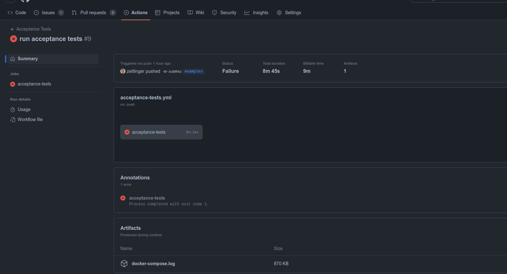

# Contributing

This project is a javaagent distribution of the OpenTelemetry Java instrumentation agent. It is modeled after the [OpenTelemetry Java instrumentation agent distro template](https://github.com/open-telemetry/opentelemetry-java-instrumentation/blob/main/examples/distro/README.md).

## Build

```sh
./gradlew clean
```

```sh
./gradlew build
```

The build process will generate `agent/build/libs/grafana-opentelemetry-java.jar`, which contains the upstream javaagent.jar as well as our custom extension.

## Debugging

If one of the test applications in the "examples" directory fails to produce the right telemetry (usually detected by the oats test), you can run the application with the javaagent attached to it by adding the following command line arguments:

```sh
./run.sh --attachDebugger --debugLogging --debugInstrumentations --includeAllInstrumentations
```

## Smoke Tests

Smoke tests test the entire javaagent distribution, including the custom extension. To run the smoke tests, run the following command:

```sh
SMOKE_TEST_JAVA_VERSION=8 ./gradlew :smoke-tests:test
```

## Acceptance Tests

Unlike smoke tests, acceptance tests are only run if the pull request has the "oats" label.

Acceptance test cases are defined in `oats.yaml` files in the examples directory. The test cases are run by [oats]. The declarative yaml tests are described in <https://github.com/grafana/oats/blob/main/yaml>.

> **Note**: that many `oats.yaml` files are symlinks to avoid repetition.

If a test case fails (lets say "examples/jdbc/spring-boot-reactive-2.7"), follows these steps:

1. Check out the [oats] repo
2. Go to the oats folder
3. `cd yaml`
4. Install ginkgo: `go install github.com/onsi/ginkgo/v2/ginkgo`
5. `TESTCASE_TIMEOUT=2h TESTCASE_BASE_PATH=/path/to/this/repo/examples ginkgo -v -r -focus 'jdbc-spring-boot-reactive-2'`
6. go to <http://localhost:3000> and login with admin/admin

Use `-focus 'yaml'` to run all acceptance tests.

Also see [Java specific options](https://github.com/grafana/oats/blob/main/yaml/README.md#java-specific-options) for additional options.

### Common problems

First, check the [java specific oats options](https://github.com/grafana/oats/tree/main/yaml#java-specific-options), which can be used for debugging.

#### Instrumentation not included

Check if the test passes with `TESTCASE_INCLUDE_ALL_INSTRUMENTATIONS=true`.

If yes, check what the instrumentation scope is, and include this instrumentation in the list of [tested instrumentations](./README.md#tested-instrumentations). You should also include a test case for this instrumentation, similar to the other tests in the examples directory.

Where you can find the instrumentation scope:

- for traces - look in tempo plugin in grafana
- for metrics - look at the debug log output in output.log

## Debugging GitHub Actions

GitHub Actions for Acceptance test store the output log files - which can be found in the artifacts section of the GitHub Actions run.

- If you need more files, you can change the `path` for `actions/upload-artifact@v3` in acceptance-tests.yml.
- If you want to run a single test only, you can change the ginkgo command in run-acceptance-tests.sh to
  e.g. `ginkgo -v -r -focus 'redis-spring-boot-reactive-2'`.



## Known Issues

The tests occasionally fail due to TestContainers not starting in time.  Please rerun the build for now, until a new wait strategy can be determined.

[oats]: https://github.com/grafana/oats
