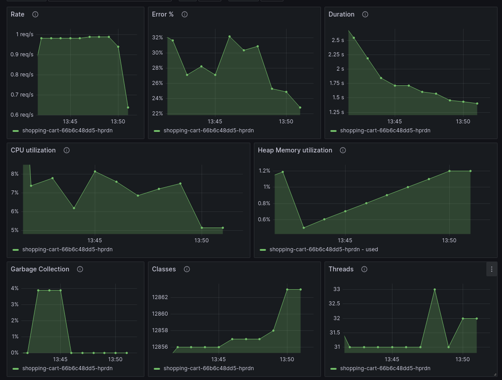

# grafana-opentelemetry-java

## About

The Grafana distribution of the [OpenTelemetry JavaAgent].

This project provides a Java agent JAR that can be attached to any Java 8+ application and dynamically injects bytecode to capture telemetry from a number of popular libraries and frameworks.

As this is the Grafana distribution, there are some settings that make it easy to connect to Grafana Cloud or a Grafana OSS stack - but all configuration options of the [OpenTelemetry JavaAgent] are available as well.

## Compatibility

- Java 8+
- We regularly update to the latest version of the [OpenTelemetry JavaAgent] - you can find the current
  version [here](https://github.com/grafana/grafana-opentelemetry-java/blob/main/build.gradle#L6)
- [Tested Libraries](https://github.com/open-telemetry/opentelemetry-java-instrumentation/blob/main/docs/tested-libraries.md#libraries--frameworks)

## Getting Started

### Configure your application

You can use the [Grafana Agent](#grafana-agent) or the [Grafana Cloud OTLP Gateway](#grafana-cloud-otlp-gateway) to send telemetry data to Grafana Cloud.

#### Grafana Cloud OTLP Gateway

> **Important**: Please use the Grafana Agent configuration for production use cases.

The easiest setup is to use the Grafana Cloud OTLP Gateway, because you don't need to run any service to transport the telemetry data to Grafana Cloud. The Grafana Cloud OTLP Gateway is a managed service that is available in all Grafana Cloud plans.

First, download the latest release from the [releases page](https://github.com/grafana/grafana-opentelemetry-java/releases).

If you're just getting started with Grafana Cloud, you can [sign up for permanent free plan](https://grafana.com/products/cloud/).

1. Click **Details** in the **Grafana** section on <https://grafana.com/profile/org>
2. Copy **Instance ID** and **Zone** into the java command below
3. On the left side, click on **Security** and then on **API Keys**
4. Click on **Create API Key** (MetricsPublisher role) and copy the key into the java command below

Enable the instrumentation agent using the `-javaagent` flag to the JVM.

```shell
GRAFANA_OTLP_CLOUD_INSTANCE_ID=<GRAFANA_INSTANCE_ID> \
GRAFANA_OTLP_CLOUD_ZONE=<GRAFANA_ZONE> \
GRAFANA_OTLP_CLOUD_API_KEY=<GRAFANA_CLOUD_API_KEY> \
OTEL_SERVICE_NAME=<APP_NAME> \
OTEL_RESOURCE_ATTRIBUTES=deployment.environment=<PRODUCTION_OR_STAGING>,service.namespace=<AREA_OF_APP>,service.version=<APP_VERSION> \
java -javaagent:path/to/opentelemetry-javaagent.jar -jar myapp.jar
```

> **Note**: You can also use system properties instead of environment variables, 
> e.g. `-Dgrafana.otlp.cloud.instance.id=<GRAFANA_INSTANCE_ID>` instead of 
> `export GRAFANA_OTLP_CLOUD_INSTANCE_ID=<GRAFANA_INSTANCE_ID>`.


| Attribute              | Description                                                           | Default Value                                                      |
|------------------------|-----------------------------------------------------------------------|--------------------------------------------------------------------|
| service.namespace      | An optional namespace for `service.name`                              | -                                                                  |
| service.name           | The application name                                                  | name of the jar file                                               |
| deployment.environment | Name of the deployment environment (`staging` or `production`)        | -                                                                  |
| service.instance.id    | The unique instance, e.g. the pod name                                | random UUID or `<k8s.pod.name>/<k8s.container.name>` (if provided) |
| service.version        | The application version, to see if a new version has introduced a bug | -                                                                  |

#### Grafana Agent

The Grafana Agent is a single binary that can be deployed as a sidecar or daemonset in Kubernetes, or as a service in your network. It provides an endpoint where the application can send its telemetry data to. The telemetry data is then forwarded to Grafana Cloud or a Grafana OSS stack.

First, download the latest release from the [releases page](https://github.com/grafana/grafana-opentelemetry-java/releases).

> **Important**: If you use **Grafana Cloud**, follow the [OpenTelemetry Integration](https://grafana.com/docs/grafana-cloud/data-configuration/integrations/integration-reference/integration-opentelemetry/), 
> which creates a Grafana Agent configuration for you. Instead of using the download link for the javaagent in 
> the integration, you can use the download link from the releases page.

Enable the instrumentation agent using the `-javaagent` flag to the JVM.

```shell
OTEL_EXPORTER_OTLP_ENDPOINT=http://localhost:4317 \
OTEL_EXPORTER_OTLP_PROTOCOL=grpc \
OTEL_SERVICE_NAME=<APP_NAME> \
OTEL_RESOURCE_ATTRIBUTES=deployment.environment=<PRODUCTION_OR_STAGING>,service.namespace=<AREA_OF_APP>,service.version=<APP_VERSION> \
java -javaagent:path/to/opentelemetry-javaagent.jar -jar myapp.jar
```

> **Note**: You can also use system properties instead of environment variables, 
> e.g. `-Dgrafana.otlp.cloud.instance.id=<GRAFANA_INSTANCE_ID>` instead of 
> `export GRAFANA_OTLP_CLOUD_INSTANCE_ID=<GRAFANA_INSTANCE_ID>`.


| Attribute              | Description                                                           | Default Value                                                      |
|------------------------|-----------------------------------------------------------------------|--------------------------------------------------------------------|
| service.namespace      | An optional namespace for `service.name`                              | -                                                                  |
| service.name           | The application name                                                  | name of the jar file                                               |
| deployment.environment | Name of the deployment environment (`staging` or `production`)        | -                                                                  |
| service.instance.id    | The unique instance, e.g. the pod name                                | random UUID or `<k8s.pod.name>/<k8s.container.name>` (if provided) |
| service.version        | The application version, to see if a new version has introduced a bug | -                                                                  |


The application will send data to the Grafana Agent. Please follow the [Grafana Agent configuration for OpenTelemetry](https://grafana.com/docs/opentelemetry/instrumentation/configuration/grafana-agent/) guide.
       
> **Note**: If the grafana agent is **not** running locally with the default gRPC endpoint (localhost:4317), 
> adjust the endpoint and protocol.

### Grafana Dashboard

You can use [this dashboard](https://grafana.com/grafana/dashboards/18812-jvm-overview-opentelemetry) to get and overview about the most important JVM metrics: CPU, memory, classes, threads, and garbage collection.



## Reference

- In addition to the configuration explained above, you can use all system properties or environment variables from the [SDK auto-configuration](https://github.com/open-telemetry/opentelemetry-java/tree/main/sdk-extensions/autoconfigure) - which will take precedence.
- All exporters are set to `otlp` by default (even the logs exporter).

### Enable Debug Logging

Log all metrics, traces, and logs that are created for debugging purposes (in addition to sending them to the backend via OTLP).

This will also send metrics and traces to Loki as an unintended side effect.

Add the following command line parameter:

```shell
export GRAFANA_OTLP_DEBUG_LOGGING=true
```

For more fine-grained control, you can also enable debug logging for specific signal types:

```shell
export GRAFANA_OTLP_LOGGING_EXPORTER_ENABLED="metrics,logs,traces"
```

The above would enable debug logging for all signal types (Note that order/case do not matter). If you only wish to enable logging for specific signals, simply include those of interest in the list.

The following would only enable logging for metrics data.

```shell
export GRAFANA_OTLP_LOGGING_EXPORTER_ENABLED="metrics"
```

### Tested Instrumentations

This project provides end-to-end tests for a number of libraries. The tests are located in the `examples` folder and are run by [oats](https://github.com/grafana/oats/). They cover the integration into the Grafana LTGM stack.

You can run the Grafana distribution in a mode that includes all instrumentation modules that are covered by the tests, no more, no less.

```shell
export GRAFANA_OTEL_USE_TESTED_INSTRUMENTATIONS=true
```

These are the tested instrumentations:

| ID                                        | Name                                                                                                                                              |
| ----------------------------------------- | ------------------------------------------------------------------------------------------------------------------------------------------------- |
| opentelemetry-extension-annotations       | [@WithSpan annotation](./examples/manual/README.md)                                                                                               |
| opentelemetry-instrumentation-annotations | [@WithSpan annotation](./examples/manual/README.md)                                                                                               |
| opentelemetry-api                         | [Manual instrumentation](./examples/manual/README.md)                                                                                             |
| tomcat                                    | Non-reactive spring boot default web server, e.g. [JDBC](./examples/jdbc/spring-boot-non-reactive-3.1)                                            |
| jetty                                     | [Jetty Web Server](./examples/jetty/README.md)                                                                                                    |
| netty                                     | Reactive spring boot web server, e.g. in [JDBC](./examples/jdbc/spring-boot-reactive-3.1)                                                         |
| undertow                                  | [Undertow Web Server](./examples/undertow/README.md)                                                                                              |
| spring-web                                | Non-reactive spring boot, e.g. in [JDBC](./examples/jdbc/spring-boot-non-reactive-3.1)                                                            |
| spring-webmvc                             | Non-reactive spring boot, e.g. in [JDBC](./examples/jdbc/spring-boot-non-reactive-3.1)                                                            |
| spring-webflux                            | Reactive spring boot, e.g. in [JDBC](./examples/jdbc/spring-boot-reactive-3.1)                                                                    |
| reactor                                   | Reactive spring boot, e.g. in [JDBC](./examples/jdbc/spring-boot-reactive-3.1)                                                                    |
| spring-data                               | [JDBC Database Clients](./examples/jdbc/README.md)                                                                                                |
| jdbc                                      | [JDBC Database Clients](./examples/jdbc/README.md)                                                                                                |
| hikaricp                                  | [JDBC Database Clients](./examples/jdbc/README.md)                                                                                                |
| r2dbc                                     | [JDBC Database Clients](./examples/jdbc/README.md)                                                                                                |
| jms                                       | [JMS with ActiveMQ](./examples/jms/README.md)                                                                                                     |
| logback-appender                          | [Logback logs](./examples/logback/README.md)                                                                                                      |
| log4j-appender                            | [Log4j logs](./examples/log4j/README.md)                                                                                                          |
| runtime-telemetry                         | JVM Runtime Metrics - used in all examples, e.g. in [JDBC](./examples/jdbc/README.md)                                                             |
| executors                                 | Support library to synchronize thread local when using [Executors](https://docs.oracle.com/javase/8/docs/api/java/util/concurrent/Executors.html) |
| micrometer                                | Micrometer is used in some examples where the JavaAgent doesn't have a metric, e.g. [MongoDB](./examples/mongodb/README.md)                       |
| kafka-clients                             | [Kafka](./examples/kafka/README.md)                                                                                                               |
| spring-kafka                              | [Kafka](./examples/kafka/README.md)                                                                                                               |
| mongo                                     | [MongoDB](./examples/mongodb/README.md)                                                                                                           |
| jedis                                     | [Redis with Jedis client](./examples/redis/README.md)                                                                                             |
| lettuce                                   | [Redis with Jedis client](./examples/redis/README.md)                                                                                             |

### Application Observability Metrics

If you're using [Application Observability](https://grafana.com/docs/grafana-cloud/monitor-applications/application-observability/),
you can reduce metrics costs by turning off all metrics that are not used by the dashboards in Application Observability.

```shell
export GRAFANA_OTEL_APPLICATION_OBSERVABILITY_METRICS=true
```

> **Note**: If you're creating metrics manually, you can enable them by setting the meter name to `application`.
 
The following metrics are currently (or planned to be) used by Application Observability:

| Metric                                     | Description                                                                                      |
|--------------------------------------------|--------------------------------------------------------------------------------------------------|
| process.runtime.jvm.system.cpu.utilization | Used in [JVM dashboard](https://grafana.com/grafana/dashboards/18812-jvm-overview-opentelemetry) |
| process.runtime.jvm.memory.usage           | Used in [JVM dashboard](https://grafana.com/grafana/dashboards/18812-jvm-overview-opentelemetry) |
| process.runtime.jvm.memory.limit           | Used in [JVM dashboard](https://grafana.com/grafana/dashboards/18812-jvm-overview-opentelemetry) |
| process.runtime.jvm.gc.duration            | Used in [JVM dashboard](https://grafana.com/grafana/dashboards/18812-jvm-overview-opentelemetry) |
| process.runtime.jvm.classes.current_loaded | Used in [JVM dashboard](https://grafana.com/grafana/dashboards/18812-jvm-overview-opentelemetry) |
| process.runtime.jvm.threads.count          | Used in [JVM dashboard](https://grafana.com/grafana/dashboards/18812-jvm-overview-opentelemetry) |
| db.client.connections.usage                | Used in [JDBC dashboard](https://grafana.com/grafana/dashboards/19732)                           |
| db.client.connections.max                  | Used in [JDBC dashboard](https://grafana.com/grafana/dashboards/19732)                           |
| db.client.connections.pending_requests     | Used in [JDBC dashboard](https://grafana.com/grafana/dashboards/19732)                           |
| r2dbc.pool.acquired                        | Used by [reactive Database example](examples/jdbc/README.md)                                     |
| r2dbc.pool.max.allocated                   | Used by [reactive Database example](examples/jdbc/README.md)                                     |
| r2dbc.pool.pending                         | Used by [reactive Database example](examples/jdbc/README.md)                                     |
| kafka.producer.record_error_total          | Used by [Kafka example](examples/kafka/README.md)                                                |
| mongodb.driver.pool.waitqueuesize          | Used by [MongoDB example](examples/mongodb/README.md)                                            |
| mongodb.driver.pool.checkedout             | Used by [MongoDB example](examples/mongodb/README.md)                                            |


[OpenTelemetry Javaagent]: https://github.com/open-telemetry/opentelemetry-java-instrumentation
