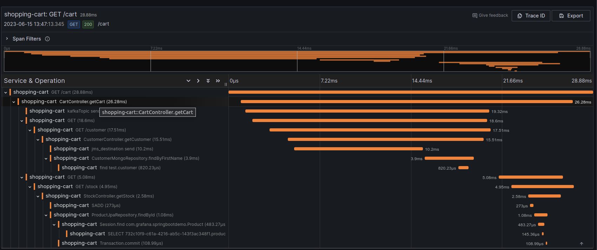
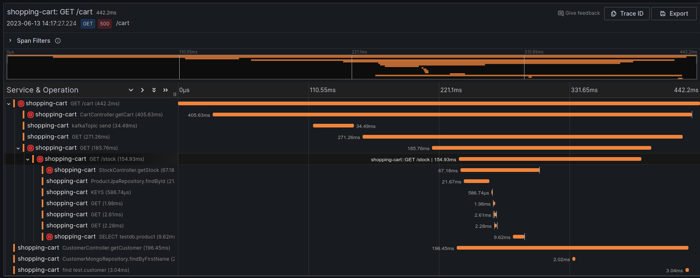
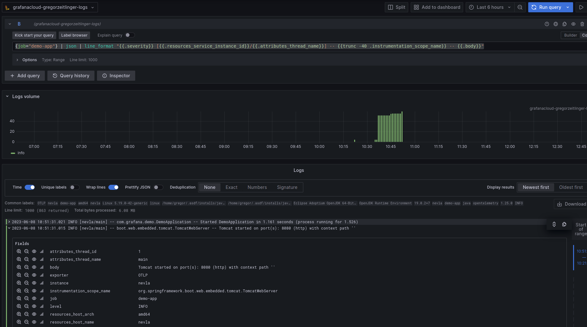
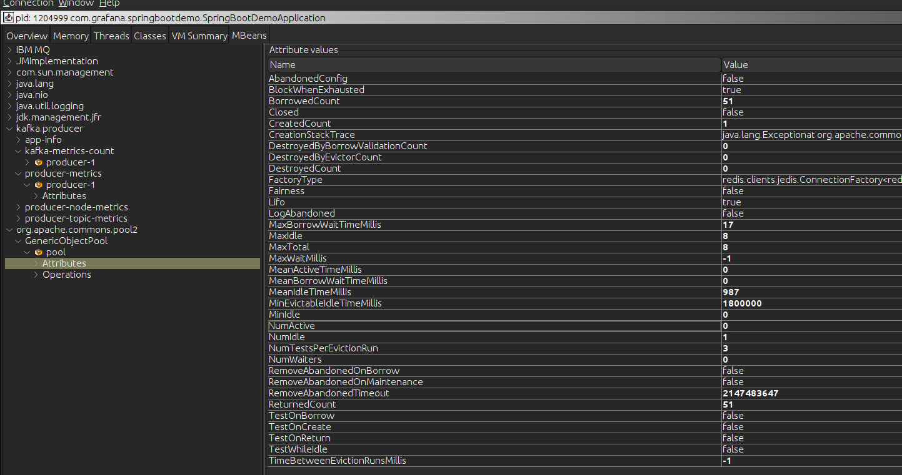

# Overview 

The example applications tests various instrumentation libraries.

The goal is to make it very easy to check if a certain combination of libraries and frameworks is observable
using the [Java Agent](https://github.com/open-telemetry/opentelemetry-java-instrumentation),
e.g. Java 8 with [IBM Message Queue](https://developer.ibm.com/tutorials/mq-jms-application-development-with-spring-boot/).

Each example project explains how to run them, the results are displayed here fore easy summary.

# Results
       
## Libraries used

### Spring Web

This is a traditional Spring Boot application setup.

Note that Spring Boot manages other versions (e.g. for Kafka), so those are not mentioned explicitly. 
Versions not mentioned are the same as the column to the left.

| Library                   | Java 17 [^1] | Java 8 [^2] | Log4j [^2] |
|---------------------------|--------------|-------------|------------|
| Java                      | 19 [^3]      | 8 [^4]      |            |
| Java Agent                | 1.26.0       |             |            |
| Spring Boot (starter-web) | 3.1.0        | 2.7.12      |            |
| Jedis (Redis)             | 4.4.1        |             |            |
| Logback                   | 1.4.7        | 1.2.12      | not used   |
| Log4j                     | not used     | not used    | 2.7.12     |

[^1]: Demo project spring-boot-web-3.1
[^2]: Demo project spring-boot-web-2.7
[^3]: OpenJDK Runtime Environment Temurin-17.0.7+7 (build 17.0.7+7)               
[^4]: OpenJDK Runtime Environment (Temurin)(build 1.8.0_372-b07)               
  
### Spring Webflux

| Library               | WebFlux [^5] |
|-----------------------|--------------|
| Java                  | 8 [^4]       |
| Java Agent            | 1.26.0       |
| Spring Boot (webflux) | 2.7.12       |
| Jedis (Redis)         | 4.4.1        |
| Logback               | 1.2.12       |

[^5]: Demo project spring-boot-webflux-2.7

## Produced Telemetry data

If a certain feature (e.g. traces for Jedis client) only worked in a specific setup (e.g. Webflux), 
it's noted separately in the section (e.g. [Jedis client span](#jedis-client-span).) 

| Framework       | Traces | Metrics                   |
|-----------------|--------|---------------------------|
| JVM Overview    | N/A    | ☑️                        |
| Web Server      | ☑️     | ☑️                        |
| RestTemplate    | ☑️     | ☑️                        |
| Kafka Client    | ☑️     | ☑️                        |
| MongoDB client  | ☑️     | ☑️                        |
| Jedis client    | ☑️     | ☑️ (requires manual work) |
| Hibernate / JPA | ☑️     | ☑️                        |
| Active MQ / JMS | ☑️     | ❌                         |

### Traces
             
Full trace for a request to the Cart Controller: 

For a reactive spring application

Notes:
- the nesting level in the reactive trace is "too flat" - not investigated why
- the server span "GET /controller" is missing - not investigated why

#### Web Server span
           
Name: GET /cart

Attributes:

<table class="css-1ago99h"><tbody class="css-14g0w27-body"><tr class="css-10clzph-row"><td class="css-mntbtq-keyColumn" data-testid="KeyValueTable--keyColumn">http.method</td><td>

"GET"

</td><td class="css-8fecs8-copyColumn"></td></tr><tr class="css-10clzph-row"><td class="css-mntbtq-keyColumn" data-testid="KeyValueTable--keyColumn">http.response_content_length</td><td>

29

</td><td class="css-8fecs8-copyColumn"></td></tr><tr class="css-10clzph-row"><td class="css-mntbtq-keyColumn" data-testid="KeyValueTable--keyColumn">http.route</td><td>

"/cart"

</td><td class="css-8fecs8-copyColumn"></td></tr><tr class="css-10clzph-row"><td class="css-mntbtq-keyColumn" data-testid="KeyValueTable--keyColumn">http.scheme</td><td>

"http"

</td><td class="css-8fecs8-copyColumn"></td></tr><tr class="css-10clzph-row"><td class="css-mntbtq-keyColumn" data-testid="KeyValueTable--keyColumn">http.status_code</td><td>

200

</td><td class="css-8fecs8-copyColumn"></td></tr><tr class="css-10clzph-row"><td class="css-mntbtq-keyColumn" data-testid="KeyValueTable--keyColumn">http.target</td><td>

"/cart"

</td><td class="css-8fecs8-copyColumn"></td></tr><tr class="css-10clzph-row"><td class="css-mntbtq-keyColumn" data-testid="KeyValueTable--keyColumn">net.host.name</td><td>

"localhost"

</td><td class="css-8fecs8-copyColumn"></td></tr><tr class="css-10clzph-row"><td class="css-mntbtq-keyColumn" data-testid="KeyValueTable--keyColumn">net.host.port</td><td>

8080

</td><td class="css-8fecs8-copyColumn"></td></tr><tr class="css-10clzph-row"><td class="css-mntbtq-keyColumn" data-testid="KeyValueTable--keyColumn">net.protocol.name</td><td>

"http"

</td><td class="css-8fecs8-copyColumn"></td></tr><tr class="css-10clzph-row"><td class="css-mntbtq-keyColumn" data-testid="KeyValueTable--keyColumn">net.protocol.version</td><td>

"1.1"

</td><td class="css-8fecs8-copyColumn"></td></tr><tr class="css-10clzph-row"><td class="css-mntbtq-keyColumn" data-testid="KeyValueTable--keyColumn">net.sock.host.addr</td><td>

"127.0.0.1"

</td><td class="css-8fecs8-copyColumn"></td></tr><tr class="css-10clzph-row"><td class="css-mntbtq-keyColumn" data-testid="KeyValueTable--keyColumn">net.sock.peer.addr</td><td>

"127.0.0.1"

</td><td class="css-8fecs8-copyColumn"></td></tr><tr class="css-10clzph-row"><td class="css-mntbtq-keyColumn" data-testid="KeyValueTable--keyColumn">net.sock.peer.port</td><td>

57108

</td><td class="css-8fecs8-copyColumn"></td></tr><tr class="css-10clzph-row"><td class="css-mntbtq-keyColumn" data-testid="KeyValueTable--keyColumn">otel.library.name</td><td>

"io.opentelemetry.tomcat-10.0"

</td><td class="css-8fecs8-copyColumn"></td></tr><tr class="css-10clzph-row"><td class="css-mntbtq-keyColumn" data-testid="KeyValueTable--keyColumn">otel.library.version</td><td>

"1.26.0-alpha"

</td><td class="css-8fecs8-copyColumn"></td></tr><tr class="css-10clzph-row"><td class="css-mntbtq-keyColumn" data-testid="KeyValueTable--keyColumn">span.kind</td><td>

"server"

</td><td class="css-8fecs8-copyColumn"></td></tr><tr class="css-10clzph-row"><td class="css-mntbtq-keyColumn" data-testid="KeyValueTable--keyColumn">status.code</td><td>

0

</td><td class="css-8fecs8-copyColumn"></td></tr><tr class="css-10clzph-row"><td class="css-mntbtq-keyColumn" data-testid="KeyValueTable--keyColumn">thread.id</td><td>

56

</td><td class="css-8fecs8-copyColumn"></td></tr><tr class="css-10clzph-row"><td class="css-mntbtq-keyColumn" data-testid="KeyValueTable--keyColumn">thread.name</td><td>

"http-nio-8080-exec-7"

</td><td class="css-8fecs8-copyColumn"></td></tr><tr class="css-10clzph-row"><td class="css-mntbtq-keyColumn" data-testid="KeyValueTable--keyColumn">user_agent.original</td><td>

"curl/7.81.0"

</td><td class="css-8fecs8-copyColumn"></td></tr></tbody></table>

#### Spring Web MVC span

- Shows the Java method name of the controller
                                                     
Name: `CartController.getCart`

Attributes:

<table class="css-1ago99h"><tbody class="css-14g0w27-body"><tr class="css-10clzph-row"><td class="css-mntbtq-keyColumn" data-testid="KeyValueTable--keyColumn">otel.library.name</td><td>

"io.opentelemetry.spring-webmvc-6.0"

</td><td class="css-8fecs8-copyColumn"></td></tr><tr class="css-10clzph-row"><td class="css-mntbtq-keyColumn" data-testid="KeyValueTable--keyColumn">otel.library.version</td><td>

"1.26.0-alpha"

</td><td class="css-8fecs8-copyColumn"></td></tr><tr class="css-10clzph-row"><td class="css-mntbtq-keyColumn" data-testid="KeyValueTable--keyColumn">span.kind</td><td>

"internal"

</td><td class="css-8fecs8-copyColumn"></td></tr><tr class="css-10clzph-row"><td class="css-mntbtq-keyColumn" data-testid="KeyValueTable--keyColumn">status.code</td><td>

0

</td><td class="css-8fecs8-copyColumn"></td></tr><tr class="css-10clzph-row"><td class="css-mntbtq-keyColumn" data-testid="KeyValueTable--keyColumn">thread.id</td><td>

56

</td><td class="css-8fecs8-copyColumn"></td></tr><tr class="css-10clzph-row"><td class="css-mntbtq-keyColumn" data-testid="KeyValueTable--keyColumn">thread.name</td><td>

"http-nio-8080-exec-7"

</td><td class="css-8fecs8-copyColumn"></td></tr></tbody></table>

#### Kafka client span

Name: `topic1 send`

Attributes:

<table class="css-1ago99h"><tbody class="css-14g0w27-body"><tr class="css-10clzph-row"><td class="css-mntbtq-keyColumn" data-testid="KeyValueTable--keyColumn">messaging.destination.kind</td><td>

"topic"

</td><td class="css-8fecs8-copyColumn"></td></tr><tr class="css-10clzph-row"><td class="css-mntbtq-keyColumn" data-testid="KeyValueTable--keyColumn">messaging.destination.name</td><td>

"topic1"

</td><td class="css-8fecs8-copyColumn"></td></tr><tr class="css-10clzph-row"><td class="css-mntbtq-keyColumn" data-testid="KeyValueTable--keyColumn">messaging.kafka.client_id</td><td>

"producer-1"

</td><td class="css-8fecs8-copyColumn"></td></tr><tr class="css-10clzph-row"><td class="css-mntbtq-keyColumn" data-testid="KeyValueTable--keyColumn">messaging.kafka.destination.partition</td><td>

2

</td><td class="css-8fecs8-copyColumn"></td></tr><tr class="css-10clzph-row"><td class="css-mntbtq-keyColumn" data-testid="KeyValueTable--keyColumn">messaging.kafka.message.offset</td><td>

6

</td><td class="css-8fecs8-copyColumn"></td></tr><tr class="css-10clzph-row"><td class="css-mntbtq-keyColumn" data-testid="KeyValueTable--keyColumn">messaging.system</td><td>

"kafka"

</td><td class="css-8fecs8-copyColumn"></td></tr><tr class="css-10clzph-row"><td class="css-mntbtq-keyColumn" data-testid="KeyValueTable--keyColumn">otel.library.name</td><td>

"io.opentelemetry.kafka-clients-0.11"

</td><td class="css-8fecs8-copyColumn"></td></tr><tr class="css-10clzph-row"><td class="css-mntbtq-keyColumn" data-testid="KeyValueTable--keyColumn">otel.library.version</td><td>

"1.26.0-alpha"

</td><td class="css-8fecs8-copyColumn"></td></tr><tr class="css-10clzph-row"><td class="css-mntbtq-keyColumn" data-testid="KeyValueTable--keyColumn">span.kind</td><td>

"producer"

</td><td class="css-8fecs8-copyColumn"></td></tr><tr class="css-10clzph-row"><td class="css-mntbtq-keyColumn" data-testid="KeyValueTable--keyColumn">status.code</td><td>

0

</td><td class="css-8fecs8-copyColumn"></td></tr><tr class="css-10clzph-row"><td class="css-mntbtq-keyColumn" data-testid="KeyValueTable--keyColumn">thread.id</td><td>

56

</td><td class="css-8fecs8-copyColumn"></td></tr><tr class="css-10clzph-row"><td class="css-mntbtq-keyColumn" data-testid="KeyValueTable--keyColumn">thread.name</td><td>

"http-nio-8080-exec-7"

</td><td class="css-8fecs8-copyColumn"></td></tr></tbody></table>

#### RestTemplate client span

Name: `GET`

Attributes:

<table class="css-1ago99h"><tbody class="css-14g0w27-body"><tr class="css-10clzph-row"><td class="css-mntbtq-keyColumn" data-testid="KeyValueTable--keyColumn">http.method</td><td>

"GET"

</td><td class="css-8fecs8-copyColumn"></td></tr><tr class="css-10clzph-row"><td class="css-mntbtq-keyColumn" data-testid="KeyValueTable--keyColumn">http.response_content_length</td><td>

4

</td><td class="css-8fecs8-copyColumn"></td></tr><tr class="css-10clzph-row"><td class="css-mntbtq-keyColumn" data-testid="KeyValueTable--keyColumn">http.status_code</td><td>

200

</td><td class="css-8fecs8-copyColumn"></td></tr><tr class="css-10clzph-row"><td class="css-mntbtq-keyColumn" data-testid="KeyValueTable--keyColumn">http.url</td><td>

"<a href="http://localhost:8080/customer">http://localhost:8080/customer</a>"

</td><td class="css-8fecs8-copyColumn"></td></tr><tr class="css-10clzph-row"><td class="css-mntbtq-keyColumn" data-testid="KeyValueTable--keyColumn">net.peer.name</td><td>

"localhost"

</td><td class="css-8fecs8-copyColumn"></td></tr><tr class="css-10clzph-row"><td class="css-mntbtq-keyColumn" data-testid="KeyValueTable--keyColumn">net.peer.port</td><td>

8080

</td><td class="css-8fecs8-copyColumn"></td></tr><tr class="css-10clzph-row"><td class="css-mntbtq-keyColumn" data-testid="KeyValueTable--keyColumn">net.protocol.name</td><td>

"http"

</td><td class="css-8fecs8-copyColumn"></td></tr><tr class="css-10clzph-row"><td class="css-mntbtq-keyColumn" data-testid="KeyValueTable--keyColumn">net.protocol.version</td><td>

"1.1"

</td><td class="css-8fecs8-copyColumn"></td></tr><tr class="css-10clzph-row"><td class="css-mntbtq-keyColumn" data-testid="KeyValueTable--keyColumn">otel.library.name</td><td>

"io.opentelemetry.http-url-connection"

</td><td class="css-8fecs8-copyColumn"></td></tr><tr class="css-10clzph-row"><td class="css-mntbtq-keyColumn" data-testid="KeyValueTable--keyColumn">otel.library.version</td><td>

"1.26.0-alpha"

</td><td class="css-8fecs8-copyColumn"></td></tr><tr class="css-10clzph-row"><td class="css-mntbtq-keyColumn" data-testid="KeyValueTable--keyColumn">span.kind</td><td>

"client"

</td><td class="css-8fecs8-copyColumn"></td></tr><tr class="css-10clzph-row"><td class="css-mntbtq-keyColumn" data-testid="KeyValueTable--keyColumn">status.code</td><td>

0

</td><td class="css-8fecs8-copyColumn"></td></tr><tr class="css-10clzph-row"><td class="css-mntbtq-keyColumn" data-testid="KeyValueTable--keyColumn">thread.id</td><td>

56

</td><td class="css-8fecs8-copyColumn"></td></tr><tr class="css-10clzph-row"><td class="css-mntbtq-keyColumn" data-testid="KeyValueTable--keyColumn">thread.name</td><td>

"http-nio-8080-exec-7"

</td><td class="css-8fecs8-copyColumn"></td></tr></tbody></table>

#### Spring Data MongoDB internal span

Name: `CustomerMongoRepository.findByFirstName` 
                                              
Attributes:

<table class="css-1ago99h"><tbody class="css-14g0w27-body"><tr class="css-10clzph-row"><td class="css-mntbtq-keyColumn" data-testid="KeyValueTable--keyColumn">code.function</td><td>

"findByFirstName"

</td><td class="css-8fecs8-copyColumn"></td></tr><tr class="css-10clzph-row"><td class="css-mntbtq-keyColumn" data-testid="KeyValueTable--keyColumn">code.namespace</td><td>

"com.grafana.springbootdemo.CustomerMongoRepository"

</td><td class="css-8fecs8-copyColumn"></td></tr><tr class="css-10clzph-row"><td class="css-mntbtq-keyColumn" data-testid="KeyValueTable--keyColumn">otel.library.name</td><td>

"io.opentelemetry.spring-data-1.8"

</td><td class="css-8fecs8-copyColumn"></td></tr><tr class="css-10clzph-row"><td class="css-mntbtq-keyColumn" data-testid="KeyValueTable--keyColumn">otel.library.version</td><td>

"1.26.0-alpha"

</td><td class="css-8fecs8-copyColumn"></td></tr><tr class="css-10clzph-row"><td class="css-mntbtq-keyColumn" data-testid="KeyValueTable--keyColumn">span.kind</td><td>

"internal"

</td><td class="css-8fecs8-copyColumn"></td></tr><tr class="css-10clzph-row"><td class="css-mntbtq-keyColumn" data-testid="KeyValueTable--keyColumn">status.code</td><td>

0

</td><td class="css-8fecs8-copyColumn"></td></tr><tr class="css-10clzph-row"><td class="css-mntbtq-keyColumn" data-testid="KeyValueTable--keyColumn">thread.id</td><td>

51

</td><td class="css-8fecs8-copyColumn"></td></tr><tr class="css-10clzph-row"><td class="css-mntbtq-keyColumn" data-testid="KeyValueTable--keyColumn">thread.name</td><td>

"http-nio-8080-exec-2"

</td><td class="css-8fecs8-copyColumn"></td></tr></tbody></table>

#### MongoDB client span

Name: `find test.customer`

Attributes:

<table class="css-1ago99h"><tbody class="css-14g0w27-body"><tr class="css-10clzph-row"><td class="css-mntbtq-keyColumn" data-testid="KeyValueTable--keyColumn">db.connection_string</td><td>

"mongodb://localhost:27017"

</td><td class="css-8fecs8-copyColumn"></td></tr><tr class="css-10clzph-row"><td class="css-mntbtq-keyColumn" data-testid="KeyValueTable--keyColumn">db.mongodb.collection</td><td>

"customer"

</td><td class="css-8fecs8-copyColumn"></td></tr><tr class="css-10clzph-row"><td class="css-mntbtq-keyColumn" data-testid="KeyValueTable--keyColumn">db.name</td><td>

"test"

</td><td class="css-8fecs8-copyColumn"></td></tr><tr class="css-10clzph-row"><td class="css-mntbtq-keyColumn" data-testid="KeyValueTable--keyColumn">db.operation</td><td>

"find"

</td><td class="css-8fecs8-copyColumn"></td></tr><tr class="css-10clzph-row"><td class="css-mntbtq-keyColumn" data-testid="KeyValueTable--keyColumn">db.statement</td><td>

{
    "find": "customer",
    "filter": {
        "firstName": "?"
    },
    "limit": "?",
    "$db": "?",
    "lsid": {
        "id": "?"
    }
}

</td><td class="css-8fecs8-copyColumn"></td></tr><tr class="css-10clzph-row"><td class="css-mntbtq-keyColumn" data-testid="KeyValueTable--keyColumn">db.system</td><td>

"mongodb"

</td><td class="css-8fecs8-copyColumn"></td></tr><tr class="css-10clzph-row"><td class="css-mntbtq-keyColumn" data-testid="KeyValueTable--keyColumn">net.peer.name</td><td>

"localhost"

</td><td class="css-8fecs8-copyColumn"></td></tr><tr class="css-10clzph-row"><td class="css-mntbtq-keyColumn" data-testid="KeyValueTable--keyColumn">net.peer.port</td><td>

27017

</td><td class="css-8fecs8-copyColumn"></td></tr><tr class="css-10clzph-row"><td class="css-mntbtq-keyColumn" data-testid="KeyValueTable--keyColumn">otel.library.name</td><td>

"io.opentelemetry.mongo-3.1"

</td><td class="css-8fecs8-copyColumn"></td></tr><tr class="css-10clzph-row"><td class="css-mntbtq-keyColumn" data-testid="KeyValueTable--keyColumn">otel.library.version</td><td>

"1.26.0-alpha"

</td><td class="css-8fecs8-copyColumn"></td></tr><tr class="css-10clzph-row"><td class="css-mntbtq-keyColumn" data-testid="KeyValueTable--keyColumn">span.kind</td><td>

"client"

</td><td class="css-8fecs8-copyColumn"></td></tr><tr class="css-10clzph-row"><td class="css-mntbtq-keyColumn" data-testid="KeyValueTable--keyColumn">status.code</td><td>

0

</td><td class="css-8fecs8-copyColumn"></td></tr><tr class="css-10clzph-row"><td class="css-mntbtq-keyColumn" data-testid="KeyValueTable--keyColumn">thread.id</td><td>

51

</td><td class="css-8fecs8-copyColumn"></td></tr><tr class="css-10clzph-row"><td class="css-mntbtq-keyColumn" data-testid="KeyValueTable--keyColumn">thread.name</td><td>

"http-nio-8080-exec-2"

</td><td class="css-8fecs8-copyColumn"></td></tr></tbody></table>

#### Jedis client span

Name: `SADD`

Attributes: 

<table class="css-1ago99h"><tbody class="css-14g0w27-body"><tr class="css-10clzph-row"><td class="css-mntbtq-keyColumn" data-testid="KeyValueTable--keyColumn">db.operation</td><td>

"SADD"

</td><td class="css-8fecs8-copyColumn"></td></tr><tr class="css-10clzph-row"><td class="css-mntbtq-keyColumn" data-testid="KeyValueTable--keyColumn">db.statement</td><td>

"SADD planets ?"

</td><td class="css-8fecs8-copyColumn"></td></tr><tr class="css-10clzph-row"><td class="css-mntbtq-keyColumn" data-testid="KeyValueTable--keyColumn">db.system</td><td>

"redis"

</td><td class="css-8fecs8-copyColumn"></td></tr><tr class="css-10clzph-row"><td class="css-mntbtq-keyColumn" data-testid="KeyValueTable--keyColumn">net.sock.peer.addr</td><td>

"127.0.0.1"

</td><td class="css-8fecs8-copyColumn"></td></tr><tr class="css-10clzph-row"><td class="css-mntbtq-keyColumn" data-testid="KeyValueTable--keyColumn">net.sock.peer.name</td><td>

"127.0.0.1"

</td><td class="css-8fecs8-copyColumn"></td></tr><tr class="css-10clzph-row"><td class="css-mntbtq-keyColumn" data-testid="KeyValueTable--keyColumn">net.sock.peer.port</td><td>

6379

</td><td class="css-8fecs8-copyColumn"></td></tr><tr class="css-10clzph-row"><td class="css-mntbtq-keyColumn" data-testid="KeyValueTable--keyColumn">otel.library.name</td><td>

"io.opentelemetry.jedis-4.0"

</td><td class="css-8fecs8-copyColumn"></td></tr><tr class="css-10clzph-row"><td class="css-mntbtq-keyColumn" data-testid="KeyValueTable--keyColumn">otel.library.version</td><td>

"1.26.0-alpha"

</td><td class="css-8fecs8-copyColumn"></td></tr><tr class="css-10clzph-row"><td class="css-mntbtq-keyColumn" data-testid="KeyValueTable--keyColumn">span.kind</td><td>

"client"

</td><td class="css-8fecs8-copyColumn"></td></tr><tr class="css-10clzph-row"><td class="css-mntbtq-keyColumn" data-testid="KeyValueTable--keyColumn">status.code</td><td>

0

</td><td class="css-8fecs8-copyColumn"></td></tr><tr class="css-10clzph-row"><td class="css-mntbtq-keyColumn" data-testid="KeyValueTable--keyColumn">thread.id</td><td>

52

</td><td class="css-8fecs8-copyColumn"></td></tr><tr class="css-10clzph-row"><td class="css-mntbtq-keyColumn" data-testid="KeyValueTable--keyColumn">thread.name</td><td>

"http-nio-8080-exec-3"

</td><td class="css-8fecs8-copyColumn"></td></tr></tbody></table>

#### Spring Data JPA internal span

Name: `ProductJpaRepository.findById`

Attributes: 

<table class="css-1ago99h"><tbody class="css-14g0w27-body"><tr class="css-10clzph-row"><td class="css-mntbtq-keyColumn" data-testid="KeyValueTable--keyColumn">code.function</td><td>

"findById"

</td><td class="css-8fecs8-copyColumn"></td></tr><tr class="css-10clzph-row"><td class="css-mntbtq-keyColumn" data-testid="KeyValueTable--keyColumn">code.namespace</td><td>

"com.grafana.springbootdemo.ProductJpaRepository"

</td><td class="css-8fecs8-copyColumn"></td></tr><tr class="css-10clzph-row"><td class="css-mntbtq-keyColumn" data-testid="KeyValueTable--keyColumn">otel.library.name</td><td>

"io.opentelemetry.spring-data-1.8"

</td><td class="css-8fecs8-copyColumn"></td></tr><tr class="css-10clzph-row"><td class="css-mntbtq-keyColumn" data-testid="KeyValueTable--keyColumn">otel.library.version</td><td>

"1.26.0-alpha"

</td><td class="css-8fecs8-copyColumn"></td></tr><tr class="css-10clzph-row"><td class="css-mntbtq-keyColumn" data-testid="KeyValueTable--keyColumn">span.kind</td><td>

"internal"

</td><td class="css-8fecs8-copyColumn"></td></tr><tr class="css-10clzph-row"><td class="css-mntbtq-keyColumn" data-testid="KeyValueTable--keyColumn">status.code</td><td>

0

</td><td class="css-8fecs8-copyColumn"></td></tr><tr class="css-10clzph-row"><td class="css-mntbtq-keyColumn" data-testid="KeyValueTable--keyColumn">thread.id</td><td>

52

</td><td class="css-8fecs8-copyColumn"></td></tr><tr class="css-10clzph-row"><td class="css-mntbtq-keyColumn" data-testid="KeyValueTable--keyColumn">thread.name</td><td>

"http-nio-8080-exec-3"

</td><td class="css-8fecs8-copyColumn"></td></tr></tbody></table>

#### Hibernate internal span

Name: `Session.find com.grafana.springbootdemo.Product`

Attributes:

<table class="css-1ago99h"><tbody class="css-14g0w27-body"><tr class="css-10clzph-row"><td class="css-mntbtq-keyColumn" data-testid="KeyValueTable--keyColumn">otel.library.name</td><td>

"io.opentelemetry.hibernate-6.0"

</td><td class="css-8fecs8-copyColumn"></td></tr><tr class="css-10clzph-row"><td class="css-mntbtq-keyColumn" data-testid="KeyValueTable--keyColumn">otel.library.version</td><td>

"1.26.0-alpha"

</td><td class="css-8fecs8-copyColumn"></td></tr><tr class="css-10clzph-row"><td class="css-mntbtq-keyColumn" data-testid="KeyValueTable--keyColumn">span.kind</td><td>

"internal"

</td><td class="css-8fecs8-copyColumn"></td></tr><tr class="css-10clzph-row"><td class="css-mntbtq-keyColumn" data-testid="KeyValueTable--keyColumn">status.code</td><td>

0

</td><td class="css-8fecs8-copyColumn"></td></tr><tr class="css-10clzph-row"><td class="css-mntbtq-keyColumn" data-testid="KeyValueTable--keyColumn">thread.id</td><td>

52

</td><td class="css-8fecs8-copyColumn"></td></tr><tr class="css-10clzph-row"><td class="css-mntbtq-keyColumn" data-testid="KeyValueTable--keyColumn">thread.name</td><td>

"http-nio-8080-exec-3"

</td><td class="css-8fecs8-copyColumn"></td></tr></tbody></table>

#### JDBC client span

Name: `SELECT 7a4ae095-d193-45c6-bcb0-baa64fd4241e.product`

Attributes:

<table class="css-1ago99h"><tbody class="css-14g0w27-body"><tr class="css-10clzph-row"><td class="css-mntbtq-keyColumn" data-testid="KeyValueTable--keyColumn">db.connection_string</td><td>

"h2:mem:"

</td><td class="css-8fecs8-copyColumn"></td></tr><tr class="css-10clzph-row"><td class="css-mntbtq-keyColumn" data-testid="KeyValueTable--keyColumn">db.name</td><td>

"7a4ae095-d193-45c6-bcb0-baa64fd4241e"

</td><td class="css-8fecs8-copyColumn"></td></tr><tr class="css-10clzph-row"><td class="css-mntbtq-keyColumn" data-testid="KeyValueTable--keyColumn">db.operation</td><td>

"SELECT"

</td><td class="css-8fecs8-copyColumn"></td></tr><tr class="css-10clzph-row"><td class="css-mntbtq-keyColumn" data-testid="KeyValueTable--keyColumn">db.sql.table</td><td>

"product"

</td><td class="css-8fecs8-copyColumn"></td></tr><tr class="css-10clzph-row"><td class="css-mntbtq-keyColumn" data-testid="KeyValueTable--keyColumn">db.statement</td><td>

"select p1_0.id,p1_0.name,p1_0.picture_url,p1_0.price from product p1_0 where p1_0.id=?"

</td><td class="css-8fecs8-copyColumn"></td></tr><tr class="css-10clzph-row"><td class="css-mntbtq-keyColumn" data-testid="KeyValueTable--keyColumn">db.system</td><td>

"h2"

</td><td class="css-8fecs8-copyColumn"></td></tr><tr class="css-10clzph-row"><td class="css-mntbtq-keyColumn" data-testid="KeyValueTable--keyColumn">db.user</td><td>

"sa"

</td><td class="css-8fecs8-copyColumn"></td></tr><tr class="css-10clzph-row"><td class="css-mntbtq-keyColumn" data-testid="KeyValueTable--keyColumn">otel.library.name</td><td>

"io.opentelemetry.jdbc"

</td><td class="css-8fecs8-copyColumn"></td></tr><tr class="css-10clzph-row"><td class="css-mntbtq-keyColumn" data-testid="KeyValueTable--keyColumn">otel.library.version</td><td>

"1.26.0-alpha"

</td><td class="css-8fecs8-copyColumn"></td></tr><tr class="css-10clzph-row"><td class="css-mntbtq-keyColumn" data-testid="KeyValueTable--keyColumn">span.kind</td><td>

"client"

</td><td class="css-8fecs8-copyColumn"></td></tr><tr class="css-10clzph-row"><td class="css-mntbtq-keyColumn" data-testid="KeyValueTable--keyColumn">status.code</td><td>

0

</td><td class="css-8fecs8-copyColumn"></td></tr><tr class="css-10clzph-row"><td class="css-mntbtq-keyColumn" data-testid="KeyValueTable--keyColumn">thread.id</td><td>

52

</td><td class="css-8fecs8-copyColumn"></td></tr><tr class="css-10clzph-row"><td class="css-mntbtq-keyColumn" data-testid="KeyValueTable--keyColumn">thread.name</td><td>

"http-nio-8080-exec-3"

</td><td class="css-8fecs8-copyColumn"></td></tr></tbody></table>

#### JMS

Name: `jms_destination send`

<table class="css-1ago99h"><tbody class="css-14g0w27-body"><tr class="css-10clzph-row"><td class="css-mntbtq-keyColumn" data-testid="KeyValueTable--keyColumn">messaging.destination.kind</td><td>

"queue"

</td><td class="css-8fecs8-copyColumn"></td></tr><tr class="css-10clzph-row"><td class="css-mntbtq-keyColumn" data-testid="KeyValueTable--keyColumn">messaging.destination.name</td><td>

"jms_destination"

</td><td class="css-8fecs8-copyColumn"></td></tr><tr class="css-10clzph-row"><td class="css-mntbtq-keyColumn" data-testid="KeyValueTable--keyColumn">messaging.message.id</td><td>

"ID:nevla-33549-1686830860119-4:1:1:1:5"

</td><td class="css-8fecs8-copyColumn"></td></tr><tr class="css-10clzph-row"><td class="css-mntbtq-keyColumn" data-testid="KeyValueTable--keyColumn">messaging.system</td><td>

"jms"

</td><td class="css-8fecs8-copyColumn"></td></tr><tr class="css-10clzph-row"><td class="css-mntbtq-keyColumn" data-testid="KeyValueTable--keyColumn">otel.library.name</td><td>

"io.opentelemetry.jms-1.1"

</td><td class="css-8fecs8-copyColumn"></td></tr><tr class="css-10clzph-row"><td class="css-mntbtq-keyColumn" data-testid="KeyValueTable--keyColumn">otel.library.version</td><td>

"1.26.0-alpha"

</td><td class="css-8fecs8-copyColumn"></td></tr><tr class="css-10clzph-row"><td class="css-mntbtq-keyColumn" data-testid="KeyValueTable--keyColumn">span.kind</td><td>

"producer"

</td><td class="css-8fecs8-copyColumn"></td></tr><tr class="css-10clzph-row"><td class="css-mntbtq-keyColumn" data-testid="KeyValueTable--keyColumn">status.code</td><td>

0

</td><td class="css-8fecs8-copyColumn"></td></tr><tr class="css-10clzph-row"><td class="css-mntbtq-keyColumn" data-testid="KeyValueTable--keyColumn">thread.id</td><td>

56

</td><td class="css-8fecs8-copyColumn"></td></tr><tr class="css-10clzph-row"><td class="css-mntbtq-keyColumn" data-testid="KeyValueTable--keyColumn">thread.name</td><td>

"reactor-http-epoll-3"

</td><td class="css-8fecs8-copyColumn"></td></tr></tbody></table>

### Logging

- using the Grafana Logs pattern `{job="demo-app"} | json | line_format "{{.severity}} [{{.resources_service_instance_id}}/{{.attributes_thread_name}}] -- {{trunc -40 .instrumentation_scope_name}} -- {{.body}}"` is a reasonable default

`2023-06-08 10:51:31.021	
INFO [nevla/main] -- com.grafana.demo.DemoApplication -- Started DemoApplication in 1.161 seconds (process running for 1.526)`

               
Log message attributes:

<table class="css-xdnfhu-logs-row-details-table"><tbody><tr><td colspan="100" class="css-1m3a7rd-logs-row-details__heading" aria-label="Fields">Fields</td></tr><tr class="css-gi55n9-logs-row-details__row"><td class="css-1996m6s-logs-row-details__icon">

</td><td class="css-1d24gbv-logs-row-details__label">attributes_thread_id</td><td class="css-1lm1wit-wordBreakAll-wrapLine">
1

</td></tr><tr class="css-gi55n9-logs-row-details__row"><td class="css-1996m6s-logs-row-details__icon">

</td><td class="css-1d24gbv-logs-row-details__label">attributes_thread_name</td><td class="css-1lm1wit-wordBreakAll-wrapLine">
main

</td></tr><tr class="css-gi55n9-logs-row-details__row"><td class="css-1996m6s-logs-row-details__icon">

</td><td class="css-1d24gbv-logs-row-details__label">body</td><td class="css-1lm1wit-wordBreakAll-wrapLine">
Tomcat started on port(s): 8080 (http) with context path ''

</td></tr><tr class="css-gi55n9-logs-row-details__row"><td class="css-1996m6s-logs-row-details__icon">

</td><td class="css-1d24gbv-logs-row-details__label">exporter</td><td class="css-1lm1wit-wordBreakAll-wrapLine">
OTLP

</td></tr><tr class="css-gi55n9-logs-row-details__row"><td class="css-1996m6s-logs-row-details__icon">

</td><td class="css-1d24gbv-logs-row-details__label">instance</td><td class="css-1lm1wit-wordBreakAll-wrapLine">
nevla

</td></tr><tr class="css-gi55n9-logs-row-details__row"><td class="css-1996m6s-logs-row-details__icon">

</td><td class="css-1d24gbv-logs-row-details__label">instrumentation_scope_name</td><td class="css-1lm1wit-wordBreakAll-wrapLine">
org.springframework.boot.web.embedded.tomcat.TomcatWebServer

</td></tr><tr class="css-gi55n9-logs-row-details__row"><td class="css-1996m6s-logs-row-details__icon">

</td><td class="css-1d24gbv-logs-row-details__label">job</td><td class="css-1lm1wit-wordBreakAll-wrapLine">
demo-app

</td></tr><tr class="css-gi55n9-logs-row-details__row"><td class="css-1996m6s-logs-row-details__icon">

</td><td class="css-1d24gbv-logs-row-details__label">level</td><td class="css-1lm1wit-wordBreakAll-wrapLine">
INFO

</td></tr><tr class="css-gi55n9-logs-row-details__row"><td class="css-1996m6s-logs-row-details__icon">

</td><td class="css-1d24gbv-logs-row-details__label">resources_host_arch</td><td class="css-1lm1wit-wordBreakAll-wrapLine">
amd64

</td></tr><tr class="css-gi55n9-logs-row-details__row"><td class="css-1996m6s-logs-row-details__icon">

</td><td class="css-1d24gbv-logs-row-details__label">resources_host_name</td><td class="css-1lm1wit-wordBreakAll-wrapLine">
nevla

</td></tr><tr class="css-gi55n9-logs-row-details__row"><td class="css-1996m6s-logs-row-details__icon">

</td><td class="css-1d24gbv-logs-row-details__label">resources_os_description</td><td class="css-1lm1wit-wordBreakAll-wrapLine">
Linux 5.19.0-42-generic

</td></tr><tr class="css-gi55n9-logs-row-details__row"><td class="css-1996m6s-logs-row-details__icon">

</td><td class="css-1d24gbv-logs-row-details__label">resources_os_type</td><td class="css-1lm1wit-wordBreakAll-wrapLine">
linux

</td></tr><tr class="css-gi55n9-logs-row-details__row"><td class="css-1996m6s-logs-row-details__icon">

</td><td class="css-1d24gbv-logs-row-details__label">resources_process_command_line</td><td class="css-1lm1wit-wordBreakAll-wrapLine">
/home/foo/.asdf/installs/java/temurin-19.0.2+7/bin/java -XX:TieredStopAtLevel=1 -Dfile.encoding=UTF-8 -Duser.country=US -Duser.language=en -Duser.variant com.grafana.demo.DemoApplication

</td></tr><tr class="css-gi55n9-logs-row-details__row"><td class="css-1996m6s-logs-row-details__icon">

</td><td class="css-1d24gbv-logs-row-details__label">resources_process_executable_path</td><td class="css-1lm1wit-wordBreakAll-wrapLine">
/home/foo/.asdf/installs/java/temurin-19.0.2+7/bin/java

</td></tr><tr class="css-gi55n9-logs-row-details__row"><td class="css-1996m6s-logs-row-details__icon">

</td><td class="css-1d24gbv-logs-row-details__label">resources_process_pid</td><td class="css-1lm1wit-wordBreakAll-wrapLine">
866314

</td></tr><tr class="css-gi55n9-logs-row-details__row"><td class="css-1996m6s-logs-row-details__icon">

</td><td class="css-1d24gbv-logs-row-details__label">resources_process_runtime_description</td><td class="css-1lm1wit-wordBreakAll-wrapLine">
Eclipse Adoptium OpenJDK 64-Bit Server VM 19.0.2+7

</td></tr><tr class="css-gi55n9-logs-row-details__row"><td class="css-1996m6s-logs-row-details__icon">

</td><td class="css-1d24gbv-logs-row-details__label">resources_process_runtime_name</td><td class="css-1lm1wit-wordBreakAll-wrapLine">
OpenJDK Runtime Environment

</td></tr><tr class="css-gi55n9-logs-row-details__row"><td class="css-1996m6s-logs-row-details__icon">

</td><td class="css-1d24gbv-logs-row-details__label">resources_process_runtime_version</td><td class="css-1lm1wit-wordBreakAll-wrapLine">
19.0.2+7

</td></tr><tr class="css-gi55n9-logs-row-details__row"><td class="css-1996m6s-logs-row-details__icon">

</td><td class="css-1d24gbv-logs-row-details__label">resources_service_instance_id</td><td class="css-1lm1wit-wordBreakAll-wrapLine">
nevla

</td></tr><tr class="css-gi55n9-logs-row-details__row"><td class="css-1996m6s-logs-row-details__icon">

</td><td class="css-1d24gbv-logs-row-details__label">resources_service_name</td><td class="css-1lm1wit-wordBreakAll-wrapLine">
demo-app

</td></tr><tr class="css-gi55n9-logs-row-details__row"><td class="css-1996m6s-logs-row-details__icon">

</td><td class="css-1d24gbv-logs-row-details__label">resources_telemetry_sdk_language</td><td class="css-1lm1wit-wordBreakAll-wrapLine">
java

</td></tr><tr class="css-gi55n9-logs-row-details__row"><td class="css-1996m6s-logs-row-details__icon">

</td><td class="css-1d24gbv-logs-row-details__label">resources_telemetry_sdk_name</td><td class="css-1lm1wit-wordBreakAll-wrapLine">
opentelemetry

</td></tr><tr class="css-gi55n9-logs-row-details__row"><td class="css-1996m6s-logs-row-details__icon">

</td><td class="css-1d24gbv-logs-row-details__label">resources_telemetry_sdk_version</td><td class="css-1lm1wit-wordBreakAll-wrapLine">
1.25.0

</td></tr><tr class="css-gi55n9-logs-row-details__row"><td class="css-1996m6s-logs-row-details__icon">

</td><td class="css-1d24gbv-logs-row-details__label">severity</td><td class="css-1lm1wit-wordBreakAll-wrapLine">
INFO

</td></tr></tbody></table>

### Metrics

#### JVM overview metrics

Use https://grafana.com/grafana/dashboards/18812-jvm-overview-opentelemetry/ or the Application Observability app

#### Web Server metrics

Use Application Observability app

or manually:

- Duration: `(sum by (instance)(rate(http_server_duration_sum{job=~"$job", instance=~"$instance"}[$__rate_interval]))) / 
on (instance) 
(sum by (instance)(rate(http_server_duration_count{job=~"$job", instance=~"$instance"}[$__rate_interval])))
`
- Errors: `(sum by (instance)(rate(http_server_duration_count{job=~"$job", instance=~"$instance", http_status_code="500"}[$__rate_interval]))) / on (instance) (sum by (instance)(rate(http_server_duration_count{job=~"$job", instance=~"$instance"}[$__rate_interval])))`

- Rate: `sum by (instance) (rate(http_server_duration_count{job=~"$job", instance=~"$instance"}[$__rate_interval]))`

#### JDBC / HikariCP

A very useful set of metrics is the current and max. number of connections to detect a draining connection pool

- max: `db_client_connections_max{pool_name="HikariPool-1"}`
- current: `db_client_connections_usage{pool_name="HikariPool-1", state="used"}`
                     
For reactive, `r2dbc_pool_acquired{}` seems like a good metric to monitor pool usage.

#### Kafka client metrics

There are [many metrics](https://github.com/open-telemetry/opentelemetry-java-instrumentation/blob/main/instrumentation/kafka/kafka-clients/kafka-clients-2.6/library/README.md). 
Not sure what the best practice is to get a good overview, maybe error rate: `sum(rate(kafka_producer_record_error_total[$__rate_interval]))`

#### RestTemplate client
             
Same metrics as for [http server](#web-server-metrics), just replace `server` by `client`, 
e.g. for rate: `sum by (instance) (rate(http_client_duration_count{}[$__rate_interval]))`

#### MongoDB client
    
`mongodb_driver_pool_size{}` seems like a good metric.
(Note that this is a micrometer metric).

#### Jedis client
    
JMX provides good connection pool metrics (e.g. `NumActive`) - and JMX metrics can be turned into
OpenTelemetry metrics as described [here](https://github.com/open-telemetry/opentelemetry-java-instrumentation/blob/3d0971b318d523022ea66555cb02f2c5e9607bd2/instrumentation/jmx-metrics/javaagent/README.md#configuration-files).

#### JMS

not available
