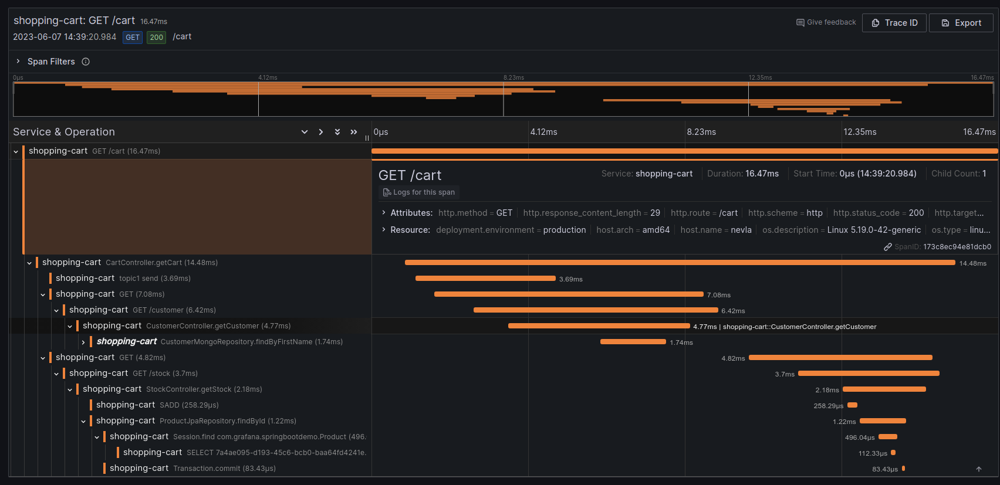
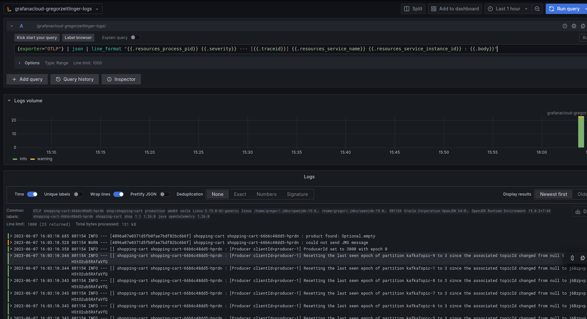

# Overview 

The Demo application is a Spring Boot application to test various instrumentation libraries.

The goal is to make it very easy to check if a certain combination of libraries and frameworks is observable
using the [Java Agent](https://github.com/open-telemetry/opentelemetry-java-instrumentation),
e.g. Java 8 with [IBM Message Queue](https://developer.ibm.com/tutorials/mq-jms-application-development-with-spring-boot/).

This demo takes some ideas from https://github.com/grafana/opentelemetry-demo/ - but is very JVM focused and tries to be easier to install (although that can still be simplified further).

# Running

## Kafka

- check out branch "otlp_gateway" from https://github.com/grafana/opentelemetry-demo/
- `docker-compose --env-file .env  up kafka`

## Grafana Agent or OpenTelemetry Collector
        
- install the Grafana Agent - https://gregorzeitlinger.grafana.net/connections/add-new-connection/java-open-telemetry
- skip the last step ("Running the Java Application")

Instead of the Grafana Agent, you can also use the otel collector, which is a bit more complicated, but implements
the latest Prometheus naming conventions

- Go to the directory where you checked out opentelemetry-demo (see [Kafka](#kafka))
- Fill out [these variables](https://github.com/grafana/opentelemetry-demo/blob/2e0e2ccf762749b5beef61df5cef48fd0c3a4de3/.env#L122C1-L126) in ".env"
- `docker-compose --env-file .env  up otelcol`

## Mongo DB

- Follow the install guide at https://www.mongodb.com/docs/manual/installation/

## Java Agent

- `cd examples/spring-boot-demo`
- `curl -Lo opentelemetry-javaagent-1.26.0.jar https://github.com/open-telemetry/opentelemetry-java-instrumentation/releases/download/v1.26.0/opentelemetry-javaagent.jar

## Demo Application

- check that you have Java 17 or higher 
- `../../gradlew bootRun`
- In another shell: `curl http://localhost:8080/cart` 

# Architecture

The Demo application is a single Spring Boot application that calls itself using HTTP.
                                        
```
┌──────────────────────────┐
│                          │       ┌───────────────────┐
│                          ├──────►│ Kafka             │
│                          │       └───────────────────┘
│                          │
│ Cart Controller          │
│                          │
│                          │
│                          │
│                          │
└─────────────────┬────┬───┘      ┌────────────────────────────┐          ┌────────────────────┐
                  │    │          │                            ├─────────►│ IBM MQ / JMS       │
                  │    │          │                            │          └────────────────────┘
                  │    │ HTTP     │                            │
                  │    └─────────►│                            │
                  │               │  Customer Controller       │          ┌───────────────────┐
                  │               │                            ├─────────►│ Mongo DB          │
                  │               │                            │          └───────────────────┘
                  │               │                            │
                  │               │                            │
                  │               └────────────────────────────┘
                  │
                  │
                  │
                  │
                  │               ┌────────────────────────────┐          ┌───────────────────┐
                  │ HTTP          │                            ├─────────►│ Redis             │
                  └──────────────►│                            │          └───────────────────┘
                                  │                            │
                                  │                            │
                                  │  Stock Controller          │           ┌───────────────────┐
                                  │                            ├──────────►│ Hibernate / JPA   │
                                  │                            │           └───────────────────┘
                                  │  Returns an error 30% of   │
                                  │  the time                  │
                                  └────────────────────────────┘
```

# Results

## Spring Web

This is a traditional Spring Boot application setup.

Note that Spring Boot manages other versions (e.g. for Kafka), so those are not mentioned explicitly. 

| Library                   | Version                                                       |
|---------------------------|---------------------------------------------------------------|
| Java                      | OpenJDK Runtime Environment Temurin-19.0.2+7 (build 19.0.2+7) |
| Java Agent                | 1.26.0                                                        |
| Spring Boot (starter-web) | 3.1.0                                                         |
| Jedis (Redis)             | 4.4.1                                                         |
| IBM MQ / JMS              | 3.1.0                                                         |
| Logback                   | todo                                                          |


### Traces
             
Full trace for a request to the Cart Controller: 



#### Web Server span
           
Name: GET /cart

Attributes:

<table class="css-1ago99h"><tbody class="css-14g0w27-body"><tr class="css-10clzph-row"><td class="css-mntbtq-keyColumn" data-testid="KeyValueTable--keyColumn">http.method</td><td><div class="css-7kp13n"><div class="json-markup"><span class="json-markup-string">"GET"</span></div></div></td><td class="css-8fecs8-copyColumn"><button class="css-frmoxw-button" type="button" tabindex="0"><div class="css-wf08df-Icon"><svg xmlns="http://www.w3.org/2000/svg" viewBox="0 0 24 24" width="16" height="16" class="css-196v9ys"><path d="M21,8.94a1.31,1.31,0,0,0-.06-.27l0-.09a1.07,1.07,0,0,0-.19-.28h0l-6-6h0a1.07,1.07,0,0,0-.28-.19.32.32,0,0,0-.09,0A.88.88,0,0,0,14.05,2H10A3,3,0,0,0,7,5V6H6A3,3,0,0,0,3,9V19a3,3,0,0,0,3,3h8a3,3,0,0,0,3-3V18h1a3,3,0,0,0,3-3V9S21,9,21,8.94ZM15,5.41,17.59,8H16a1,1,0,0,1-1-1ZM15,19a1,1,0,0,1-1,1H6a1,1,0,0,1-1-1V9A1,1,0,0,1,6,8H7v7a3,3,0,0,0,3,3h5Zm4-4a1,1,0,0,1-1,1H10a1,1,0,0,1-1-1V5a1,1,0,0,1,1-1h3V7a3,3,0,0,0,3,3h3Z"></path></svg></div></button></td></tr><tr class="css-10clzph-row"><td class="css-mntbtq-keyColumn" data-testid="KeyValueTable--keyColumn">http.response_content_length</td><td><div class="css-7kp13n"><div class="json-markup"><span class="json-markup-number">29</span></div></div></td><td class="css-8fecs8-copyColumn"><button class="css-frmoxw-button" type="button" tabindex="0"><div class="css-wf08df-Icon"><svg xmlns="http://www.w3.org/2000/svg" viewBox="0 0 24 24" width="16" height="16" class="css-196v9ys"><path d="M21,8.94a1.31,1.31,0,0,0-.06-.27l0-.09a1.07,1.07,0,0,0-.19-.28h0l-6-6h0a1.07,1.07,0,0,0-.28-.19.32.32,0,0,0-.09,0A.88.88,0,0,0,14.05,2H10A3,3,0,0,0,7,5V6H6A3,3,0,0,0,3,9V19a3,3,0,0,0,3,3h8a3,3,0,0,0,3-3V18h1a3,3,0,0,0,3-3V9S21,9,21,8.94ZM15,5.41,17.59,8H16a1,1,0,0,1-1-1ZM15,19a1,1,0,0,1-1,1H6a1,1,0,0,1-1-1V9A1,1,0,0,1,6,8H7v7a3,3,0,0,0,3,3h5Zm4-4a1,1,0,0,1-1,1H10a1,1,0,0,1-1-1V5a1,1,0,0,1,1-1h3V7a3,3,0,0,0,3,3h3Z"></path></svg></div></button></td></tr><tr class="css-10clzph-row"><td class="css-mntbtq-keyColumn" data-testid="KeyValueTable--keyColumn">http.route</td><td><div class="css-7kp13n"><div class="json-markup"><span class="json-markup-string">"/cart"</span></div></div></td><td class="css-8fecs8-copyColumn"><button class="css-frmoxw-button" type="button" tabindex="0"><div class="css-wf08df-Icon"><svg xmlns="http://www.w3.org/2000/svg" viewBox="0 0 24 24" width="16" height="16" class="css-196v9ys"><path d="M21,8.94a1.31,1.31,0,0,0-.06-.27l0-.09a1.07,1.07,0,0,0-.19-.28h0l-6-6h0a1.07,1.07,0,0,0-.28-.19.32.32,0,0,0-.09,0A.88.88,0,0,0,14.05,2H10A3,3,0,0,0,7,5V6H6A3,3,0,0,0,3,9V19a3,3,0,0,0,3,3h8a3,3,0,0,0,3-3V18h1a3,3,0,0,0,3-3V9S21,9,21,8.94ZM15,5.41,17.59,8H16a1,1,0,0,1-1-1ZM15,19a1,1,0,0,1-1,1H6a1,1,0,0,1-1-1V9A1,1,0,0,1,6,8H7v7a3,3,0,0,0,3,3h5Zm4-4a1,1,0,0,1-1,1H10a1,1,0,0,1-1-1V5a1,1,0,0,1,1-1h3V7a3,3,0,0,0,3,3h3Z"></path></svg></div></button></td></tr><tr class="css-10clzph-row"><td class="css-mntbtq-keyColumn" data-testid="KeyValueTable--keyColumn">http.scheme</td><td><div class="css-7kp13n"><div class="json-markup"><span class="json-markup-string">"http"</span></div></div></td><td class="css-8fecs8-copyColumn"><button class="css-frmoxw-button" type="button" tabindex="0"><div class="css-wf08df-Icon"><svg xmlns="http://www.w3.org/2000/svg" viewBox="0 0 24 24" width="16" height="16" class="css-196v9ys"><path d="M21,8.94a1.31,1.31,0,0,0-.06-.27l0-.09a1.07,1.07,0,0,0-.19-.28h0l-6-6h0a1.07,1.07,0,0,0-.28-.19.32.32,0,0,0-.09,0A.88.88,0,0,0,14.05,2H10A3,3,0,0,0,7,5V6H6A3,3,0,0,0,3,9V19a3,3,0,0,0,3,3h8a3,3,0,0,0,3-3V18h1a3,3,0,0,0,3-3V9S21,9,21,8.94ZM15,5.41,17.59,8H16a1,1,0,0,1-1-1ZM15,19a1,1,0,0,1-1,1H6a1,1,0,0,1-1-1V9A1,1,0,0,1,6,8H7v7a3,3,0,0,0,3,3h5Zm4-4a1,1,0,0,1-1,1H10a1,1,0,0,1-1-1V5a1,1,0,0,1,1-1h3V7a3,3,0,0,0,3,3h3Z"></path></svg></div></button></td></tr><tr class="css-10clzph-row"><td class="css-mntbtq-keyColumn" data-testid="KeyValueTable--keyColumn">http.status_code</td><td><div class="css-7kp13n"><div class="json-markup"><span class="json-markup-number">200</span></div></div></td><td class="css-8fecs8-copyColumn"><button class="css-frmoxw-button" type="button" tabindex="0"><div class="css-wf08df-Icon"><svg xmlns="http://www.w3.org/2000/svg" viewBox="0 0 24 24" width="16" height="16" class="css-196v9ys"><path d="M21,8.94a1.31,1.31,0,0,0-.06-.27l0-.09a1.07,1.07,0,0,0-.19-.28h0l-6-6h0a1.07,1.07,0,0,0-.28-.19.32.32,0,0,0-.09,0A.88.88,0,0,0,14.05,2H10A3,3,0,0,0,7,5V6H6A3,3,0,0,0,3,9V19a3,3,0,0,0,3,3h8a3,3,0,0,0,3-3V18h1a3,3,0,0,0,3-3V9S21,9,21,8.94ZM15,5.41,17.59,8H16a1,1,0,0,1-1-1ZM15,19a1,1,0,0,1-1,1H6a1,1,0,0,1-1-1V9A1,1,0,0,1,6,8H7v7a3,3,0,0,0,3,3h5Zm4-4a1,1,0,0,1-1,1H10a1,1,0,0,1-1-1V5a1,1,0,0,1,1-1h3V7a3,3,0,0,0,3,3h3Z"></path></svg></div></button></td></tr><tr class="css-10clzph-row"><td class="css-mntbtq-keyColumn" data-testid="KeyValueTable--keyColumn">http.target</td><td><div class="css-7kp13n"><div class="json-markup"><span class="json-markup-string">"/cart"</span></div></div></td><td class="css-8fecs8-copyColumn"><button class="css-frmoxw-button" type="button" tabindex="0"><div class="css-wf08df-Icon"><svg xmlns="http://www.w3.org/2000/svg" viewBox="0 0 24 24" width="16" height="16" class="css-196v9ys"><path d="M21,8.94a1.31,1.31,0,0,0-.06-.27l0-.09a1.07,1.07,0,0,0-.19-.28h0l-6-6h0a1.07,1.07,0,0,0-.28-.19.32.32,0,0,0-.09,0A.88.88,0,0,0,14.05,2H10A3,3,0,0,0,7,5V6H6A3,3,0,0,0,3,9V19a3,3,0,0,0,3,3h8a3,3,0,0,0,3-3V18h1a3,3,0,0,0,3-3V9S21,9,21,8.94ZM15,5.41,17.59,8H16a1,1,0,0,1-1-1ZM15,19a1,1,0,0,1-1,1H6a1,1,0,0,1-1-1V9A1,1,0,0,1,6,8H7v7a3,3,0,0,0,3,3h5Zm4-4a1,1,0,0,1-1,1H10a1,1,0,0,1-1-1V5a1,1,0,0,1,1-1h3V7a3,3,0,0,0,3,3h3Z"></path></svg></div></button></td></tr><tr class="css-10clzph-row"><td class="css-mntbtq-keyColumn" data-testid="KeyValueTable--keyColumn">net.host.name</td><td><div class="css-7kp13n"><div class="json-markup"><span class="json-markup-string">"localhost"</span></div></div></td><td class="css-8fecs8-copyColumn"><button class="css-frmoxw-button" type="button" tabindex="0"><div class="css-wf08df-Icon"><svg xmlns="http://www.w3.org/2000/svg" viewBox="0 0 24 24" width="16" height="16" class="css-196v9ys"><path d="M21,8.94a1.31,1.31,0,0,0-.06-.27l0-.09a1.07,1.07,0,0,0-.19-.28h0l-6-6h0a1.07,1.07,0,0,0-.28-.19.32.32,0,0,0-.09,0A.88.88,0,0,0,14.05,2H10A3,3,0,0,0,7,5V6H6A3,3,0,0,0,3,9V19a3,3,0,0,0,3,3h8a3,3,0,0,0,3-3V18h1a3,3,0,0,0,3-3V9S21,9,21,8.94ZM15,5.41,17.59,8H16a1,1,0,0,1-1-1ZM15,19a1,1,0,0,1-1,1H6a1,1,0,0,1-1-1V9A1,1,0,0,1,6,8H7v7a3,3,0,0,0,3,3h5Zm4-4a1,1,0,0,1-1,1H10a1,1,0,0,1-1-1V5a1,1,0,0,1,1-1h3V7a3,3,0,0,0,3,3h3Z"></path></svg></div></button></td></tr><tr class="css-10clzph-row"><td class="css-mntbtq-keyColumn" data-testid="KeyValueTable--keyColumn">net.host.port</td><td><div class="css-7kp13n"><div class="json-markup"><span class="json-markup-number">8080</span></div></div></td><td class="css-8fecs8-copyColumn"><button class="css-frmoxw-button" type="button" tabindex="0"><div class="css-wf08df-Icon"><svg xmlns="http://www.w3.org/2000/svg" viewBox="0 0 24 24" width="16" height="16" class="css-196v9ys"><path d="M21,8.94a1.31,1.31,0,0,0-.06-.27l0-.09a1.07,1.07,0,0,0-.19-.28h0l-6-6h0a1.07,1.07,0,0,0-.28-.19.32.32,0,0,0-.09,0A.88.88,0,0,0,14.05,2H10A3,3,0,0,0,7,5V6H6A3,3,0,0,0,3,9V19a3,3,0,0,0,3,3h8a3,3,0,0,0,3-3V18h1a3,3,0,0,0,3-3V9S21,9,21,8.94ZM15,5.41,17.59,8H16a1,1,0,0,1-1-1ZM15,19a1,1,0,0,1-1,1H6a1,1,0,0,1-1-1V9A1,1,0,0,1,6,8H7v7a3,3,0,0,0,3,3h5Zm4-4a1,1,0,0,1-1,1H10a1,1,0,0,1-1-1V5a1,1,0,0,1,1-1h3V7a3,3,0,0,0,3,3h3Z"></path></svg></div></button></td></tr><tr class="css-10clzph-row"><td class="css-mntbtq-keyColumn" data-testid="KeyValueTable--keyColumn">net.protocol.name</td><td><div class="css-7kp13n"><div class="json-markup"><span class="json-markup-string">"http"</span></div></div></td><td class="css-8fecs8-copyColumn"><button class="css-frmoxw-button" type="button" tabindex="0"><div class="css-wf08df-Icon"><svg xmlns="http://www.w3.org/2000/svg" viewBox="0 0 24 24" width="16" height="16" class="css-196v9ys"><path d="M21,8.94a1.31,1.31,0,0,0-.06-.27l0-.09a1.07,1.07,0,0,0-.19-.28h0l-6-6h0a1.07,1.07,0,0,0-.28-.19.32.32,0,0,0-.09,0A.88.88,0,0,0,14.05,2H10A3,3,0,0,0,7,5V6H6A3,3,0,0,0,3,9V19a3,3,0,0,0,3,3h8a3,3,0,0,0,3-3V18h1a3,3,0,0,0,3-3V9S21,9,21,8.94ZM15,5.41,17.59,8H16a1,1,0,0,1-1-1ZM15,19a1,1,0,0,1-1,1H6a1,1,0,0,1-1-1V9A1,1,0,0,1,6,8H7v7a3,3,0,0,0,3,3h5Zm4-4a1,1,0,0,1-1,1H10a1,1,0,0,1-1-1V5a1,1,0,0,1,1-1h3V7a3,3,0,0,0,3,3h3Z"></path></svg></div></button></td></tr><tr class="css-10clzph-row"><td class="css-mntbtq-keyColumn" data-testid="KeyValueTable--keyColumn">net.protocol.version</td><td><div class="css-7kp13n"><div class="json-markup"><span class="json-markup-string">"1.1"</span></div></div></td><td class="css-8fecs8-copyColumn"><button class="css-frmoxw-button" type="button" tabindex="0"><div class="css-wf08df-Icon"><svg xmlns="http://www.w3.org/2000/svg" viewBox="0 0 24 24" width="16" height="16" class="css-196v9ys"><path d="M21,8.94a1.31,1.31,0,0,0-.06-.27l0-.09a1.07,1.07,0,0,0-.19-.28h0l-6-6h0a1.07,1.07,0,0,0-.28-.19.32.32,0,0,0-.09,0A.88.88,0,0,0,14.05,2H10A3,3,0,0,0,7,5V6H6A3,3,0,0,0,3,9V19a3,3,0,0,0,3,3h8a3,3,0,0,0,3-3V18h1a3,3,0,0,0,3-3V9S21,9,21,8.94ZM15,5.41,17.59,8H16a1,1,0,0,1-1-1ZM15,19a1,1,0,0,1-1,1H6a1,1,0,0,1-1-1V9A1,1,0,0,1,6,8H7v7a3,3,0,0,0,3,3h5Zm4-4a1,1,0,0,1-1,1H10a1,1,0,0,1-1-1V5a1,1,0,0,1,1-1h3V7a3,3,0,0,0,3,3h3Z"></path></svg></div></button></td></tr><tr class="css-10clzph-row"><td class="css-mntbtq-keyColumn" data-testid="KeyValueTable--keyColumn">net.sock.host.addr</td><td><div class="css-7kp13n"><div class="json-markup"><span class="json-markup-string">"127.0.0.1"</span></div></div></td><td class="css-8fecs8-copyColumn"><button class="css-frmoxw-button" type="button" tabindex="0"><div class="css-wf08df-Icon"><svg xmlns="http://www.w3.org/2000/svg" viewBox="0 0 24 24" width="16" height="16" class="css-196v9ys"><path d="M21,8.94a1.31,1.31,0,0,0-.06-.27l0-.09a1.07,1.07,0,0,0-.19-.28h0l-6-6h0a1.07,1.07,0,0,0-.28-.19.32.32,0,0,0-.09,0A.88.88,0,0,0,14.05,2H10A3,3,0,0,0,7,5V6H6A3,3,0,0,0,3,9V19a3,3,0,0,0,3,3h8a3,3,0,0,0,3-3V18h1a3,3,0,0,0,3-3V9S21,9,21,8.94ZM15,5.41,17.59,8H16a1,1,0,0,1-1-1ZM15,19a1,1,0,0,1-1,1H6a1,1,0,0,1-1-1V9A1,1,0,0,1,6,8H7v7a3,3,0,0,0,3,3h5Zm4-4a1,1,0,0,1-1,1H10a1,1,0,0,1-1-1V5a1,1,0,0,1,1-1h3V7a3,3,0,0,0,3,3h3Z"></path></svg></div></button></td></tr><tr class="css-10clzph-row"><td class="css-mntbtq-keyColumn" data-testid="KeyValueTable--keyColumn">net.sock.peer.addr</td><td><div class="css-7kp13n"><div class="json-markup"><span class="json-markup-string">"127.0.0.1"</span></div></div></td><td class="css-8fecs8-copyColumn"><button class="css-frmoxw-button" type="button" tabindex="0"><div class="css-wf08df-Icon"><svg xmlns="http://www.w3.org/2000/svg" viewBox="0 0 24 24" width="16" height="16" class="css-196v9ys"><path d="M21,8.94a1.31,1.31,0,0,0-.06-.27l0-.09a1.07,1.07,0,0,0-.19-.28h0l-6-6h0a1.07,1.07,0,0,0-.28-.19.32.32,0,0,0-.09,0A.88.88,0,0,0,14.05,2H10A3,3,0,0,0,7,5V6H6A3,3,0,0,0,3,9V19a3,3,0,0,0,3,3h8a3,3,0,0,0,3-3V18h1a3,3,0,0,0,3-3V9S21,9,21,8.94ZM15,5.41,17.59,8H16a1,1,0,0,1-1-1ZM15,19a1,1,0,0,1-1,1H6a1,1,0,0,1-1-1V9A1,1,0,0,1,6,8H7v7a3,3,0,0,0,3,3h5Zm4-4a1,1,0,0,1-1,1H10a1,1,0,0,1-1-1V5a1,1,0,0,1,1-1h3V7a3,3,0,0,0,3,3h3Z"></path></svg></div></button></td></tr><tr class="css-10clzph-row"><td class="css-mntbtq-keyColumn" data-testid="KeyValueTable--keyColumn">net.sock.peer.port</td><td><div class="css-7kp13n"><div class="json-markup"><span class="json-markup-number">57108</span></div></div></td><td class="css-8fecs8-copyColumn"><button class="css-frmoxw-button" type="button" tabindex="0"><div class="css-wf08df-Icon"><svg xmlns="http://www.w3.org/2000/svg" viewBox="0 0 24 24" width="16" height="16" class="css-196v9ys"><path d="M21,8.94a1.31,1.31,0,0,0-.06-.27l0-.09a1.07,1.07,0,0,0-.19-.28h0l-6-6h0a1.07,1.07,0,0,0-.28-.19.32.32,0,0,0-.09,0A.88.88,0,0,0,14.05,2H10A3,3,0,0,0,7,5V6H6A3,3,0,0,0,3,9V19a3,3,0,0,0,3,3h8a3,3,0,0,0,3-3V18h1a3,3,0,0,0,3-3V9S21,9,21,8.94ZM15,5.41,17.59,8H16a1,1,0,0,1-1-1ZM15,19a1,1,0,0,1-1,1H6a1,1,0,0,1-1-1V9A1,1,0,0,1,6,8H7v7a3,3,0,0,0,3,3h5Zm4-4a1,1,0,0,1-1,1H10a1,1,0,0,1-1-1V5a1,1,0,0,1,1-1h3V7a3,3,0,0,0,3,3h3Z"></path></svg></div></button></td></tr><tr class="css-10clzph-row"><td class="css-mntbtq-keyColumn" data-testid="KeyValueTable--keyColumn">otel.library.name</td><td><div class="css-7kp13n"><div class="json-markup"><span class="json-markup-string">"io.opentelemetry.tomcat-10.0"</span></div></div></td><td class="css-8fecs8-copyColumn"><button class="css-frmoxw-button" type="button" tabindex="0"><div class="css-wf08df-Icon"><svg xmlns="http://www.w3.org/2000/svg" viewBox="0 0 24 24" width="16" height="16" class="css-196v9ys"><path d="M21,8.94a1.31,1.31,0,0,0-.06-.27l0-.09a1.07,1.07,0,0,0-.19-.28h0l-6-6h0a1.07,1.07,0,0,0-.28-.19.32.32,0,0,0-.09,0A.88.88,0,0,0,14.05,2H10A3,3,0,0,0,7,5V6H6A3,3,0,0,0,3,9V19a3,3,0,0,0,3,3h8a3,3,0,0,0,3-3V18h1a3,3,0,0,0,3-3V9S21,9,21,8.94ZM15,5.41,17.59,8H16a1,1,0,0,1-1-1ZM15,19a1,1,0,0,1-1,1H6a1,1,0,0,1-1-1V9A1,1,0,0,1,6,8H7v7a3,3,0,0,0,3,3h5Zm4-4a1,1,0,0,1-1,1H10a1,1,0,0,1-1-1V5a1,1,0,0,1,1-1h3V7a3,3,0,0,0,3,3h3Z"></path></svg></div></button></td></tr><tr class="css-10clzph-row"><td class="css-mntbtq-keyColumn" data-testid="KeyValueTable--keyColumn">otel.library.version</td><td><div class="css-7kp13n"><div class="json-markup"><span class="json-markup-string">"1.26.0-alpha"</span></div></div></td><td class="css-8fecs8-copyColumn"><button class="css-frmoxw-button" type="button" tabindex="0"><div class="css-wf08df-Icon"><svg xmlns="http://www.w3.org/2000/svg" viewBox="0 0 24 24" width="16" height="16" class="css-196v9ys"><path d="M21,8.94a1.31,1.31,0,0,0-.06-.27l0-.09a1.07,1.07,0,0,0-.19-.28h0l-6-6h0a1.07,1.07,0,0,0-.28-.19.32.32,0,0,0-.09,0A.88.88,0,0,0,14.05,2H10A3,3,0,0,0,7,5V6H6A3,3,0,0,0,3,9V19a3,3,0,0,0,3,3h8a3,3,0,0,0,3-3V18h1a3,3,0,0,0,3-3V9S21,9,21,8.94ZM15,5.41,17.59,8H16a1,1,0,0,1-1-1ZM15,19a1,1,0,0,1-1,1H6a1,1,0,0,1-1-1V9A1,1,0,0,1,6,8H7v7a3,3,0,0,0,3,3h5Zm4-4a1,1,0,0,1-1,1H10a1,1,0,0,1-1-1V5a1,1,0,0,1,1-1h3V7a3,3,0,0,0,3,3h3Z"></path></svg></div></button></td></tr><tr class="css-10clzph-row"><td class="css-mntbtq-keyColumn" data-testid="KeyValueTable--keyColumn">span.kind</td><td><div class="css-7kp13n"><div class="json-markup"><span class="json-markup-string">"server"</span></div></div></td><td class="css-8fecs8-copyColumn"><button class="css-frmoxw-button" type="button" tabindex="0"><div class="css-wf08df-Icon"><svg xmlns="http://www.w3.org/2000/svg" viewBox="0 0 24 24" width="16" height="16" class="css-196v9ys"><path d="M21,8.94a1.31,1.31,0,0,0-.06-.27l0-.09a1.07,1.07,0,0,0-.19-.28h0l-6-6h0a1.07,1.07,0,0,0-.28-.19.32.32,0,0,0-.09,0A.88.88,0,0,0,14.05,2H10A3,3,0,0,0,7,5V6H6A3,3,0,0,0,3,9V19a3,3,0,0,0,3,3h8a3,3,0,0,0,3-3V18h1a3,3,0,0,0,3-3V9S21,9,21,8.94ZM15,5.41,17.59,8H16a1,1,0,0,1-1-1ZM15,19a1,1,0,0,1-1,1H6a1,1,0,0,1-1-1V9A1,1,0,0,1,6,8H7v7a3,3,0,0,0,3,3h5Zm4-4a1,1,0,0,1-1,1H10a1,1,0,0,1-1-1V5a1,1,0,0,1,1-1h3V7a3,3,0,0,0,3,3h3Z"></path></svg></div></button></td></tr><tr class="css-10clzph-row"><td class="css-mntbtq-keyColumn" data-testid="KeyValueTable--keyColumn">status.code</td><td><div class="css-7kp13n"><div class="json-markup"><span class="json-markup-number">0</span></div></div></td><td class="css-8fecs8-copyColumn"><button class="css-frmoxw-button" type="button" tabindex="0"><div class="css-wf08df-Icon"><svg xmlns="http://www.w3.org/2000/svg" viewBox="0 0 24 24" width="16" height="16" class="css-196v9ys"><path d="M21,8.94a1.31,1.31,0,0,0-.06-.27l0-.09a1.07,1.07,0,0,0-.19-.28h0l-6-6h0a1.07,1.07,0,0,0-.28-.19.32.32,0,0,0-.09,0A.88.88,0,0,0,14.05,2H10A3,3,0,0,0,7,5V6H6A3,3,0,0,0,3,9V19a3,3,0,0,0,3,3h8a3,3,0,0,0,3-3V18h1a3,3,0,0,0,3-3V9S21,9,21,8.94ZM15,5.41,17.59,8H16a1,1,0,0,1-1-1ZM15,19a1,1,0,0,1-1,1H6a1,1,0,0,1-1-1V9A1,1,0,0,1,6,8H7v7a3,3,0,0,0,3,3h5Zm4-4a1,1,0,0,1-1,1H10a1,1,0,0,1-1-1V5a1,1,0,0,1,1-1h3V7a3,3,0,0,0,3,3h3Z"></path></svg></div></button></td></tr><tr class="css-10clzph-row"><td class="css-mntbtq-keyColumn" data-testid="KeyValueTable--keyColumn">thread.id</td><td><div class="css-7kp13n"><div class="json-markup"><span class="json-markup-number">56</span></div></div></td><td class="css-8fecs8-copyColumn"><button class="css-frmoxw-button" type="button" tabindex="0"><div class="css-wf08df-Icon"><svg xmlns="http://www.w3.org/2000/svg" viewBox="0 0 24 24" width="16" height="16" class="css-196v9ys"><path d="M21,8.94a1.31,1.31,0,0,0-.06-.27l0-.09a1.07,1.07,0,0,0-.19-.28h0l-6-6h0a1.07,1.07,0,0,0-.28-.19.32.32,0,0,0-.09,0A.88.88,0,0,0,14.05,2H10A3,3,0,0,0,7,5V6H6A3,3,0,0,0,3,9V19a3,3,0,0,0,3,3h8a3,3,0,0,0,3-3V18h1a3,3,0,0,0,3-3V9S21,9,21,8.94ZM15,5.41,17.59,8H16a1,1,0,0,1-1-1ZM15,19a1,1,0,0,1-1,1H6a1,1,0,0,1-1-1V9A1,1,0,0,1,6,8H7v7a3,3,0,0,0,3,3h5Zm4-4a1,1,0,0,1-1,1H10a1,1,0,0,1-1-1V5a1,1,0,0,1,1-1h3V7a3,3,0,0,0,3,3h3Z"></path></svg></div></button></td></tr><tr class="css-10clzph-row"><td class="css-mntbtq-keyColumn" data-testid="KeyValueTable--keyColumn">thread.name</td><td><div class="css-7kp13n"><div class="json-markup"><span class="json-markup-string">"http-nio-8080-exec-7"</span></div></div></td><td class="css-8fecs8-copyColumn"><button class="css-frmoxw-button" type="button" tabindex="0"><div class="css-wf08df-Icon"><svg xmlns="http://www.w3.org/2000/svg" viewBox="0 0 24 24" width="16" height="16" class="css-196v9ys"><path d="M21,8.94a1.31,1.31,0,0,0-.06-.27l0-.09a1.07,1.07,0,0,0-.19-.28h0l-6-6h0a1.07,1.07,0,0,0-.28-.19.32.32,0,0,0-.09,0A.88.88,0,0,0,14.05,2H10A3,3,0,0,0,7,5V6H6A3,3,0,0,0,3,9V19a3,3,0,0,0,3,3h8a3,3,0,0,0,3-3V18h1a3,3,0,0,0,3-3V9S21,9,21,8.94ZM15,5.41,17.59,8H16a1,1,0,0,1-1-1ZM15,19a1,1,0,0,1-1,1H6a1,1,0,0,1-1-1V9A1,1,0,0,1,6,8H7v7a3,3,0,0,0,3,3h5Zm4-4a1,1,0,0,1-1,1H10a1,1,0,0,1-1-1V5a1,1,0,0,1,1-1h3V7a3,3,0,0,0,3,3h3Z"></path></svg></div></button></td></tr><tr class="css-10clzph-row"><td class="css-mntbtq-keyColumn" data-testid="KeyValueTable--keyColumn">user_agent.original</td><td><div class="css-7kp13n"><div class="json-markup"><span class="json-markup-string">"curl/7.81.0"</span></div></div></td><td class="css-8fecs8-copyColumn"><button class="css-frmoxw-button" type="button" tabindex="0"><div class="css-wf08df-Icon"><svg xmlns="http://www.w3.org/2000/svg" viewBox="0 0 24 24" width="16" height="16" class="css-196v9ys"><path d="M21,8.94a1.31,1.31,0,0,0-.06-.27l0-.09a1.07,1.07,0,0,0-.19-.28h0l-6-6h0a1.07,1.07,0,0,0-.28-.19.32.32,0,0,0-.09,0A.88.88,0,0,0,14.05,2H10A3,3,0,0,0,7,5V6H6A3,3,0,0,0,3,9V19a3,3,0,0,0,3,3h8a3,3,0,0,0,3-3V18h1a3,3,0,0,0,3-3V9S21,9,21,8.94ZM15,5.41,17.59,8H16a1,1,0,0,1-1-1ZM15,19a1,1,0,0,1-1,1H6a1,1,0,0,1-1-1V9A1,1,0,0,1,6,8H7v7a3,3,0,0,0,3,3h5Zm4-4a1,1,0,0,1-1,1H10a1,1,0,0,1-1-1V5a1,1,0,0,1,1-1h3V7a3,3,0,0,0,3,3h3Z"></path></svg></div></button></td></tr></tbody></table>

#### Spring Web MVC span

- Shows the Java method name of the controller
                                                     
Name: `CartController.getCart`

Attributes:

<table class="css-1ago99h"><tbody class="css-14g0w27-body"><tr class="css-10clzph-row"><td class="css-mntbtq-keyColumn" data-testid="KeyValueTable--keyColumn">otel.library.name</td><td><div class="css-7kp13n"><div class="json-markup"><span class="json-markup-string">"io.opentelemetry.spring-webmvc-6.0"</span></div></div></td><td class="css-8fecs8-copyColumn"><button class="css-frmoxw-button" type="button" tabindex="0"><div class="css-wf08df-Icon"><svg xmlns="http://www.w3.org/2000/svg" viewBox="0 0 24 24" width="16" height="16" class="css-196v9ys"><path d="M21,8.94a1.31,1.31,0,0,0-.06-.27l0-.09a1.07,1.07,0,0,0-.19-.28h0l-6-6h0a1.07,1.07,0,0,0-.28-.19.32.32,0,0,0-.09,0A.88.88,0,0,0,14.05,2H10A3,3,0,0,0,7,5V6H6A3,3,0,0,0,3,9V19a3,3,0,0,0,3,3h8a3,3,0,0,0,3-3V18h1a3,3,0,0,0,3-3V9S21,9,21,8.94ZM15,5.41,17.59,8H16a1,1,0,0,1-1-1ZM15,19a1,1,0,0,1-1,1H6a1,1,0,0,1-1-1V9A1,1,0,0,1,6,8H7v7a3,3,0,0,0,3,3h5Zm4-4a1,1,0,0,1-1,1H10a1,1,0,0,1-1-1V5a1,1,0,0,1,1-1h3V7a3,3,0,0,0,3,3h3Z"></path></svg></div></button></td></tr><tr class="css-10clzph-row"><td class="css-mntbtq-keyColumn" data-testid="KeyValueTable--keyColumn">otel.library.version</td><td><div class="css-7kp13n"><div class="json-markup"><span class="json-markup-string">"1.26.0-alpha"</span></div></div></td><td class="css-8fecs8-copyColumn"><button class="css-frmoxw-button" type="button" tabindex="0"><div class="css-wf08df-Icon"><svg xmlns="http://www.w3.org/2000/svg" viewBox="0 0 24 24" width="16" height="16" class="css-196v9ys"><path d="M21,8.94a1.31,1.31,0,0,0-.06-.27l0-.09a1.07,1.07,0,0,0-.19-.28h0l-6-6h0a1.07,1.07,0,0,0-.28-.19.32.32,0,0,0-.09,0A.88.88,0,0,0,14.05,2H10A3,3,0,0,0,7,5V6H6A3,3,0,0,0,3,9V19a3,3,0,0,0,3,3h8a3,3,0,0,0,3-3V18h1a3,3,0,0,0,3-3V9S21,9,21,8.94ZM15,5.41,17.59,8H16a1,1,0,0,1-1-1ZM15,19a1,1,0,0,1-1,1H6a1,1,0,0,1-1-1V9A1,1,0,0,1,6,8H7v7a3,3,0,0,0,3,3h5Zm4-4a1,1,0,0,1-1,1H10a1,1,0,0,1-1-1V5a1,1,0,0,1,1-1h3V7a3,3,0,0,0,3,3h3Z"></path></svg></div></button></td></tr><tr class="css-10clzph-row"><td class="css-mntbtq-keyColumn" data-testid="KeyValueTable--keyColumn">span.kind</td><td><div class="css-7kp13n"><div class="json-markup"><span class="json-markup-string">"internal"</span></div></div></td><td class="css-8fecs8-copyColumn"><button class="css-frmoxw-button" type="button" tabindex="0"><div class="css-wf08df-Icon"><svg xmlns="http://www.w3.org/2000/svg" viewBox="0 0 24 24" width="16" height="16" class="css-196v9ys"><path d="M21,8.94a1.31,1.31,0,0,0-.06-.27l0-.09a1.07,1.07,0,0,0-.19-.28h0l-6-6h0a1.07,1.07,0,0,0-.28-.19.32.32,0,0,0-.09,0A.88.88,0,0,0,14.05,2H10A3,3,0,0,0,7,5V6H6A3,3,0,0,0,3,9V19a3,3,0,0,0,3,3h8a3,3,0,0,0,3-3V18h1a3,3,0,0,0,3-3V9S21,9,21,8.94ZM15,5.41,17.59,8H16a1,1,0,0,1-1-1ZM15,19a1,1,0,0,1-1,1H6a1,1,0,0,1-1-1V9A1,1,0,0,1,6,8H7v7a3,3,0,0,0,3,3h5Zm4-4a1,1,0,0,1-1,1H10a1,1,0,0,1-1-1V5a1,1,0,0,1,1-1h3V7a3,3,0,0,0,3,3h3Z"></path></svg></div></button></td></tr><tr class="css-10clzph-row"><td class="css-mntbtq-keyColumn" data-testid="KeyValueTable--keyColumn">status.code</td><td><div class="css-7kp13n"><div class="json-markup"><span class="json-markup-number">0</span></div></div></td><td class="css-8fecs8-copyColumn"><button class="css-frmoxw-button" type="button" tabindex="0"><div class="css-wf08df-Icon"><svg xmlns="http://www.w3.org/2000/svg" viewBox="0 0 24 24" width="16" height="16" class="css-196v9ys"><path d="M21,8.94a1.31,1.31,0,0,0-.06-.27l0-.09a1.07,1.07,0,0,0-.19-.28h0l-6-6h0a1.07,1.07,0,0,0-.28-.19.32.32,0,0,0-.09,0A.88.88,0,0,0,14.05,2H10A3,3,0,0,0,7,5V6H6A3,3,0,0,0,3,9V19a3,3,0,0,0,3,3h8a3,3,0,0,0,3-3V18h1a3,3,0,0,0,3-3V9S21,9,21,8.94ZM15,5.41,17.59,8H16a1,1,0,0,1-1-1ZM15,19a1,1,0,0,1-1,1H6a1,1,0,0,1-1-1V9A1,1,0,0,1,6,8H7v7a3,3,0,0,0,3,3h5Zm4-4a1,1,0,0,1-1,1H10a1,1,0,0,1-1-1V5a1,1,0,0,1,1-1h3V7a3,3,0,0,0,3,3h3Z"></path></svg></div></button></td></tr><tr class="css-10clzph-row"><td class="css-mntbtq-keyColumn" data-testid="KeyValueTable--keyColumn">thread.id</td><td><div class="css-7kp13n"><div class="json-markup"><span class="json-markup-number">56</span></div></div></td><td class="css-8fecs8-copyColumn"><button class="css-frmoxw-button" type="button" tabindex="0"><div class="css-wf08df-Icon"><svg xmlns="http://www.w3.org/2000/svg" viewBox="0 0 24 24" width="16" height="16" class="css-196v9ys"><path d="M21,8.94a1.31,1.31,0,0,0-.06-.27l0-.09a1.07,1.07,0,0,0-.19-.28h0l-6-6h0a1.07,1.07,0,0,0-.28-.19.32.32,0,0,0-.09,0A.88.88,0,0,0,14.05,2H10A3,3,0,0,0,7,5V6H6A3,3,0,0,0,3,9V19a3,3,0,0,0,3,3h8a3,3,0,0,0,3-3V18h1a3,3,0,0,0,3-3V9S21,9,21,8.94ZM15,5.41,17.59,8H16a1,1,0,0,1-1-1ZM15,19a1,1,0,0,1-1,1H6a1,1,0,0,1-1-1V9A1,1,0,0,1,6,8H7v7a3,3,0,0,0,3,3h5Zm4-4a1,1,0,0,1-1,1H10a1,1,0,0,1-1-1V5a1,1,0,0,1,1-1h3V7a3,3,0,0,0,3,3h3Z"></path></svg></div></button></td></tr><tr class="css-10clzph-row"><td class="css-mntbtq-keyColumn" data-testid="KeyValueTable--keyColumn">thread.name</td><td><div class="css-7kp13n"><div class="json-markup"><span class="json-markup-string">"http-nio-8080-exec-7"</span></div></div></td><td class="css-8fecs8-copyColumn"><button class="css-frmoxw-button" type="button" tabindex="0"><div class="css-wf08df-Icon"><svg xmlns="http://www.w3.org/2000/svg" viewBox="0 0 24 24" width="16" height="16" class="css-196v9ys"><path d="M21,8.94a1.31,1.31,0,0,0-.06-.27l0-.09a1.07,1.07,0,0,0-.19-.28h0l-6-6h0a1.07,1.07,0,0,0-.28-.19.32.32,0,0,0-.09,0A.88.88,0,0,0,14.05,2H10A3,3,0,0,0,7,5V6H6A3,3,0,0,0,3,9V19a3,3,0,0,0,3,3h8a3,3,0,0,0,3-3V18h1a3,3,0,0,0,3-3V9S21,9,21,8.94ZM15,5.41,17.59,8H16a1,1,0,0,1-1-1ZM15,19a1,1,0,0,1-1,1H6a1,1,0,0,1-1-1V9A1,1,0,0,1,6,8H7v7a3,3,0,0,0,3,3h5Zm4-4a1,1,0,0,1-1,1H10a1,1,0,0,1-1-1V5a1,1,0,0,1,1-1h3V7a3,3,0,0,0,3,3h3Z"></path></svg></div></button></td></tr></tbody></table>

#### Kafka client span

Name: `topic1 send`

Attributes:

<table class="css-1ago99h"><tbody class="css-14g0w27-body"><tr class="css-10clzph-row"><td class="css-mntbtq-keyColumn" data-testid="KeyValueTable--keyColumn">messaging.destination.kind</td><td><div class="css-7kp13n"><div class="json-markup"><span class="json-markup-string">"topic"</span></div></div></td><td class="css-8fecs8-copyColumn"><button class="css-frmoxw-button" type="button" tabindex="0"><div class="css-wf08df-Icon"><svg xmlns="http://www.w3.org/2000/svg" viewBox="0 0 24 24" width="16" height="16" class="css-196v9ys"><path d="M21,8.94a1.31,1.31,0,0,0-.06-.27l0-.09a1.07,1.07,0,0,0-.19-.28h0l-6-6h0a1.07,1.07,0,0,0-.28-.19.32.32,0,0,0-.09,0A.88.88,0,0,0,14.05,2H10A3,3,0,0,0,7,5V6H6A3,3,0,0,0,3,9V19a3,3,0,0,0,3,3h8a3,3,0,0,0,3-3V18h1a3,3,0,0,0,3-3V9S21,9,21,8.94ZM15,5.41,17.59,8H16a1,1,0,0,1-1-1ZM15,19a1,1,0,0,1-1,1H6a1,1,0,0,1-1-1V9A1,1,0,0,1,6,8H7v7a3,3,0,0,0,3,3h5Zm4-4a1,1,0,0,1-1,1H10a1,1,0,0,1-1-1V5a1,1,0,0,1,1-1h3V7a3,3,0,0,0,3,3h3Z"></path></svg></div></button></td></tr><tr class="css-10clzph-row"><td class="css-mntbtq-keyColumn" data-testid="KeyValueTable--keyColumn">messaging.destination.name</td><td><div class="css-7kp13n"><div class="json-markup"><span class="json-markup-string">"topic1"</span></div></div></td><td class="css-8fecs8-copyColumn"><button class="css-frmoxw-button" type="button" tabindex="0"><div class="css-wf08df-Icon"><svg xmlns="http://www.w3.org/2000/svg" viewBox="0 0 24 24" width="16" height="16" class="css-196v9ys"><path d="M21,8.94a1.31,1.31,0,0,0-.06-.27l0-.09a1.07,1.07,0,0,0-.19-.28h0l-6-6h0a1.07,1.07,0,0,0-.28-.19.32.32,0,0,0-.09,0A.88.88,0,0,0,14.05,2H10A3,3,0,0,0,7,5V6H6A3,3,0,0,0,3,9V19a3,3,0,0,0,3,3h8a3,3,0,0,0,3-3V18h1a3,3,0,0,0,3-3V9S21,9,21,8.94ZM15,5.41,17.59,8H16a1,1,0,0,1-1-1ZM15,19a1,1,0,0,1-1,1H6a1,1,0,0,1-1-1V9A1,1,0,0,1,6,8H7v7a3,3,0,0,0,3,3h5Zm4-4a1,1,0,0,1-1,1H10a1,1,0,0,1-1-1V5a1,1,0,0,1,1-1h3V7a3,3,0,0,0,3,3h3Z"></path></svg></div></button></td></tr><tr class="css-10clzph-row"><td class="css-mntbtq-keyColumn" data-testid="KeyValueTable--keyColumn">messaging.kafka.client_id</td><td><div class="css-7kp13n"><div class="json-markup"><span class="json-markup-string">"producer-1"</span></div></div></td><td class="css-8fecs8-copyColumn"><button class="css-frmoxw-button" type="button" tabindex="0"><div class="css-wf08df-Icon"><svg xmlns="http://www.w3.org/2000/svg" viewBox="0 0 24 24" width="16" height="16" class="css-196v9ys"><path d="M21,8.94a1.31,1.31,0,0,0-.06-.27l0-.09a1.07,1.07,0,0,0-.19-.28h0l-6-6h0a1.07,1.07,0,0,0-.28-.19.32.32,0,0,0-.09,0A.88.88,0,0,0,14.05,2H10A3,3,0,0,0,7,5V6H6A3,3,0,0,0,3,9V19a3,3,0,0,0,3,3h8a3,3,0,0,0,3-3V18h1a3,3,0,0,0,3-3V9S21,9,21,8.94ZM15,5.41,17.59,8H16a1,1,0,0,1-1-1ZM15,19a1,1,0,0,1-1,1H6a1,1,0,0,1-1-1V9A1,1,0,0,1,6,8H7v7a3,3,0,0,0,3,3h5Zm4-4a1,1,0,0,1-1,1H10a1,1,0,0,1-1-1V5a1,1,0,0,1,1-1h3V7a3,3,0,0,0,3,3h3Z"></path></svg></div></button></td></tr><tr class="css-10clzph-row"><td class="css-mntbtq-keyColumn" data-testid="KeyValueTable--keyColumn">messaging.kafka.destination.partition</td><td><div class="css-7kp13n"><div class="json-markup"><span class="json-markup-number">2</span></div></div></td><td class="css-8fecs8-copyColumn"><button class="css-frmoxw-button" type="button" tabindex="0"><div class="css-wf08df-Icon"><svg xmlns="http://www.w3.org/2000/svg" viewBox="0 0 24 24" width="16" height="16" class="css-196v9ys"><path d="M21,8.94a1.31,1.31,0,0,0-.06-.27l0-.09a1.07,1.07,0,0,0-.19-.28h0l-6-6h0a1.07,1.07,0,0,0-.28-.19.32.32,0,0,0-.09,0A.88.88,0,0,0,14.05,2H10A3,3,0,0,0,7,5V6H6A3,3,0,0,0,3,9V19a3,3,0,0,0,3,3h8a3,3,0,0,0,3-3V18h1a3,3,0,0,0,3-3V9S21,9,21,8.94ZM15,5.41,17.59,8H16a1,1,0,0,1-1-1ZM15,19a1,1,0,0,1-1,1H6a1,1,0,0,1-1-1V9A1,1,0,0,1,6,8H7v7a3,3,0,0,0,3,3h5Zm4-4a1,1,0,0,1-1,1H10a1,1,0,0,1-1-1V5a1,1,0,0,1,1-1h3V7a3,3,0,0,0,3,3h3Z"></path></svg></div></button></td></tr><tr class="css-10clzph-row"><td class="css-mntbtq-keyColumn" data-testid="KeyValueTable--keyColumn">messaging.kafka.message.offset</td><td><div class="css-7kp13n"><div class="json-markup"><span class="json-markup-number">6</span></div></div></td><td class="css-8fecs8-copyColumn"><button class="css-frmoxw-button" type="button" tabindex="0"><div class="css-wf08df-Icon"><svg xmlns="http://www.w3.org/2000/svg" viewBox="0 0 24 24" width="16" height="16" class="css-196v9ys"><path d="M21,8.94a1.31,1.31,0,0,0-.06-.27l0-.09a1.07,1.07,0,0,0-.19-.28h0l-6-6h0a1.07,1.07,0,0,0-.28-.19.32.32,0,0,0-.09,0A.88.88,0,0,0,14.05,2H10A3,3,0,0,0,7,5V6H6A3,3,0,0,0,3,9V19a3,3,0,0,0,3,3h8a3,3,0,0,0,3-3V18h1a3,3,0,0,0,3-3V9S21,9,21,8.94ZM15,5.41,17.59,8H16a1,1,0,0,1-1-1ZM15,19a1,1,0,0,1-1,1H6a1,1,0,0,1-1-1V9A1,1,0,0,1,6,8H7v7a3,3,0,0,0,3,3h5Zm4-4a1,1,0,0,1-1,1H10a1,1,0,0,1-1-1V5a1,1,0,0,1,1-1h3V7a3,3,0,0,0,3,3h3Z"></path></svg></div></button></td></tr><tr class="css-10clzph-row"><td class="css-mntbtq-keyColumn" data-testid="KeyValueTable--keyColumn">messaging.system</td><td><div class="css-7kp13n"><div class="json-markup"><span class="json-markup-string">"kafka"</span></div></div></td><td class="css-8fecs8-copyColumn"><button class="css-frmoxw-button" type="button" tabindex="0"><div class="css-wf08df-Icon"><svg xmlns="http://www.w3.org/2000/svg" viewBox="0 0 24 24" width="16" height="16" class="css-196v9ys"><path d="M21,8.94a1.31,1.31,0,0,0-.06-.27l0-.09a1.07,1.07,0,0,0-.19-.28h0l-6-6h0a1.07,1.07,0,0,0-.28-.19.32.32,0,0,0-.09,0A.88.88,0,0,0,14.05,2H10A3,3,0,0,0,7,5V6H6A3,3,0,0,0,3,9V19a3,3,0,0,0,3,3h8a3,3,0,0,0,3-3V18h1a3,3,0,0,0,3-3V9S21,9,21,8.94ZM15,5.41,17.59,8H16a1,1,0,0,1-1-1ZM15,19a1,1,0,0,1-1,1H6a1,1,0,0,1-1-1V9A1,1,0,0,1,6,8H7v7a3,3,0,0,0,3,3h5Zm4-4a1,1,0,0,1-1,1H10a1,1,0,0,1-1-1V5a1,1,0,0,1,1-1h3V7a3,3,0,0,0,3,3h3Z"></path></svg></div></button></td></tr><tr class="css-10clzph-row"><td class="css-mntbtq-keyColumn" data-testid="KeyValueTable--keyColumn">otel.library.name</td><td><div class="css-7kp13n"><div class="json-markup"><span class="json-markup-string">"io.opentelemetry.kafka-clients-0.11"</span></div></div></td><td class="css-8fecs8-copyColumn"><button class="css-frmoxw-button" type="button" tabindex="0"><div class="css-wf08df-Icon"><svg xmlns="http://www.w3.org/2000/svg" viewBox="0 0 24 24" width="16" height="16" class="css-196v9ys"><path d="M21,8.94a1.31,1.31,0,0,0-.06-.27l0-.09a1.07,1.07,0,0,0-.19-.28h0l-6-6h0a1.07,1.07,0,0,0-.28-.19.32.32,0,0,0-.09,0A.88.88,0,0,0,14.05,2H10A3,3,0,0,0,7,5V6H6A3,3,0,0,0,3,9V19a3,3,0,0,0,3,3h8a3,3,0,0,0,3-3V18h1a3,3,0,0,0,3-3V9S21,9,21,8.94ZM15,5.41,17.59,8H16a1,1,0,0,1-1-1ZM15,19a1,1,0,0,1-1,1H6a1,1,0,0,1-1-1V9A1,1,0,0,1,6,8H7v7a3,3,0,0,0,3,3h5Zm4-4a1,1,0,0,1-1,1H10a1,1,0,0,1-1-1V5a1,1,0,0,1,1-1h3V7a3,3,0,0,0,3,3h3Z"></path></svg></div></button></td></tr><tr class="css-10clzph-row"><td class="css-mntbtq-keyColumn" data-testid="KeyValueTable--keyColumn">otel.library.version</td><td><div class="css-7kp13n"><div class="json-markup"><span class="json-markup-string">"1.26.0-alpha"</span></div></div></td><td class="css-8fecs8-copyColumn"><button class="css-frmoxw-button" type="button" tabindex="0"><div class="css-wf08df-Icon"><svg xmlns="http://www.w3.org/2000/svg" viewBox="0 0 24 24" width="16" height="16" class="css-196v9ys"><path d="M21,8.94a1.31,1.31,0,0,0-.06-.27l0-.09a1.07,1.07,0,0,0-.19-.28h0l-6-6h0a1.07,1.07,0,0,0-.28-.19.32.32,0,0,0-.09,0A.88.88,0,0,0,14.05,2H10A3,3,0,0,0,7,5V6H6A3,3,0,0,0,3,9V19a3,3,0,0,0,3,3h8a3,3,0,0,0,3-3V18h1a3,3,0,0,0,3-3V9S21,9,21,8.94ZM15,5.41,17.59,8H16a1,1,0,0,1-1-1ZM15,19a1,1,0,0,1-1,1H6a1,1,0,0,1-1-1V9A1,1,0,0,1,6,8H7v7a3,3,0,0,0,3,3h5Zm4-4a1,1,0,0,1-1,1H10a1,1,0,0,1-1-1V5a1,1,0,0,1,1-1h3V7a3,3,0,0,0,3,3h3Z"></path></svg></div></button></td></tr><tr class="css-10clzph-row"><td class="css-mntbtq-keyColumn" data-testid="KeyValueTable--keyColumn">span.kind</td><td><div class="css-7kp13n"><div class="json-markup"><span class="json-markup-string">"producer"</span></div></div></td><td class="css-8fecs8-copyColumn"><button class="css-frmoxw-button" type="button" tabindex="0"><div class="css-wf08df-Icon"><svg xmlns="http://www.w3.org/2000/svg" viewBox="0 0 24 24" width="16" height="16" class="css-196v9ys"><path d="M21,8.94a1.31,1.31,0,0,0-.06-.27l0-.09a1.07,1.07,0,0,0-.19-.28h0l-6-6h0a1.07,1.07,0,0,0-.28-.19.32.32,0,0,0-.09,0A.88.88,0,0,0,14.05,2H10A3,3,0,0,0,7,5V6H6A3,3,0,0,0,3,9V19a3,3,0,0,0,3,3h8a3,3,0,0,0,3-3V18h1a3,3,0,0,0,3-3V9S21,9,21,8.94ZM15,5.41,17.59,8H16a1,1,0,0,1-1-1ZM15,19a1,1,0,0,1-1,1H6a1,1,0,0,1-1-1V9A1,1,0,0,1,6,8H7v7a3,3,0,0,0,3,3h5Zm4-4a1,1,0,0,1-1,1H10a1,1,0,0,1-1-1V5a1,1,0,0,1,1-1h3V7a3,3,0,0,0,3,3h3Z"></path></svg></div></button></td></tr><tr class="css-10clzph-row"><td class="css-mntbtq-keyColumn" data-testid="KeyValueTable--keyColumn">status.code</td><td><div class="css-7kp13n"><div class="json-markup"><span class="json-markup-number">0</span></div></div></td><td class="css-8fecs8-copyColumn"><button class="css-frmoxw-button" type="button" tabindex="0"><div class="css-wf08df-Icon"><svg xmlns="http://www.w3.org/2000/svg" viewBox="0 0 24 24" width="16" height="16" class="css-196v9ys"><path d="M21,8.94a1.31,1.31,0,0,0-.06-.27l0-.09a1.07,1.07,0,0,0-.19-.28h0l-6-6h0a1.07,1.07,0,0,0-.28-.19.32.32,0,0,0-.09,0A.88.88,0,0,0,14.05,2H10A3,3,0,0,0,7,5V6H6A3,3,0,0,0,3,9V19a3,3,0,0,0,3,3h8a3,3,0,0,0,3-3V18h1a3,3,0,0,0,3-3V9S21,9,21,8.94ZM15,5.41,17.59,8H16a1,1,0,0,1-1-1ZM15,19a1,1,0,0,1-1,1H6a1,1,0,0,1-1-1V9A1,1,0,0,1,6,8H7v7a3,3,0,0,0,3,3h5Zm4-4a1,1,0,0,1-1,1H10a1,1,0,0,1-1-1V5a1,1,0,0,1,1-1h3V7a3,3,0,0,0,3,3h3Z"></path></svg></div></button></td></tr><tr class="css-10clzph-row"><td class="css-mntbtq-keyColumn" data-testid="KeyValueTable--keyColumn">thread.id</td><td><div class="css-7kp13n"><div class="json-markup"><span class="json-markup-number">56</span></div></div></td><td class="css-8fecs8-copyColumn"><button class="css-frmoxw-button" type="button" tabindex="0"><div class="css-wf08df-Icon"><svg xmlns="http://www.w3.org/2000/svg" viewBox="0 0 24 24" width="16" height="16" class="css-196v9ys"><path d="M21,8.94a1.31,1.31,0,0,0-.06-.27l0-.09a1.07,1.07,0,0,0-.19-.28h0l-6-6h0a1.07,1.07,0,0,0-.28-.19.32.32,0,0,0-.09,0A.88.88,0,0,0,14.05,2H10A3,3,0,0,0,7,5V6H6A3,3,0,0,0,3,9V19a3,3,0,0,0,3,3h8a3,3,0,0,0,3-3V18h1a3,3,0,0,0,3-3V9S21,9,21,8.94ZM15,5.41,17.59,8H16a1,1,0,0,1-1-1ZM15,19a1,1,0,0,1-1,1H6a1,1,0,0,1-1-1V9A1,1,0,0,1,6,8H7v7a3,3,0,0,0,3,3h5Zm4-4a1,1,0,0,1-1,1H10a1,1,0,0,1-1-1V5a1,1,0,0,1,1-1h3V7a3,3,0,0,0,3,3h3Z"></path></svg></div></button></td></tr><tr class="css-10clzph-row"><td class="css-mntbtq-keyColumn" data-testid="KeyValueTable--keyColumn">thread.name</td><td><div class="css-7kp13n"><div class="json-markup"><span class="json-markup-string">"http-nio-8080-exec-7"</span></div></div></td><td class="css-8fecs8-copyColumn"><button class="css-frmoxw-button" type="button" tabindex="0"><div class="css-wf08df-Icon"><svg xmlns="http://www.w3.org/2000/svg" viewBox="0 0 24 24" width="16" height="16" class="css-196v9ys"><path d="M21,8.94a1.31,1.31,0,0,0-.06-.27l0-.09a1.07,1.07,0,0,0-.19-.28h0l-6-6h0a1.07,1.07,0,0,0-.28-.19.32.32,0,0,0-.09,0A.88.88,0,0,0,14.05,2H10A3,3,0,0,0,7,5V6H6A3,3,0,0,0,3,9V19a3,3,0,0,0,3,3h8a3,3,0,0,0,3-3V18h1a3,3,0,0,0,3-3V9S21,9,21,8.94ZM15,5.41,17.59,8H16a1,1,0,0,1-1-1ZM15,19a1,1,0,0,1-1,1H6a1,1,0,0,1-1-1V9A1,1,0,0,1,6,8H7v7a3,3,0,0,0,3,3h5Zm4-4a1,1,0,0,1-1,1H10a1,1,0,0,1-1-1V5a1,1,0,0,1,1-1h3V7a3,3,0,0,0,3,3h3Z"></path></svg></div></button></td></tr></tbody></table>

#### RestTemplate client span

Name: `GET`

Attributes:

<table class="css-1ago99h"><tbody class="css-14g0w27-body"><tr class="css-10clzph-row"><td class="css-mntbtq-keyColumn" data-testid="KeyValueTable--keyColumn">http.method</td><td><div class="css-7kp13n"><div class="json-markup"><span class="json-markup-string">"GET"</span></div></div></td><td class="css-8fecs8-copyColumn"><button class="css-frmoxw-button" type="button" tabindex="0"><div class="css-wf08df-Icon"><svg xmlns="http://www.w3.org/2000/svg" viewBox="0 0 24 24" width="16" height="16" class="css-196v9ys"><path d="M21,8.94a1.31,1.31,0,0,0-.06-.27l0-.09a1.07,1.07,0,0,0-.19-.28h0l-6-6h0a1.07,1.07,0,0,0-.28-.19.32.32,0,0,0-.09,0A.88.88,0,0,0,14.05,2H10A3,3,0,0,0,7,5V6H6A3,3,0,0,0,3,9V19a3,3,0,0,0,3,3h8a3,3,0,0,0,3-3V18h1a3,3,0,0,0,3-3V9S21,9,21,8.94ZM15,5.41,17.59,8H16a1,1,0,0,1-1-1ZM15,19a1,1,0,0,1-1,1H6a1,1,0,0,1-1-1V9A1,1,0,0,1,6,8H7v7a3,3,0,0,0,3,3h5Zm4-4a1,1,0,0,1-1,1H10a1,1,0,0,1-1-1V5a1,1,0,0,1,1-1h3V7a3,3,0,0,0,3,3h3Z"></path></svg></div></button></td></tr><tr class="css-10clzph-row"><td class="css-mntbtq-keyColumn" data-testid="KeyValueTable--keyColumn">http.response_content_length</td><td><div class="css-7kp13n"><div class="json-markup"><span class="json-markup-number">4</span></div></div></td><td class="css-8fecs8-copyColumn"><button class="css-frmoxw-button" type="button" tabindex="0"><div class="css-wf08df-Icon"><svg xmlns="http://www.w3.org/2000/svg" viewBox="0 0 24 24" width="16" height="16" class="css-196v9ys"><path d="M21,8.94a1.31,1.31,0,0,0-.06-.27l0-.09a1.07,1.07,0,0,0-.19-.28h0l-6-6h0a1.07,1.07,0,0,0-.28-.19.32.32,0,0,0-.09,0A.88.88,0,0,0,14.05,2H10A3,3,0,0,0,7,5V6H6A3,3,0,0,0,3,9V19a3,3,0,0,0,3,3h8a3,3,0,0,0,3-3V18h1a3,3,0,0,0,3-3V9S21,9,21,8.94ZM15,5.41,17.59,8H16a1,1,0,0,1-1-1ZM15,19a1,1,0,0,1-1,1H6a1,1,0,0,1-1-1V9A1,1,0,0,1,6,8H7v7a3,3,0,0,0,3,3h5Zm4-4a1,1,0,0,1-1,1H10a1,1,0,0,1-1-1V5a1,1,0,0,1,1-1h3V7a3,3,0,0,0,3,3h3Z"></path></svg></div></button></td></tr><tr class="css-10clzph-row"><td class="css-mntbtq-keyColumn" data-testid="KeyValueTable--keyColumn">http.status_code</td><td><div class="css-7kp13n"><div class="json-markup"><span class="json-markup-number">200</span></div></div></td><td class="css-8fecs8-copyColumn"><button class="css-frmoxw-button" type="button" tabindex="0"><div class="css-wf08df-Icon"><svg xmlns="http://www.w3.org/2000/svg" viewBox="0 0 24 24" width="16" height="16" class="css-196v9ys"><path d="M21,8.94a1.31,1.31,0,0,0-.06-.27l0-.09a1.07,1.07,0,0,0-.19-.28h0l-6-6h0a1.07,1.07,0,0,0-.28-.19.32.32,0,0,0-.09,0A.88.88,0,0,0,14.05,2H10A3,3,0,0,0,7,5V6H6A3,3,0,0,0,3,9V19a3,3,0,0,0,3,3h8a3,3,0,0,0,3-3V18h1a3,3,0,0,0,3-3V9S21,9,21,8.94ZM15,5.41,17.59,8H16a1,1,0,0,1-1-1ZM15,19a1,1,0,0,1-1,1H6a1,1,0,0,1-1-1V9A1,1,0,0,1,6,8H7v7a3,3,0,0,0,3,3h5Zm4-4a1,1,0,0,1-1,1H10a1,1,0,0,1-1-1V5a1,1,0,0,1,1-1h3V7a3,3,0,0,0,3,3h3Z"></path></svg></div></button></td></tr><tr class="css-10clzph-row"><td class="css-mntbtq-keyColumn" data-testid="KeyValueTable--keyColumn">http.url</td><td><div class="css-7kp13n"><div class="json-markup"><span class="json-markup-string">"<a href="http://localhost:8080/customer">http://localhost:8080/customer</a>"</span></div></div></td><td class="css-8fecs8-copyColumn"><button class="css-frmoxw-button" type="button" tabindex="0"><div class="css-wf08df-Icon"><svg xmlns="http://www.w3.org/2000/svg" viewBox="0 0 24 24" width="16" height="16" class="css-196v9ys"><path d="M21,8.94a1.31,1.31,0,0,0-.06-.27l0-.09a1.07,1.07,0,0,0-.19-.28h0l-6-6h0a1.07,1.07,0,0,0-.28-.19.32.32,0,0,0-.09,0A.88.88,0,0,0,14.05,2H10A3,3,0,0,0,7,5V6H6A3,3,0,0,0,3,9V19a3,3,0,0,0,3,3h8a3,3,0,0,0,3-3V18h1a3,3,0,0,0,3-3V9S21,9,21,8.94ZM15,5.41,17.59,8H16a1,1,0,0,1-1-1ZM15,19a1,1,0,0,1-1,1H6a1,1,0,0,1-1-1V9A1,1,0,0,1,6,8H7v7a3,3,0,0,0,3,3h5Zm4-4a1,1,0,0,1-1,1H10a1,1,0,0,1-1-1V5a1,1,0,0,1,1-1h3V7a3,3,0,0,0,3,3h3Z"></path></svg></div></button></td></tr><tr class="css-10clzph-row"><td class="css-mntbtq-keyColumn" data-testid="KeyValueTable--keyColumn">net.peer.name</td><td><div class="css-7kp13n"><div class="json-markup"><span class="json-markup-string">"localhost"</span></div></div></td><td class="css-8fecs8-copyColumn"><button class="css-frmoxw-button" type="button" tabindex="0"><div class="css-wf08df-Icon"><svg xmlns="http://www.w3.org/2000/svg" viewBox="0 0 24 24" width="16" height="16" class="css-196v9ys"><path d="M21,8.94a1.31,1.31,0,0,0-.06-.27l0-.09a1.07,1.07,0,0,0-.19-.28h0l-6-6h0a1.07,1.07,0,0,0-.28-.19.32.32,0,0,0-.09,0A.88.88,0,0,0,14.05,2H10A3,3,0,0,0,7,5V6H6A3,3,0,0,0,3,9V19a3,3,0,0,0,3,3h8a3,3,0,0,0,3-3V18h1a3,3,0,0,0,3-3V9S21,9,21,8.94ZM15,5.41,17.59,8H16a1,1,0,0,1-1-1ZM15,19a1,1,0,0,1-1,1H6a1,1,0,0,1-1-1V9A1,1,0,0,1,6,8H7v7a3,3,0,0,0,3,3h5Zm4-4a1,1,0,0,1-1,1H10a1,1,0,0,1-1-1V5a1,1,0,0,1,1-1h3V7a3,3,0,0,0,3,3h3Z"></path></svg></div></button></td></tr><tr class="css-10clzph-row"><td class="css-mntbtq-keyColumn" data-testid="KeyValueTable--keyColumn">net.peer.port</td><td><div class="css-7kp13n"><div class="json-markup"><span class="json-markup-number">8080</span></div></div></td><td class="css-8fecs8-copyColumn"><button class="css-frmoxw-button" type="button" tabindex="0"><div class="css-wf08df-Icon"><svg xmlns="http://www.w3.org/2000/svg" viewBox="0 0 24 24" width="16" height="16" class="css-196v9ys"><path d="M21,8.94a1.31,1.31,0,0,0-.06-.27l0-.09a1.07,1.07,0,0,0-.19-.28h0l-6-6h0a1.07,1.07,0,0,0-.28-.19.32.32,0,0,0-.09,0A.88.88,0,0,0,14.05,2H10A3,3,0,0,0,7,5V6H6A3,3,0,0,0,3,9V19a3,3,0,0,0,3,3h8a3,3,0,0,0,3-3V18h1a3,3,0,0,0,3-3V9S21,9,21,8.94ZM15,5.41,17.59,8H16a1,1,0,0,1-1-1ZM15,19a1,1,0,0,1-1,1H6a1,1,0,0,1-1-1V9A1,1,0,0,1,6,8H7v7a3,3,0,0,0,3,3h5Zm4-4a1,1,0,0,1-1,1H10a1,1,0,0,1-1-1V5a1,1,0,0,1,1-1h3V7a3,3,0,0,0,3,3h3Z"></path></svg></div></button></td></tr><tr class="css-10clzph-row"><td class="css-mntbtq-keyColumn" data-testid="KeyValueTable--keyColumn">net.protocol.name</td><td><div class="css-7kp13n"><div class="json-markup"><span class="json-markup-string">"http"</span></div></div></td><td class="css-8fecs8-copyColumn"><button class="css-frmoxw-button" type="button" tabindex="0"><div class="css-wf08df-Icon"><svg xmlns="http://www.w3.org/2000/svg" viewBox="0 0 24 24" width="16" height="16" class="css-196v9ys"><path d="M21,8.94a1.31,1.31,0,0,0-.06-.27l0-.09a1.07,1.07,0,0,0-.19-.28h0l-6-6h0a1.07,1.07,0,0,0-.28-.19.32.32,0,0,0-.09,0A.88.88,0,0,0,14.05,2H10A3,3,0,0,0,7,5V6H6A3,3,0,0,0,3,9V19a3,3,0,0,0,3,3h8a3,3,0,0,0,3-3V18h1a3,3,0,0,0,3-3V9S21,9,21,8.94ZM15,5.41,17.59,8H16a1,1,0,0,1-1-1ZM15,19a1,1,0,0,1-1,1H6a1,1,0,0,1-1-1V9A1,1,0,0,1,6,8H7v7a3,3,0,0,0,3,3h5Zm4-4a1,1,0,0,1-1,1H10a1,1,0,0,1-1-1V5a1,1,0,0,1,1-1h3V7a3,3,0,0,0,3,3h3Z"></path></svg></div></button></td></tr><tr class="css-10clzph-row"><td class="css-mntbtq-keyColumn" data-testid="KeyValueTable--keyColumn">net.protocol.version</td><td><div class="css-7kp13n"><div class="json-markup"><span class="json-markup-string">"1.1"</span></div></div></td><td class="css-8fecs8-copyColumn"><button class="css-frmoxw-button" type="button" tabindex="0"><div class="css-wf08df-Icon"><svg xmlns="http://www.w3.org/2000/svg" viewBox="0 0 24 24" width="16" height="16" class="css-196v9ys"><path d="M21,8.94a1.31,1.31,0,0,0-.06-.27l0-.09a1.07,1.07,0,0,0-.19-.28h0l-6-6h0a1.07,1.07,0,0,0-.28-.19.32.32,0,0,0-.09,0A.88.88,0,0,0,14.05,2H10A3,3,0,0,0,7,5V6H6A3,3,0,0,0,3,9V19a3,3,0,0,0,3,3h8a3,3,0,0,0,3-3V18h1a3,3,0,0,0,3-3V9S21,9,21,8.94ZM15,5.41,17.59,8H16a1,1,0,0,1-1-1ZM15,19a1,1,0,0,1-1,1H6a1,1,0,0,1-1-1V9A1,1,0,0,1,6,8H7v7a3,3,0,0,0,3,3h5Zm4-4a1,1,0,0,1-1,1H10a1,1,0,0,1-1-1V5a1,1,0,0,1,1-1h3V7a3,3,0,0,0,3,3h3Z"></path></svg></div></button></td></tr><tr class="css-10clzph-row"><td class="css-mntbtq-keyColumn" data-testid="KeyValueTable--keyColumn">otel.library.name</td><td><div class="css-7kp13n"><div class="json-markup"><span class="json-markup-string">"io.opentelemetry.http-url-connection"</span></div></div></td><td class="css-8fecs8-copyColumn"><button class="css-frmoxw-button" type="button" tabindex="0"><div class="css-wf08df-Icon"><svg xmlns="http://www.w3.org/2000/svg" viewBox="0 0 24 24" width="16" height="16" class="css-196v9ys"><path d="M21,8.94a1.31,1.31,0,0,0-.06-.27l0-.09a1.07,1.07,0,0,0-.19-.28h0l-6-6h0a1.07,1.07,0,0,0-.28-.19.32.32,0,0,0-.09,0A.88.88,0,0,0,14.05,2H10A3,3,0,0,0,7,5V6H6A3,3,0,0,0,3,9V19a3,3,0,0,0,3,3h8a3,3,0,0,0,3-3V18h1a3,3,0,0,0,3-3V9S21,9,21,8.94ZM15,5.41,17.59,8H16a1,1,0,0,1-1-1ZM15,19a1,1,0,0,1-1,1H6a1,1,0,0,1-1-1V9A1,1,0,0,1,6,8H7v7a3,3,0,0,0,3,3h5Zm4-4a1,1,0,0,1-1,1H10a1,1,0,0,1-1-1V5a1,1,0,0,1,1-1h3V7a3,3,0,0,0,3,3h3Z"></path></svg></div></button></td></tr><tr class="css-10clzph-row"><td class="css-mntbtq-keyColumn" data-testid="KeyValueTable--keyColumn">otel.library.version</td><td><div class="css-7kp13n"><div class="json-markup"><span class="json-markup-string">"1.26.0-alpha"</span></div></div></td><td class="css-8fecs8-copyColumn"><button class="css-frmoxw-button" type="button" tabindex="0"><div class="css-wf08df-Icon"><svg xmlns="http://www.w3.org/2000/svg" viewBox="0 0 24 24" width="16" height="16" class="css-196v9ys"><path d="M21,8.94a1.31,1.31,0,0,0-.06-.27l0-.09a1.07,1.07,0,0,0-.19-.28h0l-6-6h0a1.07,1.07,0,0,0-.28-.19.32.32,0,0,0-.09,0A.88.88,0,0,0,14.05,2H10A3,3,0,0,0,7,5V6H6A3,3,0,0,0,3,9V19a3,3,0,0,0,3,3h8a3,3,0,0,0,3-3V18h1a3,3,0,0,0,3-3V9S21,9,21,8.94ZM15,5.41,17.59,8H16a1,1,0,0,1-1-1ZM15,19a1,1,0,0,1-1,1H6a1,1,0,0,1-1-1V9A1,1,0,0,1,6,8H7v7a3,3,0,0,0,3,3h5Zm4-4a1,1,0,0,1-1,1H10a1,1,0,0,1-1-1V5a1,1,0,0,1,1-1h3V7a3,3,0,0,0,3,3h3Z"></path></svg></div></button></td></tr><tr class="css-10clzph-row"><td class="css-mntbtq-keyColumn" data-testid="KeyValueTable--keyColumn">span.kind</td><td><div class="css-7kp13n"><div class="json-markup"><span class="json-markup-string">"client"</span></div></div></td><td class="css-8fecs8-copyColumn"><button class="css-frmoxw-button" type="button" tabindex="0"><div class="css-wf08df-Icon"><svg xmlns="http://www.w3.org/2000/svg" viewBox="0 0 24 24" width="16" height="16" class="css-196v9ys"><path d="M21,8.94a1.31,1.31,0,0,0-.06-.27l0-.09a1.07,1.07,0,0,0-.19-.28h0l-6-6h0a1.07,1.07,0,0,0-.28-.19.32.32,0,0,0-.09,0A.88.88,0,0,0,14.05,2H10A3,3,0,0,0,7,5V6H6A3,3,0,0,0,3,9V19a3,3,0,0,0,3,3h8a3,3,0,0,0,3-3V18h1a3,3,0,0,0,3-3V9S21,9,21,8.94ZM15,5.41,17.59,8H16a1,1,0,0,1-1-1ZM15,19a1,1,0,0,1-1,1H6a1,1,0,0,1-1-1V9A1,1,0,0,1,6,8H7v7a3,3,0,0,0,3,3h5Zm4-4a1,1,0,0,1-1,1H10a1,1,0,0,1-1-1V5a1,1,0,0,1,1-1h3V7a3,3,0,0,0,3,3h3Z"></path></svg></div></button></td></tr><tr class="css-10clzph-row"><td class="css-mntbtq-keyColumn" data-testid="KeyValueTable--keyColumn">status.code</td><td><div class="css-7kp13n"><div class="json-markup"><span class="json-markup-number">0</span></div></div></td><td class="css-8fecs8-copyColumn"><button class="css-frmoxw-button" type="button" tabindex="0"><div class="css-wf08df-Icon"><svg xmlns="http://www.w3.org/2000/svg" viewBox="0 0 24 24" width="16" height="16" class="css-196v9ys"><path d="M21,8.94a1.31,1.31,0,0,0-.06-.27l0-.09a1.07,1.07,0,0,0-.19-.28h0l-6-6h0a1.07,1.07,0,0,0-.28-.19.32.32,0,0,0-.09,0A.88.88,0,0,0,14.05,2H10A3,3,0,0,0,7,5V6H6A3,3,0,0,0,3,9V19a3,3,0,0,0,3,3h8a3,3,0,0,0,3-3V18h1a3,3,0,0,0,3-3V9S21,9,21,8.94ZM15,5.41,17.59,8H16a1,1,0,0,1-1-1ZM15,19a1,1,0,0,1-1,1H6a1,1,0,0,1-1-1V9A1,1,0,0,1,6,8H7v7a3,3,0,0,0,3,3h5Zm4-4a1,1,0,0,1-1,1H10a1,1,0,0,1-1-1V5a1,1,0,0,1,1-1h3V7a3,3,0,0,0,3,3h3Z"></path></svg></div></button></td></tr><tr class="css-10clzph-row"><td class="css-mntbtq-keyColumn" data-testid="KeyValueTable--keyColumn">thread.id</td><td><div class="css-7kp13n"><div class="json-markup"><span class="json-markup-number">56</span></div></div></td><td class="css-8fecs8-copyColumn"><button class="css-frmoxw-button" type="button" tabindex="0"><div class="css-wf08df-Icon"><svg xmlns="http://www.w3.org/2000/svg" viewBox="0 0 24 24" width="16" height="16" class="css-196v9ys"><path d="M21,8.94a1.31,1.31,0,0,0-.06-.27l0-.09a1.07,1.07,0,0,0-.19-.28h0l-6-6h0a1.07,1.07,0,0,0-.28-.19.32.32,0,0,0-.09,0A.88.88,0,0,0,14.05,2H10A3,3,0,0,0,7,5V6H6A3,3,0,0,0,3,9V19a3,3,0,0,0,3,3h8a3,3,0,0,0,3-3V18h1a3,3,0,0,0,3-3V9S21,9,21,8.94ZM15,5.41,17.59,8H16a1,1,0,0,1-1-1ZM15,19a1,1,0,0,1-1,1H6a1,1,0,0,1-1-1V9A1,1,0,0,1,6,8H7v7a3,3,0,0,0,3,3h5Zm4-4a1,1,0,0,1-1,1H10a1,1,0,0,1-1-1V5a1,1,0,0,1,1-1h3V7a3,3,0,0,0,3,3h3Z"></path></svg></div></button></td></tr><tr class="css-10clzph-row"><td class="css-mntbtq-keyColumn" data-testid="KeyValueTable--keyColumn">thread.name</td><td><div class="css-7kp13n"><div class="json-markup"><span class="json-markup-string">"http-nio-8080-exec-7"</span></div></div></td><td class="css-8fecs8-copyColumn"><button class="css-frmoxw-button" type="button" tabindex="0"><div class="css-wf08df-Icon"><svg xmlns="http://www.w3.org/2000/svg" viewBox="0 0 24 24" width="16" height="16" class="css-196v9ys"><path d="M21,8.94a1.31,1.31,0,0,0-.06-.27l0-.09a1.07,1.07,0,0,0-.19-.28h0l-6-6h0a1.07,1.07,0,0,0-.28-.19.32.32,0,0,0-.09,0A.88.88,0,0,0,14.05,2H10A3,3,0,0,0,7,5V6H6A3,3,0,0,0,3,9V19a3,3,0,0,0,3,3h8a3,3,0,0,0,3-3V18h1a3,3,0,0,0,3-3V9S21,9,21,8.94ZM15,5.41,17.59,8H16a1,1,0,0,1-1-1ZM15,19a1,1,0,0,1-1,1H6a1,1,0,0,1-1-1V9A1,1,0,0,1,6,8H7v7a3,3,0,0,0,3,3h5Zm4-4a1,1,0,0,1-1,1H10a1,1,0,0,1-1-1V5a1,1,0,0,1,1-1h3V7a3,3,0,0,0,3,3h3Z"></path></svg></div></button></td></tr></tbody></table>

#### Spring Data MongoDB internal span

Name: `CustomerMongoRepository.findByFirstName` 
                                              
Attributes:

<table class="css-1ago99h"><tbody class="css-14g0w27-body"><tr class="css-10clzph-row"><td class="css-mntbtq-keyColumn" data-testid="KeyValueTable--keyColumn">code.function</td><td><div class="css-7kp13n"><div class="json-markup"><span class="json-markup-string">"findByFirstName"</span></div></div></td><td class="css-8fecs8-copyColumn"><button class="css-frmoxw-button" type="button" tabindex="0"><div class="css-wf08df-Icon"><svg xmlns="http://www.w3.org/2000/svg" viewBox="0 0 24 24" width="16" height="16" class="css-196v9ys"><path d="M21,8.94a1.31,1.31,0,0,0-.06-.27l0-.09a1.07,1.07,0,0,0-.19-.28h0l-6-6h0a1.07,1.07,0,0,0-.28-.19.32.32,0,0,0-.09,0A.88.88,0,0,0,14.05,2H10A3,3,0,0,0,7,5V6H6A3,3,0,0,0,3,9V19a3,3,0,0,0,3,3h8a3,3,0,0,0,3-3V18h1a3,3,0,0,0,3-3V9S21,9,21,8.94ZM15,5.41,17.59,8H16a1,1,0,0,1-1-1ZM15,19a1,1,0,0,1-1,1H6a1,1,0,0,1-1-1V9A1,1,0,0,1,6,8H7v7a3,3,0,0,0,3,3h5Zm4-4a1,1,0,0,1-1,1H10a1,1,0,0,1-1-1V5a1,1,0,0,1,1-1h3V7a3,3,0,0,0,3,3h3Z"></path></svg></div></button></td></tr><tr class="css-10clzph-row"><td class="css-mntbtq-keyColumn" data-testid="KeyValueTable--keyColumn">code.namespace</td><td><div class="css-7kp13n"><div class="json-markup"><span class="json-markup-string">"com.grafana.springbootdemo.CustomerMongoRepository"</span></div></div></td><td class="css-8fecs8-copyColumn"><button class="css-frmoxw-button" type="button" tabindex="0"><div class="css-wf08df-Icon"><svg xmlns="http://www.w3.org/2000/svg" viewBox="0 0 24 24" width="16" height="16" class="css-196v9ys"><path d="M21,8.94a1.31,1.31,0,0,0-.06-.27l0-.09a1.07,1.07,0,0,0-.19-.28h0l-6-6h0a1.07,1.07,0,0,0-.28-.19.32.32,0,0,0-.09,0A.88.88,0,0,0,14.05,2H10A3,3,0,0,0,7,5V6H6A3,3,0,0,0,3,9V19a3,3,0,0,0,3,3h8a3,3,0,0,0,3-3V18h1a3,3,0,0,0,3-3V9S21,9,21,8.94ZM15,5.41,17.59,8H16a1,1,0,0,1-1-1ZM15,19a1,1,0,0,1-1,1H6a1,1,0,0,1-1-1V9A1,1,0,0,1,6,8H7v7a3,3,0,0,0,3,3h5Zm4-4a1,1,0,0,1-1,1H10a1,1,0,0,1-1-1V5a1,1,0,0,1,1-1h3V7a3,3,0,0,0,3,3h3Z"></path></svg></div></button></td></tr><tr class="css-10clzph-row"><td class="css-mntbtq-keyColumn" data-testid="KeyValueTable--keyColumn">otel.library.name</td><td><div class="css-7kp13n"><div class="json-markup"><span class="json-markup-string">"io.opentelemetry.spring-data-1.8"</span></div></div></td><td class="css-8fecs8-copyColumn"><button class="css-frmoxw-button" type="button" tabindex="0"><div class="css-wf08df-Icon"><svg xmlns="http://www.w3.org/2000/svg" viewBox="0 0 24 24" width="16" height="16" class="css-196v9ys"><path d="M21,8.94a1.31,1.31,0,0,0-.06-.27l0-.09a1.07,1.07,0,0,0-.19-.28h0l-6-6h0a1.07,1.07,0,0,0-.28-.19.32.32,0,0,0-.09,0A.88.88,0,0,0,14.05,2H10A3,3,0,0,0,7,5V6H6A3,3,0,0,0,3,9V19a3,3,0,0,0,3,3h8a3,3,0,0,0,3-3V18h1a3,3,0,0,0,3-3V9S21,9,21,8.94ZM15,5.41,17.59,8H16a1,1,0,0,1-1-1ZM15,19a1,1,0,0,1-1,1H6a1,1,0,0,1-1-1V9A1,1,0,0,1,6,8H7v7a3,3,0,0,0,3,3h5Zm4-4a1,1,0,0,1-1,1H10a1,1,0,0,1-1-1V5a1,1,0,0,1,1-1h3V7a3,3,0,0,0,3,3h3Z"></path></svg></div></button></td></tr><tr class="css-10clzph-row"><td class="css-mntbtq-keyColumn" data-testid="KeyValueTable--keyColumn">otel.library.version</td><td><div class="css-7kp13n"><div class="json-markup"><span class="json-markup-string">"1.26.0-alpha"</span></div></div></td><td class="css-8fecs8-copyColumn"><button class="css-frmoxw-button" type="button" tabindex="0"><div class="css-wf08df-Icon"><svg xmlns="http://www.w3.org/2000/svg" viewBox="0 0 24 24" width="16" height="16" class="css-196v9ys"><path d="M21,8.94a1.31,1.31,0,0,0-.06-.27l0-.09a1.07,1.07,0,0,0-.19-.28h0l-6-6h0a1.07,1.07,0,0,0-.28-.19.32.32,0,0,0-.09,0A.88.88,0,0,0,14.05,2H10A3,3,0,0,0,7,5V6H6A3,3,0,0,0,3,9V19a3,3,0,0,0,3,3h8a3,3,0,0,0,3-3V18h1a3,3,0,0,0,3-3V9S21,9,21,8.94ZM15,5.41,17.59,8H16a1,1,0,0,1-1-1ZM15,19a1,1,0,0,1-1,1H6a1,1,0,0,1-1-1V9A1,1,0,0,1,6,8H7v7a3,3,0,0,0,3,3h5Zm4-4a1,1,0,0,1-1,1H10a1,1,0,0,1-1-1V5a1,1,0,0,1,1-1h3V7a3,3,0,0,0,3,3h3Z"></path></svg></div></button></td></tr><tr class="css-10clzph-row"><td class="css-mntbtq-keyColumn" data-testid="KeyValueTable--keyColumn">span.kind</td><td><div class="css-7kp13n"><div class="json-markup"><span class="json-markup-string">"internal"</span></div></div></td><td class="css-8fecs8-copyColumn"><button class="css-frmoxw-button" type="button" tabindex="0"><div class="css-wf08df-Icon"><svg xmlns="http://www.w3.org/2000/svg" viewBox="0 0 24 24" width="16" height="16" class="css-196v9ys"><path d="M21,8.94a1.31,1.31,0,0,0-.06-.27l0-.09a1.07,1.07,0,0,0-.19-.28h0l-6-6h0a1.07,1.07,0,0,0-.28-.19.32.32,0,0,0-.09,0A.88.88,0,0,0,14.05,2H10A3,3,0,0,0,7,5V6H6A3,3,0,0,0,3,9V19a3,3,0,0,0,3,3h8a3,3,0,0,0,3-3V18h1a3,3,0,0,0,3-3V9S21,9,21,8.94ZM15,5.41,17.59,8H16a1,1,0,0,1-1-1ZM15,19a1,1,0,0,1-1,1H6a1,1,0,0,1-1-1V9A1,1,0,0,1,6,8H7v7a3,3,0,0,0,3,3h5Zm4-4a1,1,0,0,1-1,1H10a1,1,0,0,1-1-1V5a1,1,0,0,1,1-1h3V7a3,3,0,0,0,3,3h3Z"></path></svg></div></button></td></tr><tr class="css-10clzph-row"><td class="css-mntbtq-keyColumn" data-testid="KeyValueTable--keyColumn">status.code</td><td><div class="css-7kp13n"><div class="json-markup"><span class="json-markup-number">0</span></div></div></td><td class="css-8fecs8-copyColumn"><button class="css-frmoxw-button" type="button" tabindex="0"><div class="css-wf08df-Icon"><svg xmlns="http://www.w3.org/2000/svg" viewBox="0 0 24 24" width="16" height="16" class="css-196v9ys"><path d="M21,8.94a1.31,1.31,0,0,0-.06-.27l0-.09a1.07,1.07,0,0,0-.19-.28h0l-6-6h0a1.07,1.07,0,0,0-.28-.19.32.32,0,0,0-.09,0A.88.88,0,0,0,14.05,2H10A3,3,0,0,0,7,5V6H6A3,3,0,0,0,3,9V19a3,3,0,0,0,3,3h8a3,3,0,0,0,3-3V18h1a3,3,0,0,0,3-3V9S21,9,21,8.94ZM15,5.41,17.59,8H16a1,1,0,0,1-1-1ZM15,19a1,1,0,0,1-1,1H6a1,1,0,0,1-1-1V9A1,1,0,0,1,6,8H7v7a3,3,0,0,0,3,3h5Zm4-4a1,1,0,0,1-1,1H10a1,1,0,0,1-1-1V5a1,1,0,0,1,1-1h3V7a3,3,0,0,0,3,3h3Z"></path></svg></div></button></td></tr><tr class="css-10clzph-row"><td class="css-mntbtq-keyColumn" data-testid="KeyValueTable--keyColumn">thread.id</td><td><div class="css-7kp13n"><div class="json-markup"><span class="json-markup-number">51</span></div></div></td><td class="css-8fecs8-copyColumn"><button class="css-frmoxw-button" type="button" tabindex="0"><div class="css-wf08df-Icon"><svg xmlns="http://www.w3.org/2000/svg" viewBox="0 0 24 24" width="16" height="16" class="css-196v9ys"><path d="M21,8.94a1.31,1.31,0,0,0-.06-.27l0-.09a1.07,1.07,0,0,0-.19-.28h0l-6-6h0a1.07,1.07,0,0,0-.28-.19.32.32,0,0,0-.09,0A.88.88,0,0,0,14.05,2H10A3,3,0,0,0,7,5V6H6A3,3,0,0,0,3,9V19a3,3,0,0,0,3,3h8a3,3,0,0,0,3-3V18h1a3,3,0,0,0,3-3V9S21,9,21,8.94ZM15,5.41,17.59,8H16a1,1,0,0,1-1-1ZM15,19a1,1,0,0,1-1,1H6a1,1,0,0,1-1-1V9A1,1,0,0,1,6,8H7v7a3,3,0,0,0,3,3h5Zm4-4a1,1,0,0,1-1,1H10a1,1,0,0,1-1-1V5a1,1,0,0,1,1-1h3V7a3,3,0,0,0,3,3h3Z"></path></svg></div></button></td></tr><tr class="css-10clzph-row"><td class="css-mntbtq-keyColumn" data-testid="KeyValueTable--keyColumn">thread.name</td><td><div class="css-7kp13n"><div class="json-markup"><span class="json-markup-string">"http-nio-8080-exec-2"</span></div></div></td><td class="css-8fecs8-copyColumn"><button class="css-frmoxw-button" type="button" tabindex="0"><div class="css-wf08df-Icon"><svg xmlns="http://www.w3.org/2000/svg" viewBox="0 0 24 24" width="16" height="16" class="css-196v9ys"><path d="M21,8.94a1.31,1.31,0,0,0-.06-.27l0-.09a1.07,1.07,0,0,0-.19-.28h0l-6-6h0a1.07,1.07,0,0,0-.28-.19.32.32,0,0,0-.09,0A.88.88,0,0,0,14.05,2H10A3,3,0,0,0,7,5V6H6A3,3,0,0,0,3,9V19a3,3,0,0,0,3,3h8a3,3,0,0,0,3-3V18h1a3,3,0,0,0,3-3V9S21,9,21,8.94ZM15,5.41,17.59,8H16a1,1,0,0,1-1-1ZM15,19a1,1,0,0,1-1,1H6a1,1,0,0,1-1-1V9A1,1,0,0,1,6,8H7v7a3,3,0,0,0,3,3h5Zm4-4a1,1,0,0,1-1,1H10a1,1,0,0,1-1-1V5a1,1,0,0,1,1-1h3V7a3,3,0,0,0,3,3h3Z"></path></svg></div></button></td></tr></tbody></table>

#### MongoDB client span

Name: `find test.customer`

Attributes:

<table class="css-1ago99h"><tbody class="css-14g0w27-body"><tr class="css-10clzph-row"><td class="css-mntbtq-keyColumn" data-testid="KeyValueTable--keyColumn">db.connection_string</td><td><div class="css-7kp13n"><div class="json-markup"><span class="json-markup-string">"mongodb://localhost:27017"</span></div></div></td><td class="css-8fecs8-copyColumn"><button class="css-frmoxw-button" type="button" tabindex="0"><div class="css-wf08df-Icon"><svg xmlns="http://www.w3.org/2000/svg" viewBox="0 0 24 24" width="16" height="16" class="css-196v9ys"><path d="M21,8.94a1.31,1.31,0,0,0-.06-.27l0-.09a1.07,1.07,0,0,0-.19-.28h0l-6-6h0a1.07,1.07,0,0,0-.28-.19.32.32,0,0,0-.09,0A.88.88,0,0,0,14.05,2H10A3,3,0,0,0,7,5V6H6A3,3,0,0,0,3,9V19a3,3,0,0,0,3,3h8a3,3,0,0,0,3-3V18h1a3,3,0,0,0,3-3V9S21,9,21,8.94ZM15,5.41,17.59,8H16a1,1,0,0,1-1-1ZM15,19a1,1,0,0,1-1,1H6a1,1,0,0,1-1-1V9A1,1,0,0,1,6,8H7v7a3,3,0,0,0,3,3h5Zm4-4a1,1,0,0,1-1,1H10a1,1,0,0,1-1-1V5a1,1,0,0,1,1-1h3V7a3,3,0,0,0,3,3h3Z"></path></svg></div></button></td></tr><tr class="css-10clzph-row"><td class="css-mntbtq-keyColumn" data-testid="KeyValueTable--keyColumn">db.mongodb.collection</td><td><div class="css-7kp13n"><div class="json-markup"><span class="json-markup-string">"customer"</span></div></div></td><td class="css-8fecs8-copyColumn"><button class="css-frmoxw-button" type="button" tabindex="0"><div class="css-wf08df-Icon"><svg xmlns="http://www.w3.org/2000/svg" viewBox="0 0 24 24" width="16" height="16" class="css-196v9ys"><path d="M21,8.94a1.31,1.31,0,0,0-.06-.27l0-.09a1.07,1.07,0,0,0-.19-.28h0l-6-6h0a1.07,1.07,0,0,0-.28-.19.32.32,0,0,0-.09,0A.88.88,0,0,0,14.05,2H10A3,3,0,0,0,7,5V6H6A3,3,0,0,0,3,9V19a3,3,0,0,0,3,3h8a3,3,0,0,0,3-3V18h1a3,3,0,0,0,3-3V9S21,9,21,8.94ZM15,5.41,17.59,8H16a1,1,0,0,1-1-1ZM15,19a1,1,0,0,1-1,1H6a1,1,0,0,1-1-1V9A1,1,0,0,1,6,8H7v7a3,3,0,0,0,3,3h5Zm4-4a1,1,0,0,1-1,1H10a1,1,0,0,1-1-1V5a1,1,0,0,1,1-1h3V7a3,3,0,0,0,3,3h3Z"></path></svg></div></button></td></tr><tr class="css-10clzph-row"><td class="css-mntbtq-keyColumn" data-testid="KeyValueTable--keyColumn">db.name</td><td><div class="css-7kp13n"><div class="json-markup"><span class="json-markup-string">"test"</span></div></div></td><td class="css-8fecs8-copyColumn"><button class="css-frmoxw-button" type="button" tabindex="0"><div class="css-wf08df-Icon"><svg xmlns="http://www.w3.org/2000/svg" viewBox="0 0 24 24" width="16" height="16" class="css-196v9ys"><path d="M21,8.94a1.31,1.31,0,0,0-.06-.27l0-.09a1.07,1.07,0,0,0-.19-.28h0l-6-6h0a1.07,1.07,0,0,0-.28-.19.32.32,0,0,0-.09,0A.88.88,0,0,0,14.05,2H10A3,3,0,0,0,7,5V6H6A3,3,0,0,0,3,9V19a3,3,0,0,0,3,3h8a3,3,0,0,0,3-3V18h1a3,3,0,0,0,3-3V9S21,9,21,8.94ZM15,5.41,17.59,8H16a1,1,0,0,1-1-1ZM15,19a1,1,0,0,1-1,1H6a1,1,0,0,1-1-1V9A1,1,0,0,1,6,8H7v7a3,3,0,0,0,3,3h5Zm4-4a1,1,0,0,1-1,1H10a1,1,0,0,1-1-1V5a1,1,0,0,1,1-1h3V7a3,3,0,0,0,3,3h3Z"></path></svg></div></button></td></tr><tr class="css-10clzph-row"><td class="css-mntbtq-keyColumn" data-testid="KeyValueTable--keyColumn">db.operation</td><td><div class="css-7kp13n"><div class="json-markup"><span class="json-markup-string">"find"</span></div></div></td><td class="css-8fecs8-copyColumn"><button class="css-frmoxw-button" type="button" tabindex="0"><div class="css-wf08df-Icon"><svg xmlns="http://www.w3.org/2000/svg" viewBox="0 0 24 24" width="16" height="16" class="css-196v9ys"><path d="M21,8.94a1.31,1.31,0,0,0-.06-.27l0-.09a1.07,1.07,0,0,0-.19-.28h0l-6-6h0a1.07,1.07,0,0,0-.28-.19.32.32,0,0,0-.09,0A.88.88,0,0,0,14.05,2H10A3,3,0,0,0,7,5V6H6A3,3,0,0,0,3,9V19a3,3,0,0,0,3,3h8a3,3,0,0,0,3-3V18h1a3,3,0,0,0,3-3V9S21,9,21,8.94ZM15,5.41,17.59,8H16a1,1,0,0,1-1-1ZM15,19a1,1,0,0,1-1,1H6a1,1,0,0,1-1-1V9A1,1,0,0,1,6,8H7v7a3,3,0,0,0,3,3h5Zm4-4a1,1,0,0,1-1,1H10a1,1,0,0,1-1-1V5a1,1,0,0,1,1-1h3V7a3,3,0,0,0,3,3h3Z"></path></svg></div></button></td></tr><tr class="css-10clzph-row"><td class="css-mntbtq-keyColumn" data-testid="KeyValueTable--keyColumn">db.statement</td><td><div class="css-7kp13n"><div class="json-markup">{
    <span class="json-markup-key">"find":</span> <span class="json-markup-string">"customer"</span>,
    <span class="json-markup-key">"filter":</span> {
        <span class="json-markup-key">"firstName":</span> <span class="json-markup-string">"?"</span>
    },
    <span class="json-markup-key">"limit":</span> <span class="json-markup-string">"?"</span>,
    <span class="json-markup-key">"$db":</span> <span class="json-markup-string">"?"</span>,
    <span class="json-markup-key">"lsid":</span> {
        <span class="json-markup-key">"id":</span> <span class="json-markup-string">"?"</span>
    }
}</div></div></td><td class="css-8fecs8-copyColumn"><button class="css-frmoxw-button" type="button" tabindex="0"><div class="css-wf08df-Icon"><svg xmlns="http://www.w3.org/2000/svg" viewBox="0 0 24 24" width="16" height="16" class="css-196v9ys"><path d="M21,8.94a1.31,1.31,0,0,0-.06-.27l0-.09a1.07,1.07,0,0,0-.19-.28h0l-6-6h0a1.07,1.07,0,0,0-.28-.19.32.32,0,0,0-.09,0A.88.88,0,0,0,14.05,2H10A3,3,0,0,0,7,5V6H6A3,3,0,0,0,3,9V19a3,3,0,0,0,3,3h8a3,3,0,0,0,3-3V18h1a3,3,0,0,0,3-3V9S21,9,21,8.94ZM15,5.41,17.59,8H16a1,1,0,0,1-1-1ZM15,19a1,1,0,0,1-1,1H6a1,1,0,0,1-1-1V9A1,1,0,0,1,6,8H7v7a3,3,0,0,0,3,3h5Zm4-4a1,1,0,0,1-1,1H10a1,1,0,0,1-1-1V5a1,1,0,0,1,1-1h3V7a3,3,0,0,0,3,3h3Z"></path></svg></div></button></td></tr><tr class="css-10clzph-row"><td class="css-mntbtq-keyColumn" data-testid="KeyValueTable--keyColumn">db.system</td><td><div class="css-7kp13n"><div class="json-markup"><span class="json-markup-string">"mongodb"</span></div></div></td><td class="css-8fecs8-copyColumn"><button class="css-frmoxw-button" type="button" tabindex="0"><div class="css-wf08df-Icon"><svg xmlns="http://www.w3.org/2000/svg" viewBox="0 0 24 24" width="16" height="16" class="css-196v9ys"><path d="M21,8.94a1.31,1.31,0,0,0-.06-.27l0-.09a1.07,1.07,0,0,0-.19-.28h0l-6-6h0a1.07,1.07,0,0,0-.28-.19.32.32,0,0,0-.09,0A.88.88,0,0,0,14.05,2H10A3,3,0,0,0,7,5V6H6A3,3,0,0,0,3,9V19a3,3,0,0,0,3,3h8a3,3,0,0,0,3-3V18h1a3,3,0,0,0,3-3V9S21,9,21,8.94ZM15,5.41,17.59,8H16a1,1,0,0,1-1-1ZM15,19a1,1,0,0,1-1,1H6a1,1,0,0,1-1-1V9A1,1,0,0,1,6,8H7v7a3,3,0,0,0,3,3h5Zm4-4a1,1,0,0,1-1,1H10a1,1,0,0,1-1-1V5a1,1,0,0,1,1-1h3V7a3,3,0,0,0,3,3h3Z"></path></svg></div></button></td></tr><tr class="css-10clzph-row"><td class="css-mntbtq-keyColumn" data-testid="KeyValueTable--keyColumn">net.peer.name</td><td><div class="css-7kp13n"><div class="json-markup"><span class="json-markup-string">"localhost"</span></div></div></td><td class="css-8fecs8-copyColumn"><button class="css-frmoxw-button" type="button" tabindex="0"><div class="css-wf08df-Icon"><svg xmlns="http://www.w3.org/2000/svg" viewBox="0 0 24 24" width="16" height="16" class="css-196v9ys"><path d="M21,8.94a1.31,1.31,0,0,0-.06-.27l0-.09a1.07,1.07,0,0,0-.19-.28h0l-6-6h0a1.07,1.07,0,0,0-.28-.19.32.32,0,0,0-.09,0A.88.88,0,0,0,14.05,2H10A3,3,0,0,0,7,5V6H6A3,3,0,0,0,3,9V19a3,3,0,0,0,3,3h8a3,3,0,0,0,3-3V18h1a3,3,0,0,0,3-3V9S21,9,21,8.94ZM15,5.41,17.59,8H16a1,1,0,0,1-1-1ZM15,19a1,1,0,0,1-1,1H6a1,1,0,0,1-1-1V9A1,1,0,0,1,6,8H7v7a3,3,0,0,0,3,3h5Zm4-4a1,1,0,0,1-1,1H10a1,1,0,0,1-1-1V5a1,1,0,0,1,1-1h3V7a3,3,0,0,0,3,3h3Z"></path></svg></div></button></td></tr><tr class="css-10clzph-row"><td class="css-mntbtq-keyColumn" data-testid="KeyValueTable--keyColumn">net.peer.port</td><td><div class="css-7kp13n"><div class="json-markup"><span class="json-markup-number">27017</span></div></div></td><td class="css-8fecs8-copyColumn"><button class="css-frmoxw-button" type="button" tabindex="0"><div class="css-wf08df-Icon"><svg xmlns="http://www.w3.org/2000/svg" viewBox="0 0 24 24" width="16" height="16" class="css-196v9ys"><path d="M21,8.94a1.31,1.31,0,0,0-.06-.27l0-.09a1.07,1.07,0,0,0-.19-.28h0l-6-6h0a1.07,1.07,0,0,0-.28-.19.32.32,0,0,0-.09,0A.88.88,0,0,0,14.05,2H10A3,3,0,0,0,7,5V6H6A3,3,0,0,0,3,9V19a3,3,0,0,0,3,3h8a3,3,0,0,0,3-3V18h1a3,3,0,0,0,3-3V9S21,9,21,8.94ZM15,5.41,17.59,8H16a1,1,0,0,1-1-1ZM15,19a1,1,0,0,1-1,1H6a1,1,0,0,1-1-1V9A1,1,0,0,1,6,8H7v7a3,3,0,0,0,3,3h5Zm4-4a1,1,0,0,1-1,1H10a1,1,0,0,1-1-1V5a1,1,0,0,1,1-1h3V7a3,3,0,0,0,3,3h3Z"></path></svg></div></button></td></tr><tr class="css-10clzph-row"><td class="css-mntbtq-keyColumn" data-testid="KeyValueTable--keyColumn">otel.library.name</td><td><div class="css-7kp13n"><div class="json-markup"><span class="json-markup-string">"io.opentelemetry.mongo-3.1"</span></div></div></td><td class="css-8fecs8-copyColumn"><button class="css-frmoxw-button" type="button" tabindex="0"><div class="css-wf08df-Icon"><svg xmlns="http://www.w3.org/2000/svg" viewBox="0 0 24 24" width="16" height="16" class="css-196v9ys"><path d="M21,8.94a1.31,1.31,0,0,0-.06-.27l0-.09a1.07,1.07,0,0,0-.19-.28h0l-6-6h0a1.07,1.07,0,0,0-.28-.19.32.32,0,0,0-.09,0A.88.88,0,0,0,14.05,2H10A3,3,0,0,0,7,5V6H6A3,3,0,0,0,3,9V19a3,3,0,0,0,3,3h8a3,3,0,0,0,3-3V18h1a3,3,0,0,0,3-3V9S21,9,21,8.94ZM15,5.41,17.59,8H16a1,1,0,0,1-1-1ZM15,19a1,1,0,0,1-1,1H6a1,1,0,0,1-1-1V9A1,1,0,0,1,6,8H7v7a3,3,0,0,0,3,3h5Zm4-4a1,1,0,0,1-1,1H10a1,1,0,0,1-1-1V5a1,1,0,0,1,1-1h3V7a3,3,0,0,0,3,3h3Z"></path></svg></div></button></td></tr><tr class="css-10clzph-row"><td class="css-mntbtq-keyColumn" data-testid="KeyValueTable--keyColumn">otel.library.version</td><td><div class="css-7kp13n"><div class="json-markup"><span class="json-markup-string">"1.26.0-alpha"</span></div></div></td><td class="css-8fecs8-copyColumn"><button class="css-frmoxw-button" type="button" tabindex="0"><div class="css-wf08df-Icon"><svg xmlns="http://www.w3.org/2000/svg" viewBox="0 0 24 24" width="16" height="16" class="css-196v9ys"><path d="M21,8.94a1.31,1.31,0,0,0-.06-.27l0-.09a1.07,1.07,0,0,0-.19-.28h0l-6-6h0a1.07,1.07,0,0,0-.28-.19.32.32,0,0,0-.09,0A.88.88,0,0,0,14.05,2H10A3,3,0,0,0,7,5V6H6A3,3,0,0,0,3,9V19a3,3,0,0,0,3,3h8a3,3,0,0,0,3-3V18h1a3,3,0,0,0,3-3V9S21,9,21,8.94ZM15,5.41,17.59,8H16a1,1,0,0,1-1-1ZM15,19a1,1,0,0,1-1,1H6a1,1,0,0,1-1-1V9A1,1,0,0,1,6,8H7v7a3,3,0,0,0,3,3h5Zm4-4a1,1,0,0,1-1,1H10a1,1,0,0,1-1-1V5a1,1,0,0,1,1-1h3V7a3,3,0,0,0,3,3h3Z"></path></svg></div></button></td></tr><tr class="css-10clzph-row"><td class="css-mntbtq-keyColumn" data-testid="KeyValueTable--keyColumn">span.kind</td><td><div class="css-7kp13n"><div class="json-markup"><span class="json-markup-string">"client"</span></div></div></td><td class="css-8fecs8-copyColumn"><button class="css-frmoxw-button" type="button" tabindex="0"><div class="css-wf08df-Icon"><svg xmlns="http://www.w3.org/2000/svg" viewBox="0 0 24 24" width="16" height="16" class="css-196v9ys"><path d="M21,8.94a1.31,1.31,0,0,0-.06-.27l0-.09a1.07,1.07,0,0,0-.19-.28h0l-6-6h0a1.07,1.07,0,0,0-.28-.19.32.32,0,0,0-.09,0A.88.88,0,0,0,14.05,2H10A3,3,0,0,0,7,5V6H6A3,3,0,0,0,3,9V19a3,3,0,0,0,3,3h8a3,3,0,0,0,3-3V18h1a3,3,0,0,0,3-3V9S21,9,21,8.94ZM15,5.41,17.59,8H16a1,1,0,0,1-1-1ZM15,19a1,1,0,0,1-1,1H6a1,1,0,0,1-1-1V9A1,1,0,0,1,6,8H7v7a3,3,0,0,0,3,3h5Zm4-4a1,1,0,0,1-1,1H10a1,1,0,0,1-1-1V5a1,1,0,0,1,1-1h3V7a3,3,0,0,0,3,3h3Z"></path></svg></div></button></td></tr><tr class="css-10clzph-row"><td class="css-mntbtq-keyColumn" data-testid="KeyValueTable--keyColumn">status.code</td><td><div class="css-7kp13n"><div class="json-markup"><span class="json-markup-number">0</span></div></div></td><td class="css-8fecs8-copyColumn"><button class="css-frmoxw-button" type="button" tabindex="0"><div class="css-wf08df-Icon"><svg xmlns="http://www.w3.org/2000/svg" viewBox="0 0 24 24" width="16" height="16" class="css-196v9ys"><path d="M21,8.94a1.31,1.31,0,0,0-.06-.27l0-.09a1.07,1.07,0,0,0-.19-.28h0l-6-6h0a1.07,1.07,0,0,0-.28-.19.32.32,0,0,0-.09,0A.88.88,0,0,0,14.05,2H10A3,3,0,0,0,7,5V6H6A3,3,0,0,0,3,9V19a3,3,0,0,0,3,3h8a3,3,0,0,0,3-3V18h1a3,3,0,0,0,3-3V9S21,9,21,8.94ZM15,5.41,17.59,8H16a1,1,0,0,1-1-1ZM15,19a1,1,0,0,1-1,1H6a1,1,0,0,1-1-1V9A1,1,0,0,1,6,8H7v7a3,3,0,0,0,3,3h5Zm4-4a1,1,0,0,1-1,1H10a1,1,0,0,1-1-1V5a1,1,0,0,1,1-1h3V7a3,3,0,0,0,3,3h3Z"></path></svg></div></button></td></tr><tr class="css-10clzph-row"><td class="css-mntbtq-keyColumn" data-testid="KeyValueTable--keyColumn">thread.id</td><td><div class="css-7kp13n"><div class="json-markup"><span class="json-markup-number">51</span></div></div></td><td class="css-8fecs8-copyColumn"><button class="css-frmoxw-button" type="button" tabindex="0"><div class="css-wf08df-Icon"><svg xmlns="http://www.w3.org/2000/svg" viewBox="0 0 24 24" width="16" height="16" class="css-196v9ys"><path d="M21,8.94a1.31,1.31,0,0,0-.06-.27l0-.09a1.07,1.07,0,0,0-.19-.28h0l-6-6h0a1.07,1.07,0,0,0-.28-.19.32.32,0,0,0-.09,0A.88.88,0,0,0,14.05,2H10A3,3,0,0,0,7,5V6H6A3,3,0,0,0,3,9V19a3,3,0,0,0,3,3h8a3,3,0,0,0,3-3V18h1a3,3,0,0,0,3-3V9S21,9,21,8.94ZM15,5.41,17.59,8H16a1,1,0,0,1-1-1ZM15,19a1,1,0,0,1-1,1H6a1,1,0,0,1-1-1V9A1,1,0,0,1,6,8H7v7a3,3,0,0,0,3,3h5Zm4-4a1,1,0,0,1-1,1H10a1,1,0,0,1-1-1V5a1,1,0,0,1,1-1h3V7a3,3,0,0,0,3,3h3Z"></path></svg></div></button></td></tr><tr class="css-10clzph-row"><td class="css-mntbtq-keyColumn" data-testid="KeyValueTable--keyColumn">thread.name</td><td><div class="css-7kp13n"><div class="json-markup"><span class="json-markup-string">"http-nio-8080-exec-2"</span></div></div></td><td class="css-8fecs8-copyColumn"><button class="css-frmoxw-button" type="button" tabindex="0"><div class="css-wf08df-Icon"><svg xmlns="http://www.w3.org/2000/svg" viewBox="0 0 24 24" width="16" height="16" class="css-196v9ys"><path d="M21,8.94a1.31,1.31,0,0,0-.06-.27l0-.09a1.07,1.07,0,0,0-.19-.28h0l-6-6h0a1.07,1.07,0,0,0-.28-.19.32.32,0,0,0-.09,0A.88.88,0,0,0,14.05,2H10A3,3,0,0,0,7,5V6H6A3,3,0,0,0,3,9V19a3,3,0,0,0,3,3h8a3,3,0,0,0,3-3V18h1a3,3,0,0,0,3-3V9S21,9,21,8.94ZM15,5.41,17.59,8H16a1,1,0,0,1-1-1ZM15,19a1,1,0,0,1-1,1H6a1,1,0,0,1-1-1V9A1,1,0,0,1,6,8H7v7a3,3,0,0,0,3,3h5Zm4-4a1,1,0,0,1-1,1H10a1,1,0,0,1-1-1V5a1,1,0,0,1,1-1h3V7a3,3,0,0,0,3,3h3Z"></path></svg></div></button></td></tr></tbody></table>

#### Jedis client span

Name: `SADD`

Attributes: 

<table class="css-1ago99h"><tbody class="css-14g0w27-body"><tr class="css-10clzph-row"><td class="css-mntbtq-keyColumn" data-testid="KeyValueTable--keyColumn">db.operation</td><td><div class="css-7kp13n"><div class="json-markup"><span class="json-markup-string">"SADD"</span></div></div></td><td class="css-8fecs8-copyColumn"><button class="css-frmoxw-button" type="button" tabindex="0"><div class="css-wf08df-Icon"><svg xmlns="http://www.w3.org/2000/svg" viewBox="0 0 24 24" width="16" height="16" class="css-196v9ys"><path d="M21,8.94a1.31,1.31,0,0,0-.06-.27l0-.09a1.07,1.07,0,0,0-.19-.28h0l-6-6h0a1.07,1.07,0,0,0-.28-.19.32.32,0,0,0-.09,0A.88.88,0,0,0,14.05,2H10A3,3,0,0,0,7,5V6H6A3,3,0,0,0,3,9V19a3,3,0,0,0,3,3h8a3,3,0,0,0,3-3V18h1a3,3,0,0,0,3-3V9S21,9,21,8.94ZM15,5.41,17.59,8H16a1,1,0,0,1-1-1ZM15,19a1,1,0,0,1-1,1H6a1,1,0,0,1-1-1V9A1,1,0,0,1,6,8H7v7a3,3,0,0,0,3,3h5Zm4-4a1,1,0,0,1-1,1H10a1,1,0,0,1-1-1V5a1,1,0,0,1,1-1h3V7a3,3,0,0,0,3,3h3Z"></path></svg></div></button></td></tr><tr class="css-10clzph-row"><td class="css-mntbtq-keyColumn" data-testid="KeyValueTable--keyColumn">db.statement</td><td><div class="css-7kp13n"><div class="json-markup"><span class="json-markup-string">"SADD planets ?"</span></div></div></td><td class="css-8fecs8-copyColumn"><button class="css-frmoxw-button" type="button" tabindex="0"><div class="css-wf08df-Icon"><svg xmlns="http://www.w3.org/2000/svg" viewBox="0 0 24 24" width="16" height="16" class="css-196v9ys"><path d="M21,8.94a1.31,1.31,0,0,0-.06-.27l0-.09a1.07,1.07,0,0,0-.19-.28h0l-6-6h0a1.07,1.07,0,0,0-.28-.19.32.32,0,0,0-.09,0A.88.88,0,0,0,14.05,2H10A3,3,0,0,0,7,5V6H6A3,3,0,0,0,3,9V19a3,3,0,0,0,3,3h8a3,3,0,0,0,3-3V18h1a3,3,0,0,0,3-3V9S21,9,21,8.94ZM15,5.41,17.59,8H16a1,1,0,0,1-1-1ZM15,19a1,1,0,0,1-1,1H6a1,1,0,0,1-1-1V9A1,1,0,0,1,6,8H7v7a3,3,0,0,0,3,3h5Zm4-4a1,1,0,0,1-1,1H10a1,1,0,0,1-1-1V5a1,1,0,0,1,1-1h3V7a3,3,0,0,0,3,3h3Z"></path></svg></div></button></td></tr><tr class="css-10clzph-row"><td class="css-mntbtq-keyColumn" data-testid="KeyValueTable--keyColumn">db.system</td><td><div class="css-7kp13n"><div class="json-markup"><span class="json-markup-string">"redis"</span></div></div></td><td class="css-8fecs8-copyColumn"><button class="css-frmoxw-button" type="button" tabindex="0"><div class="css-wf08df-Icon"><svg xmlns="http://www.w3.org/2000/svg" viewBox="0 0 24 24" width="16" height="16" class="css-196v9ys"><path d="M21,8.94a1.31,1.31,0,0,0-.06-.27l0-.09a1.07,1.07,0,0,0-.19-.28h0l-6-6h0a1.07,1.07,0,0,0-.28-.19.32.32,0,0,0-.09,0A.88.88,0,0,0,14.05,2H10A3,3,0,0,0,7,5V6H6A3,3,0,0,0,3,9V19a3,3,0,0,0,3,3h8a3,3,0,0,0,3-3V18h1a3,3,0,0,0,3-3V9S21,9,21,8.94ZM15,5.41,17.59,8H16a1,1,0,0,1-1-1ZM15,19a1,1,0,0,1-1,1H6a1,1,0,0,1-1-1V9A1,1,0,0,1,6,8H7v7a3,3,0,0,0,3,3h5Zm4-4a1,1,0,0,1-1,1H10a1,1,0,0,1-1-1V5a1,1,0,0,1,1-1h3V7a3,3,0,0,0,3,3h3Z"></path></svg></div></button></td></tr><tr class="css-10clzph-row"><td class="css-mntbtq-keyColumn" data-testid="KeyValueTable--keyColumn">net.sock.peer.addr</td><td><div class="css-7kp13n"><div class="json-markup"><span class="json-markup-string">"127.0.0.1"</span></div></div></td><td class="css-8fecs8-copyColumn"><button class="css-frmoxw-button" type="button" tabindex="0"><div class="css-wf08df-Icon"><svg xmlns="http://www.w3.org/2000/svg" viewBox="0 0 24 24" width="16" height="16" class="css-196v9ys"><path d="M21,8.94a1.31,1.31,0,0,0-.06-.27l0-.09a1.07,1.07,0,0,0-.19-.28h0l-6-6h0a1.07,1.07,0,0,0-.28-.19.32.32,0,0,0-.09,0A.88.88,0,0,0,14.05,2H10A3,3,0,0,0,7,5V6H6A3,3,0,0,0,3,9V19a3,3,0,0,0,3,3h8a3,3,0,0,0,3-3V18h1a3,3,0,0,0,3-3V9S21,9,21,8.94ZM15,5.41,17.59,8H16a1,1,0,0,1-1-1ZM15,19a1,1,0,0,1-1,1H6a1,1,0,0,1-1-1V9A1,1,0,0,1,6,8H7v7a3,3,0,0,0,3,3h5Zm4-4a1,1,0,0,1-1,1H10a1,1,0,0,1-1-1V5a1,1,0,0,1,1-1h3V7a3,3,0,0,0,3,3h3Z"></path></svg></div></button></td></tr><tr class="css-10clzph-row"><td class="css-mntbtq-keyColumn" data-testid="KeyValueTable--keyColumn">net.sock.peer.name</td><td><div class="css-7kp13n"><div class="json-markup"><span class="json-markup-string">"127.0.0.1"</span></div></div></td><td class="css-8fecs8-copyColumn"><button class="css-frmoxw-button" type="button" tabindex="0"><div class="css-wf08df-Icon"><svg xmlns="http://www.w3.org/2000/svg" viewBox="0 0 24 24" width="16" height="16" class="css-196v9ys"><path d="M21,8.94a1.31,1.31,0,0,0-.06-.27l0-.09a1.07,1.07,0,0,0-.19-.28h0l-6-6h0a1.07,1.07,0,0,0-.28-.19.32.32,0,0,0-.09,0A.88.88,0,0,0,14.05,2H10A3,3,0,0,0,7,5V6H6A3,3,0,0,0,3,9V19a3,3,0,0,0,3,3h8a3,3,0,0,0,3-3V18h1a3,3,0,0,0,3-3V9S21,9,21,8.94ZM15,5.41,17.59,8H16a1,1,0,0,1-1-1ZM15,19a1,1,0,0,1-1,1H6a1,1,0,0,1-1-1V9A1,1,0,0,1,6,8H7v7a3,3,0,0,0,3,3h5Zm4-4a1,1,0,0,1-1,1H10a1,1,0,0,1-1-1V5a1,1,0,0,1,1-1h3V7a3,3,0,0,0,3,3h3Z"></path></svg></div></button></td></tr><tr class="css-10clzph-row"><td class="css-mntbtq-keyColumn" data-testid="KeyValueTable--keyColumn">net.sock.peer.port</td><td><div class="css-7kp13n"><div class="json-markup"><span class="json-markup-number">6379</span></div></div></td><td class="css-8fecs8-copyColumn"><button class="css-frmoxw-button" type="button" tabindex="0"><div class="css-wf08df-Icon"><svg xmlns="http://www.w3.org/2000/svg" viewBox="0 0 24 24" width="16" height="16" class="css-196v9ys"><path d="M21,8.94a1.31,1.31,0,0,0-.06-.27l0-.09a1.07,1.07,0,0,0-.19-.28h0l-6-6h0a1.07,1.07,0,0,0-.28-.19.32.32,0,0,0-.09,0A.88.88,0,0,0,14.05,2H10A3,3,0,0,0,7,5V6H6A3,3,0,0,0,3,9V19a3,3,0,0,0,3,3h8a3,3,0,0,0,3-3V18h1a3,3,0,0,0,3-3V9S21,9,21,8.94ZM15,5.41,17.59,8H16a1,1,0,0,1-1-1ZM15,19a1,1,0,0,1-1,1H6a1,1,0,0,1-1-1V9A1,1,0,0,1,6,8H7v7a3,3,0,0,0,3,3h5Zm4-4a1,1,0,0,1-1,1H10a1,1,0,0,1-1-1V5a1,1,0,0,1,1-1h3V7a3,3,0,0,0,3,3h3Z"></path></svg></div></button></td></tr><tr class="css-10clzph-row"><td class="css-mntbtq-keyColumn" data-testid="KeyValueTable--keyColumn">otel.library.name</td><td><div class="css-7kp13n"><div class="json-markup"><span class="json-markup-string">"io.opentelemetry.jedis-4.0"</span></div></div></td><td class="css-8fecs8-copyColumn"><button class="css-frmoxw-button" type="button" tabindex="0"><div class="css-wf08df-Icon"><svg xmlns="http://www.w3.org/2000/svg" viewBox="0 0 24 24" width="16" height="16" class="css-196v9ys"><path d="M21,8.94a1.31,1.31,0,0,0-.06-.27l0-.09a1.07,1.07,0,0,0-.19-.28h0l-6-6h0a1.07,1.07,0,0,0-.28-.19.32.32,0,0,0-.09,0A.88.88,0,0,0,14.05,2H10A3,3,0,0,0,7,5V6H6A3,3,0,0,0,3,9V19a3,3,0,0,0,3,3h8a3,3,0,0,0,3-3V18h1a3,3,0,0,0,3-3V9S21,9,21,8.94ZM15,5.41,17.59,8H16a1,1,0,0,1-1-1ZM15,19a1,1,0,0,1-1,1H6a1,1,0,0,1-1-1V9A1,1,0,0,1,6,8H7v7a3,3,0,0,0,3,3h5Zm4-4a1,1,0,0,1-1,1H10a1,1,0,0,1-1-1V5a1,1,0,0,1,1-1h3V7a3,3,0,0,0,3,3h3Z"></path></svg></div></button></td></tr><tr class="css-10clzph-row"><td class="css-mntbtq-keyColumn" data-testid="KeyValueTable--keyColumn">otel.library.version</td><td><div class="css-7kp13n"><div class="json-markup"><span class="json-markup-string">"1.26.0-alpha"</span></div></div></td><td class="css-8fecs8-copyColumn"><button class="css-frmoxw-button" type="button" tabindex="0"><div class="css-wf08df-Icon"><svg xmlns="http://www.w3.org/2000/svg" viewBox="0 0 24 24" width="16" height="16" class="css-196v9ys"><path d="M21,8.94a1.31,1.31,0,0,0-.06-.27l0-.09a1.07,1.07,0,0,0-.19-.28h0l-6-6h0a1.07,1.07,0,0,0-.28-.19.32.32,0,0,0-.09,0A.88.88,0,0,0,14.05,2H10A3,3,0,0,0,7,5V6H6A3,3,0,0,0,3,9V19a3,3,0,0,0,3,3h8a3,3,0,0,0,3-3V18h1a3,3,0,0,0,3-3V9S21,9,21,8.94ZM15,5.41,17.59,8H16a1,1,0,0,1-1-1ZM15,19a1,1,0,0,1-1,1H6a1,1,0,0,1-1-1V9A1,1,0,0,1,6,8H7v7a3,3,0,0,0,3,3h5Zm4-4a1,1,0,0,1-1,1H10a1,1,0,0,1-1-1V5a1,1,0,0,1,1-1h3V7a3,3,0,0,0,3,3h3Z"></path></svg></div></button></td></tr><tr class="css-10clzph-row"><td class="css-mntbtq-keyColumn" data-testid="KeyValueTable--keyColumn">span.kind</td><td><div class="css-7kp13n"><div class="json-markup"><span class="json-markup-string">"client"</span></div></div></td><td class="css-8fecs8-copyColumn"><button class="css-frmoxw-button" type="button" tabindex="0"><div class="css-wf08df-Icon"><svg xmlns="http://www.w3.org/2000/svg" viewBox="0 0 24 24" width="16" height="16" class="css-196v9ys"><path d="M21,8.94a1.31,1.31,0,0,0-.06-.27l0-.09a1.07,1.07,0,0,0-.19-.28h0l-6-6h0a1.07,1.07,0,0,0-.28-.19.32.32,0,0,0-.09,0A.88.88,0,0,0,14.05,2H10A3,3,0,0,0,7,5V6H6A3,3,0,0,0,3,9V19a3,3,0,0,0,3,3h8a3,3,0,0,0,3-3V18h1a3,3,0,0,0,3-3V9S21,9,21,8.94ZM15,5.41,17.59,8H16a1,1,0,0,1-1-1ZM15,19a1,1,0,0,1-1,1H6a1,1,0,0,1-1-1V9A1,1,0,0,1,6,8H7v7a3,3,0,0,0,3,3h5Zm4-4a1,1,0,0,1-1,1H10a1,1,0,0,1-1-1V5a1,1,0,0,1,1-1h3V7a3,3,0,0,0,3,3h3Z"></path></svg></div></button></td></tr><tr class="css-10clzph-row"><td class="css-mntbtq-keyColumn" data-testid="KeyValueTable--keyColumn">status.code</td><td><div class="css-7kp13n"><div class="json-markup"><span class="json-markup-number">0</span></div></div></td><td class="css-8fecs8-copyColumn"><button class="css-frmoxw-button" type="button" tabindex="0"><div class="css-wf08df-Icon"><svg xmlns="http://www.w3.org/2000/svg" viewBox="0 0 24 24" width="16" height="16" class="css-196v9ys"><path d="M21,8.94a1.31,1.31,0,0,0-.06-.27l0-.09a1.07,1.07,0,0,0-.19-.28h0l-6-6h0a1.07,1.07,0,0,0-.28-.19.32.32,0,0,0-.09,0A.88.88,0,0,0,14.05,2H10A3,3,0,0,0,7,5V6H6A3,3,0,0,0,3,9V19a3,3,0,0,0,3,3h8a3,3,0,0,0,3-3V18h1a3,3,0,0,0,3-3V9S21,9,21,8.94ZM15,5.41,17.59,8H16a1,1,0,0,1-1-1ZM15,19a1,1,0,0,1-1,1H6a1,1,0,0,1-1-1V9A1,1,0,0,1,6,8H7v7a3,3,0,0,0,3,3h5Zm4-4a1,1,0,0,1-1,1H10a1,1,0,0,1-1-1V5a1,1,0,0,1,1-1h3V7a3,3,0,0,0,3,3h3Z"></path></svg></div></button></td></tr><tr class="css-10clzph-row"><td class="css-mntbtq-keyColumn" data-testid="KeyValueTable--keyColumn">thread.id</td><td><div class="css-7kp13n"><div class="json-markup"><span class="json-markup-number">52</span></div></div></td><td class="css-8fecs8-copyColumn"><button class="css-frmoxw-button" type="button" tabindex="0"><div class="css-wf08df-Icon"><svg xmlns="http://www.w3.org/2000/svg" viewBox="0 0 24 24" width="16" height="16" class="css-196v9ys"><path d="M21,8.94a1.31,1.31,0,0,0-.06-.27l0-.09a1.07,1.07,0,0,0-.19-.28h0l-6-6h0a1.07,1.07,0,0,0-.28-.19.32.32,0,0,0-.09,0A.88.88,0,0,0,14.05,2H10A3,3,0,0,0,7,5V6H6A3,3,0,0,0,3,9V19a3,3,0,0,0,3,3h8a3,3,0,0,0,3-3V18h1a3,3,0,0,0,3-3V9S21,9,21,8.94ZM15,5.41,17.59,8H16a1,1,0,0,1-1-1ZM15,19a1,1,0,0,1-1,1H6a1,1,0,0,1-1-1V9A1,1,0,0,1,6,8H7v7a3,3,0,0,0,3,3h5Zm4-4a1,1,0,0,1-1,1H10a1,1,0,0,1-1-1V5a1,1,0,0,1,1-1h3V7a3,3,0,0,0,3,3h3Z"></path></svg></div></button></td></tr><tr class="css-10clzph-row"><td class="css-mntbtq-keyColumn" data-testid="KeyValueTable--keyColumn">thread.name</td><td><div class="css-7kp13n"><div class="json-markup"><span class="json-markup-string">"http-nio-8080-exec-3"</span></div></div></td><td class="css-8fecs8-copyColumn"><button class="css-frmoxw-button" type="button" tabindex="0"><div class="css-wf08df-Icon"><svg xmlns="http://www.w3.org/2000/svg" viewBox="0 0 24 24" width="16" height="16" class="css-196v9ys"><path d="M21,8.94a1.31,1.31,0,0,0-.06-.27l0-.09a1.07,1.07,0,0,0-.19-.28h0l-6-6h0a1.07,1.07,0,0,0-.28-.19.32.32,0,0,0-.09,0A.88.88,0,0,0,14.05,2H10A3,3,0,0,0,7,5V6H6A3,3,0,0,0,3,9V19a3,3,0,0,0,3,3h8a3,3,0,0,0,3-3V18h1a3,3,0,0,0,3-3V9S21,9,21,8.94ZM15,5.41,17.59,8H16a1,1,0,0,1-1-1ZM15,19a1,1,0,0,1-1,1H6a1,1,0,0,1-1-1V9A1,1,0,0,1,6,8H7v7a3,3,0,0,0,3,3h5Zm4-4a1,1,0,0,1-1,1H10a1,1,0,0,1-1-1V5a1,1,0,0,1,1-1h3V7a3,3,0,0,0,3,3h3Z"></path></svg></div></button></td></tr></tbody></table>

#### Spring Data JPA internal span

Name: `ProductJpaRepository.findById`

Attributes: 

<table class="css-1ago99h"><tbody class="css-14g0w27-body"><tr class="css-10clzph-row"><td class="css-mntbtq-keyColumn" data-testid="KeyValueTable--keyColumn">code.function</td><td><div class="css-7kp13n"><div class="json-markup"><span class="json-markup-string">"findById"</span></div></div></td><td class="css-8fecs8-copyColumn"><button class="css-frmoxw-button" type="button" tabindex="0"><div class="css-wf08df-Icon"><svg xmlns="http://www.w3.org/2000/svg" viewBox="0 0 24 24" width="16" height="16" class="css-196v9ys"><path d="M21,8.94a1.31,1.31,0,0,0-.06-.27l0-.09a1.07,1.07,0,0,0-.19-.28h0l-6-6h0a1.07,1.07,0,0,0-.28-.19.32.32,0,0,0-.09,0A.88.88,0,0,0,14.05,2H10A3,3,0,0,0,7,5V6H6A3,3,0,0,0,3,9V19a3,3,0,0,0,3,3h8a3,3,0,0,0,3-3V18h1a3,3,0,0,0,3-3V9S21,9,21,8.94ZM15,5.41,17.59,8H16a1,1,0,0,1-1-1ZM15,19a1,1,0,0,1-1,1H6a1,1,0,0,1-1-1V9A1,1,0,0,1,6,8H7v7a3,3,0,0,0,3,3h5Zm4-4a1,1,0,0,1-1,1H10a1,1,0,0,1-1-1V5a1,1,0,0,1,1-1h3V7a3,3,0,0,0,3,3h3Z"></path></svg></div></button></td></tr><tr class="css-10clzph-row"><td class="css-mntbtq-keyColumn" data-testid="KeyValueTable--keyColumn">code.namespace</td><td><div class="css-7kp13n"><div class="json-markup"><span class="json-markup-string">"com.grafana.springbootdemo.ProductJpaRepository"</span></div></div></td><td class="css-8fecs8-copyColumn"><button class="css-frmoxw-button" type="button" tabindex="0"><div class="css-wf08df-Icon"><svg xmlns="http://www.w3.org/2000/svg" viewBox="0 0 24 24" width="16" height="16" class="css-196v9ys"><path d="M21,8.94a1.31,1.31,0,0,0-.06-.27l0-.09a1.07,1.07,0,0,0-.19-.28h0l-6-6h0a1.07,1.07,0,0,0-.28-.19.32.32,0,0,0-.09,0A.88.88,0,0,0,14.05,2H10A3,3,0,0,0,7,5V6H6A3,3,0,0,0,3,9V19a3,3,0,0,0,3,3h8a3,3,0,0,0,3-3V18h1a3,3,0,0,0,3-3V9S21,9,21,8.94ZM15,5.41,17.59,8H16a1,1,0,0,1-1-1ZM15,19a1,1,0,0,1-1,1H6a1,1,0,0,1-1-1V9A1,1,0,0,1,6,8H7v7a3,3,0,0,0,3,3h5Zm4-4a1,1,0,0,1-1,1H10a1,1,0,0,1-1-1V5a1,1,0,0,1,1-1h3V7a3,3,0,0,0,3,3h3Z"></path></svg></div></button></td></tr><tr class="css-10clzph-row"><td class="css-mntbtq-keyColumn" data-testid="KeyValueTable--keyColumn">otel.library.name</td><td><div class="css-7kp13n"><div class="json-markup"><span class="json-markup-string">"io.opentelemetry.spring-data-1.8"</span></div></div></td><td class="css-8fecs8-copyColumn"><button class="css-frmoxw-button" type="button" tabindex="0"><div class="css-wf08df-Icon"><svg xmlns="http://www.w3.org/2000/svg" viewBox="0 0 24 24" width="16" height="16" class="css-196v9ys"><path d="M21,8.94a1.31,1.31,0,0,0-.06-.27l0-.09a1.07,1.07,0,0,0-.19-.28h0l-6-6h0a1.07,1.07,0,0,0-.28-.19.32.32,0,0,0-.09,0A.88.88,0,0,0,14.05,2H10A3,3,0,0,0,7,5V6H6A3,3,0,0,0,3,9V19a3,3,0,0,0,3,3h8a3,3,0,0,0,3-3V18h1a3,3,0,0,0,3-3V9S21,9,21,8.94ZM15,5.41,17.59,8H16a1,1,0,0,1-1-1ZM15,19a1,1,0,0,1-1,1H6a1,1,0,0,1-1-1V9A1,1,0,0,1,6,8H7v7a3,3,0,0,0,3,3h5Zm4-4a1,1,0,0,1-1,1H10a1,1,0,0,1-1-1V5a1,1,0,0,1,1-1h3V7a3,3,0,0,0,3,3h3Z"></path></svg></div></button></td></tr><tr class="css-10clzph-row"><td class="css-mntbtq-keyColumn" data-testid="KeyValueTable--keyColumn">otel.library.version</td><td><div class="css-7kp13n"><div class="json-markup"><span class="json-markup-string">"1.26.0-alpha"</span></div></div></td><td class="css-8fecs8-copyColumn"><button class="css-frmoxw-button" type="button" tabindex="0"><div class="css-wf08df-Icon"><svg xmlns="http://www.w3.org/2000/svg" viewBox="0 0 24 24" width="16" height="16" class="css-196v9ys"><path d="M21,8.94a1.31,1.31,0,0,0-.06-.27l0-.09a1.07,1.07,0,0,0-.19-.28h0l-6-6h0a1.07,1.07,0,0,0-.28-.19.32.32,0,0,0-.09,0A.88.88,0,0,0,14.05,2H10A3,3,0,0,0,7,5V6H6A3,3,0,0,0,3,9V19a3,3,0,0,0,3,3h8a3,3,0,0,0,3-3V18h1a3,3,0,0,0,3-3V9S21,9,21,8.94ZM15,5.41,17.59,8H16a1,1,0,0,1-1-1ZM15,19a1,1,0,0,1-1,1H6a1,1,0,0,1-1-1V9A1,1,0,0,1,6,8H7v7a3,3,0,0,0,3,3h5Zm4-4a1,1,0,0,1-1,1H10a1,1,0,0,1-1-1V5a1,1,0,0,1,1-1h3V7a3,3,0,0,0,3,3h3Z"></path></svg></div></button></td></tr><tr class="css-10clzph-row"><td class="css-mntbtq-keyColumn" data-testid="KeyValueTable--keyColumn">span.kind</td><td><div class="css-7kp13n"><div class="json-markup"><span class="json-markup-string">"internal"</span></div></div></td><td class="css-8fecs8-copyColumn"><button class="css-frmoxw-button" type="button" tabindex="0"><div class="css-wf08df-Icon"><svg xmlns="http://www.w3.org/2000/svg" viewBox="0 0 24 24" width="16" height="16" class="css-196v9ys"><path d="M21,8.94a1.31,1.31,0,0,0-.06-.27l0-.09a1.07,1.07,0,0,0-.19-.28h0l-6-6h0a1.07,1.07,0,0,0-.28-.19.32.32,0,0,0-.09,0A.88.88,0,0,0,14.05,2H10A3,3,0,0,0,7,5V6H6A3,3,0,0,0,3,9V19a3,3,0,0,0,3,3h8a3,3,0,0,0,3-3V18h1a3,3,0,0,0,3-3V9S21,9,21,8.94ZM15,5.41,17.59,8H16a1,1,0,0,1-1-1ZM15,19a1,1,0,0,1-1,1H6a1,1,0,0,1-1-1V9A1,1,0,0,1,6,8H7v7a3,3,0,0,0,3,3h5Zm4-4a1,1,0,0,1-1,1H10a1,1,0,0,1-1-1V5a1,1,0,0,1,1-1h3V7a3,3,0,0,0,3,3h3Z"></path></svg></div></button></td></tr><tr class="css-10clzph-row"><td class="css-mntbtq-keyColumn" data-testid="KeyValueTable--keyColumn">status.code</td><td><div class="css-7kp13n"><div class="json-markup"><span class="json-markup-number">0</span></div></div></td><td class="css-8fecs8-copyColumn"><button class="css-frmoxw-button" type="button" tabindex="0"><div class="css-wf08df-Icon"><svg xmlns="http://www.w3.org/2000/svg" viewBox="0 0 24 24" width="16" height="16" class="css-196v9ys"><path d="M21,8.94a1.31,1.31,0,0,0-.06-.27l0-.09a1.07,1.07,0,0,0-.19-.28h0l-6-6h0a1.07,1.07,0,0,0-.28-.19.32.32,0,0,0-.09,0A.88.88,0,0,0,14.05,2H10A3,3,0,0,0,7,5V6H6A3,3,0,0,0,3,9V19a3,3,0,0,0,3,3h8a3,3,0,0,0,3-3V18h1a3,3,0,0,0,3-3V9S21,9,21,8.94ZM15,5.41,17.59,8H16a1,1,0,0,1-1-1ZM15,19a1,1,0,0,1-1,1H6a1,1,0,0,1-1-1V9A1,1,0,0,1,6,8H7v7a3,3,0,0,0,3,3h5Zm4-4a1,1,0,0,1-1,1H10a1,1,0,0,1-1-1V5a1,1,0,0,1,1-1h3V7a3,3,0,0,0,3,3h3Z"></path></svg></div></button></td></tr><tr class="css-10clzph-row"><td class="css-mntbtq-keyColumn" data-testid="KeyValueTable--keyColumn">thread.id</td><td><div class="css-7kp13n"><div class="json-markup"><span class="json-markup-number">52</span></div></div></td><td class="css-8fecs8-copyColumn"><button class="css-frmoxw-button" type="button" tabindex="0"><div class="css-wf08df-Icon"><svg xmlns="http://www.w3.org/2000/svg" viewBox="0 0 24 24" width="16" height="16" class="css-196v9ys"><path d="M21,8.94a1.31,1.31,0,0,0-.06-.27l0-.09a1.07,1.07,0,0,0-.19-.28h0l-6-6h0a1.07,1.07,0,0,0-.28-.19.32.32,0,0,0-.09,0A.88.88,0,0,0,14.05,2H10A3,3,0,0,0,7,5V6H6A3,3,0,0,0,3,9V19a3,3,0,0,0,3,3h8a3,3,0,0,0,3-3V18h1a3,3,0,0,0,3-3V9S21,9,21,8.94ZM15,5.41,17.59,8H16a1,1,0,0,1-1-1ZM15,19a1,1,0,0,1-1,1H6a1,1,0,0,1-1-1V9A1,1,0,0,1,6,8H7v7a3,3,0,0,0,3,3h5Zm4-4a1,1,0,0,1-1,1H10a1,1,0,0,1-1-1V5a1,1,0,0,1,1-1h3V7a3,3,0,0,0,3,3h3Z"></path></svg></div></button></td></tr><tr class="css-10clzph-row"><td class="css-mntbtq-keyColumn" data-testid="KeyValueTable--keyColumn">thread.name</td><td><div class="css-7kp13n"><div class="json-markup"><span class="json-markup-string">"http-nio-8080-exec-3"</span></div></div></td><td class="css-8fecs8-copyColumn"><button class="css-frmoxw-button" type="button" tabindex="0"><div class="css-wf08df-Icon"><svg xmlns="http://www.w3.org/2000/svg" viewBox="0 0 24 24" width="16" height="16" class="css-196v9ys"><path d="M21,8.94a1.31,1.31,0,0,0-.06-.27l0-.09a1.07,1.07,0,0,0-.19-.28h0l-6-6h0a1.07,1.07,0,0,0-.28-.19.32.32,0,0,0-.09,0A.88.88,0,0,0,14.05,2H10A3,3,0,0,0,7,5V6H6A3,3,0,0,0,3,9V19a3,3,0,0,0,3,3h8a3,3,0,0,0,3-3V18h1a3,3,0,0,0,3-3V9S21,9,21,8.94ZM15,5.41,17.59,8H16a1,1,0,0,1-1-1ZM15,19a1,1,0,0,1-1,1H6a1,1,0,0,1-1-1V9A1,1,0,0,1,6,8H7v7a3,3,0,0,0,3,3h5Zm4-4a1,1,0,0,1-1,1H10a1,1,0,0,1-1-1V5a1,1,0,0,1,1-1h3V7a3,3,0,0,0,3,3h3Z"></path></svg></div></button></td></tr></tbody></table>

#### Hibernate internal span

Name: `Session.find com.grafana.springbootdemo.Product`

Attributes:

<table class="css-1ago99h"><tbody class="css-14g0w27-body"><tr class="css-10clzph-row"><td class="css-mntbtq-keyColumn" data-testid="KeyValueTable--keyColumn">otel.library.name</td><td><div class="css-7kp13n"><div class="json-markup"><span class="json-markup-string">"io.opentelemetry.hibernate-6.0"</span></div></div></td><td class="css-8fecs8-copyColumn"><button class="css-frmoxw-button" type="button" tabindex="0"><div class="css-wf08df-Icon"><svg xmlns="http://www.w3.org/2000/svg" viewBox="0 0 24 24" width="16" height="16" class="css-196v9ys"><path d="M21,8.94a1.31,1.31,0,0,0-.06-.27l0-.09a1.07,1.07,0,0,0-.19-.28h0l-6-6h0a1.07,1.07,0,0,0-.28-.19.32.32,0,0,0-.09,0A.88.88,0,0,0,14.05,2H10A3,3,0,0,0,7,5V6H6A3,3,0,0,0,3,9V19a3,3,0,0,0,3,3h8a3,3,0,0,0,3-3V18h1a3,3,0,0,0,3-3V9S21,9,21,8.94ZM15,5.41,17.59,8H16a1,1,0,0,1-1-1ZM15,19a1,1,0,0,1-1,1H6a1,1,0,0,1-1-1V9A1,1,0,0,1,6,8H7v7a3,3,0,0,0,3,3h5Zm4-4a1,1,0,0,1-1,1H10a1,1,0,0,1-1-1V5a1,1,0,0,1,1-1h3V7a3,3,0,0,0,3,3h3Z"></path></svg></div></button></td></tr><tr class="css-10clzph-row"><td class="css-mntbtq-keyColumn" data-testid="KeyValueTable--keyColumn">otel.library.version</td><td><div class="css-7kp13n"><div class="json-markup"><span class="json-markup-string">"1.26.0-alpha"</span></div></div></td><td class="css-8fecs8-copyColumn"><button class="css-frmoxw-button" type="button" tabindex="0"><div class="css-wf08df-Icon"><svg xmlns="http://www.w3.org/2000/svg" viewBox="0 0 24 24" width="16" height="16" class="css-196v9ys"><path d="M21,8.94a1.31,1.31,0,0,0-.06-.27l0-.09a1.07,1.07,0,0,0-.19-.28h0l-6-6h0a1.07,1.07,0,0,0-.28-.19.32.32,0,0,0-.09,0A.88.88,0,0,0,14.05,2H10A3,3,0,0,0,7,5V6H6A3,3,0,0,0,3,9V19a3,3,0,0,0,3,3h8a3,3,0,0,0,3-3V18h1a3,3,0,0,0,3-3V9S21,9,21,8.94ZM15,5.41,17.59,8H16a1,1,0,0,1-1-1ZM15,19a1,1,0,0,1-1,1H6a1,1,0,0,1-1-1V9A1,1,0,0,1,6,8H7v7a3,3,0,0,0,3,3h5Zm4-4a1,1,0,0,1-1,1H10a1,1,0,0,1-1-1V5a1,1,0,0,1,1-1h3V7a3,3,0,0,0,3,3h3Z"></path></svg></div></button></td></tr><tr class="css-10clzph-row"><td class="css-mntbtq-keyColumn" data-testid="KeyValueTable--keyColumn">span.kind</td><td><div class="css-7kp13n"><div class="json-markup"><span class="json-markup-string">"internal"</span></div></div></td><td class="css-8fecs8-copyColumn"><button class="css-frmoxw-button" type="button" tabindex="0"><div class="css-wf08df-Icon"><svg xmlns="http://www.w3.org/2000/svg" viewBox="0 0 24 24" width="16" height="16" class="css-196v9ys"><path d="M21,8.94a1.31,1.31,0,0,0-.06-.27l0-.09a1.07,1.07,0,0,0-.19-.28h0l-6-6h0a1.07,1.07,0,0,0-.28-.19.32.32,0,0,0-.09,0A.88.88,0,0,0,14.05,2H10A3,3,0,0,0,7,5V6H6A3,3,0,0,0,3,9V19a3,3,0,0,0,3,3h8a3,3,0,0,0,3-3V18h1a3,3,0,0,0,3-3V9S21,9,21,8.94ZM15,5.41,17.59,8H16a1,1,0,0,1-1-1ZM15,19a1,1,0,0,1-1,1H6a1,1,0,0,1-1-1V9A1,1,0,0,1,6,8H7v7a3,3,0,0,0,3,3h5Zm4-4a1,1,0,0,1-1,1H10a1,1,0,0,1-1-1V5a1,1,0,0,1,1-1h3V7a3,3,0,0,0,3,3h3Z"></path></svg></div></button></td></tr><tr class="css-10clzph-row"><td class="css-mntbtq-keyColumn" data-testid="KeyValueTable--keyColumn">status.code</td><td><div class="css-7kp13n"><div class="json-markup"><span class="json-markup-number">0</span></div></div></td><td class="css-8fecs8-copyColumn"><button class="css-frmoxw-button" type="button" tabindex="0"><div class="css-wf08df-Icon"><svg xmlns="http://www.w3.org/2000/svg" viewBox="0 0 24 24" width="16" height="16" class="css-196v9ys"><path d="M21,8.94a1.31,1.31,0,0,0-.06-.27l0-.09a1.07,1.07,0,0,0-.19-.28h0l-6-6h0a1.07,1.07,0,0,0-.28-.19.32.32,0,0,0-.09,0A.88.88,0,0,0,14.05,2H10A3,3,0,0,0,7,5V6H6A3,3,0,0,0,3,9V19a3,3,0,0,0,3,3h8a3,3,0,0,0,3-3V18h1a3,3,0,0,0,3-3V9S21,9,21,8.94ZM15,5.41,17.59,8H16a1,1,0,0,1-1-1ZM15,19a1,1,0,0,1-1,1H6a1,1,0,0,1-1-1V9A1,1,0,0,1,6,8H7v7a3,3,0,0,0,3,3h5Zm4-4a1,1,0,0,1-1,1H10a1,1,0,0,1-1-1V5a1,1,0,0,1,1-1h3V7a3,3,0,0,0,3,3h3Z"></path></svg></div></button></td></tr><tr class="css-10clzph-row"><td class="css-mntbtq-keyColumn" data-testid="KeyValueTable--keyColumn">thread.id</td><td><div class="css-7kp13n"><div class="json-markup"><span class="json-markup-number">52</span></div></div></td><td class="css-8fecs8-copyColumn"><button class="css-frmoxw-button" type="button" tabindex="0"><div class="css-wf08df-Icon"><svg xmlns="http://www.w3.org/2000/svg" viewBox="0 0 24 24" width="16" height="16" class="css-196v9ys"><path d="M21,8.94a1.31,1.31,0,0,0-.06-.27l0-.09a1.07,1.07,0,0,0-.19-.28h0l-6-6h0a1.07,1.07,0,0,0-.28-.19.32.32,0,0,0-.09,0A.88.88,0,0,0,14.05,2H10A3,3,0,0,0,7,5V6H6A3,3,0,0,0,3,9V19a3,3,0,0,0,3,3h8a3,3,0,0,0,3-3V18h1a3,3,0,0,0,3-3V9S21,9,21,8.94ZM15,5.41,17.59,8H16a1,1,0,0,1-1-1ZM15,19a1,1,0,0,1-1,1H6a1,1,0,0,1-1-1V9A1,1,0,0,1,6,8H7v7a3,3,0,0,0,3,3h5Zm4-4a1,1,0,0,1-1,1H10a1,1,0,0,1-1-1V5a1,1,0,0,1,1-1h3V7a3,3,0,0,0,3,3h3Z"></path></svg></div></button></td></tr><tr class="css-10clzph-row"><td class="css-mntbtq-keyColumn" data-testid="KeyValueTable--keyColumn">thread.name</td><td><div class="css-7kp13n"><div class="json-markup"><span class="json-markup-string">"http-nio-8080-exec-3"</span></div></div></td><td class="css-8fecs8-copyColumn"><button class="css-frmoxw-button" type="button" tabindex="0"><div class="css-wf08df-Icon"><svg xmlns="http://www.w3.org/2000/svg" viewBox="0 0 24 24" width="16" height="16" class="css-196v9ys"><path d="M21,8.94a1.31,1.31,0,0,0-.06-.27l0-.09a1.07,1.07,0,0,0-.19-.28h0l-6-6h0a1.07,1.07,0,0,0-.28-.19.32.32,0,0,0-.09,0A.88.88,0,0,0,14.05,2H10A3,3,0,0,0,7,5V6H6A3,3,0,0,0,3,9V19a3,3,0,0,0,3,3h8a3,3,0,0,0,3-3V18h1a3,3,0,0,0,3-3V9S21,9,21,8.94ZM15,5.41,17.59,8H16a1,1,0,0,1-1-1ZM15,19a1,1,0,0,1-1,1H6a1,1,0,0,1-1-1V9A1,1,0,0,1,6,8H7v7a3,3,0,0,0,3,3h5Zm4-4a1,1,0,0,1-1,1H10a1,1,0,0,1-1-1V5a1,1,0,0,1,1-1h3V7a3,3,0,0,0,3,3h3Z"></path></svg></div></button></td></tr></tbody></table>

#### JDBC client span

Name: `SELECT 7a4ae095-d193-45c6-bcb0-baa64fd4241e.product`

Attributes:

<table class="css-1ago99h"><tbody class="css-14g0w27-body"><tr class="css-10clzph-row"><td class="css-mntbtq-keyColumn" data-testid="KeyValueTable--keyColumn">db.connection_string</td><td><div class="css-7kp13n"><div class="json-markup"><span class="json-markup-string">"h2:mem:"</span></div></div></td><td class="css-8fecs8-copyColumn"><button class="css-frmoxw-button" type="button" tabindex="0"><div class="css-wf08df-Icon"><svg xmlns="http://www.w3.org/2000/svg" viewBox="0 0 24 24" width="16" height="16" class="css-196v9ys"><path d="M21,8.94a1.31,1.31,0,0,0-.06-.27l0-.09a1.07,1.07,0,0,0-.19-.28h0l-6-6h0a1.07,1.07,0,0,0-.28-.19.32.32,0,0,0-.09,0A.88.88,0,0,0,14.05,2H10A3,3,0,0,0,7,5V6H6A3,3,0,0,0,3,9V19a3,3,0,0,0,3,3h8a3,3,0,0,0,3-3V18h1a3,3,0,0,0,3-3V9S21,9,21,8.94ZM15,5.41,17.59,8H16a1,1,0,0,1-1-1ZM15,19a1,1,0,0,1-1,1H6a1,1,0,0,1-1-1V9A1,1,0,0,1,6,8H7v7a3,3,0,0,0,3,3h5Zm4-4a1,1,0,0,1-1,1H10a1,1,0,0,1-1-1V5a1,1,0,0,1,1-1h3V7a3,3,0,0,0,3,3h3Z"></path></svg></div></button></td></tr><tr class="css-10clzph-row"><td class="css-mntbtq-keyColumn" data-testid="KeyValueTable--keyColumn">db.name</td><td><div class="css-7kp13n"><div class="json-markup"><span class="json-markup-string">"7a4ae095-d193-45c6-bcb0-baa64fd4241e"</span></div></div></td><td class="css-8fecs8-copyColumn"><button class="css-frmoxw-button" type="button" tabindex="0"><div class="css-wf08df-Icon"><svg xmlns="http://www.w3.org/2000/svg" viewBox="0 0 24 24" width="16" height="16" class="css-196v9ys"><path d="M21,8.94a1.31,1.31,0,0,0-.06-.27l0-.09a1.07,1.07,0,0,0-.19-.28h0l-6-6h0a1.07,1.07,0,0,0-.28-.19.32.32,0,0,0-.09,0A.88.88,0,0,0,14.05,2H10A3,3,0,0,0,7,5V6H6A3,3,0,0,0,3,9V19a3,3,0,0,0,3,3h8a3,3,0,0,0,3-3V18h1a3,3,0,0,0,3-3V9S21,9,21,8.94ZM15,5.41,17.59,8H16a1,1,0,0,1-1-1ZM15,19a1,1,0,0,1-1,1H6a1,1,0,0,1-1-1V9A1,1,0,0,1,6,8H7v7a3,3,0,0,0,3,3h5Zm4-4a1,1,0,0,1-1,1H10a1,1,0,0,1-1-1V5a1,1,0,0,1,1-1h3V7a3,3,0,0,0,3,3h3Z"></path></svg></div></button></td></tr><tr class="css-10clzph-row"><td class="css-mntbtq-keyColumn" data-testid="KeyValueTable--keyColumn">db.operation</td><td><div class="css-7kp13n"><div class="json-markup"><span class="json-markup-string">"SELECT"</span></div></div></td><td class="css-8fecs8-copyColumn"><button class="css-frmoxw-button" type="button" tabindex="0"><div class="css-wf08df-Icon"><svg xmlns="http://www.w3.org/2000/svg" viewBox="0 0 24 24" width="16" height="16" class="css-196v9ys"><path d="M21,8.94a1.31,1.31,0,0,0-.06-.27l0-.09a1.07,1.07,0,0,0-.19-.28h0l-6-6h0a1.07,1.07,0,0,0-.28-.19.32.32,0,0,0-.09,0A.88.88,0,0,0,14.05,2H10A3,3,0,0,0,7,5V6H6A3,3,0,0,0,3,9V19a3,3,0,0,0,3,3h8a3,3,0,0,0,3-3V18h1a3,3,0,0,0,3-3V9S21,9,21,8.94ZM15,5.41,17.59,8H16a1,1,0,0,1-1-1ZM15,19a1,1,0,0,1-1,1H6a1,1,0,0,1-1-1V9A1,1,0,0,1,6,8H7v7a3,3,0,0,0,3,3h5Zm4-4a1,1,0,0,1-1,1H10a1,1,0,0,1-1-1V5a1,1,0,0,1,1-1h3V7a3,3,0,0,0,3,3h3Z"></path></svg></div></button></td></tr><tr class="css-10clzph-row"><td class="css-mntbtq-keyColumn" data-testid="KeyValueTable--keyColumn">db.sql.table</td><td><div class="css-7kp13n"><div class="json-markup"><span class="json-markup-string">"product"</span></div></div></td><td class="css-8fecs8-copyColumn"><button class="css-frmoxw-button" type="button" tabindex="0"><div class="css-wf08df-Icon"><svg xmlns="http://www.w3.org/2000/svg" viewBox="0 0 24 24" width="16" height="16" class="css-196v9ys"><path d="M21,8.94a1.31,1.31,0,0,0-.06-.27l0-.09a1.07,1.07,0,0,0-.19-.28h0l-6-6h0a1.07,1.07,0,0,0-.28-.19.32.32,0,0,0-.09,0A.88.88,0,0,0,14.05,2H10A3,3,0,0,0,7,5V6H6A3,3,0,0,0,3,9V19a3,3,0,0,0,3,3h8a3,3,0,0,0,3-3V18h1a3,3,0,0,0,3-3V9S21,9,21,8.94ZM15,5.41,17.59,8H16a1,1,0,0,1-1-1ZM15,19a1,1,0,0,1-1,1H6a1,1,0,0,1-1-1V9A1,1,0,0,1,6,8H7v7a3,3,0,0,0,3,3h5Zm4-4a1,1,0,0,1-1,1H10a1,1,0,0,1-1-1V5a1,1,0,0,1,1-1h3V7a3,3,0,0,0,3,3h3Z"></path></svg></div></button></td></tr><tr class="css-10clzph-row"><td class="css-mntbtq-keyColumn" data-testid="KeyValueTable--keyColumn">db.statement</td><td><div class="css-7kp13n"><div class="json-markup"><span class="json-markup-string">"select p1_0.id,p1_0.name,p1_0.picture_url,p1_0.price from product p1_0 where p1_0.id=?"</span></div></div></td><td class="css-8fecs8-copyColumn"><button class="css-frmoxw-button" type="button" tabindex="0"><div class="css-wf08df-Icon"><svg xmlns="http://www.w3.org/2000/svg" viewBox="0 0 24 24" width="16" height="16" class="css-196v9ys"><path d="M21,8.94a1.31,1.31,0,0,0-.06-.27l0-.09a1.07,1.07,0,0,0-.19-.28h0l-6-6h0a1.07,1.07,0,0,0-.28-.19.32.32,0,0,0-.09,0A.88.88,0,0,0,14.05,2H10A3,3,0,0,0,7,5V6H6A3,3,0,0,0,3,9V19a3,3,0,0,0,3,3h8a3,3,0,0,0,3-3V18h1a3,3,0,0,0,3-3V9S21,9,21,8.94ZM15,5.41,17.59,8H16a1,1,0,0,1-1-1ZM15,19a1,1,0,0,1-1,1H6a1,1,0,0,1-1-1V9A1,1,0,0,1,6,8H7v7a3,3,0,0,0,3,3h5Zm4-4a1,1,0,0,1-1,1H10a1,1,0,0,1-1-1V5a1,1,0,0,1,1-1h3V7a3,3,0,0,0,3,3h3Z"></path></svg></div></button></td></tr><tr class="css-10clzph-row"><td class="css-mntbtq-keyColumn" data-testid="KeyValueTable--keyColumn">db.system</td><td><div class="css-7kp13n"><div class="json-markup"><span class="json-markup-string">"h2"</span></div></div></td><td class="css-8fecs8-copyColumn"><button class="css-frmoxw-button" type="button" tabindex="0"><div class="css-wf08df-Icon"><svg xmlns="http://www.w3.org/2000/svg" viewBox="0 0 24 24" width="16" height="16" class="css-196v9ys"><path d="M21,8.94a1.31,1.31,0,0,0-.06-.27l0-.09a1.07,1.07,0,0,0-.19-.28h0l-6-6h0a1.07,1.07,0,0,0-.28-.19.32.32,0,0,0-.09,0A.88.88,0,0,0,14.05,2H10A3,3,0,0,0,7,5V6H6A3,3,0,0,0,3,9V19a3,3,0,0,0,3,3h8a3,3,0,0,0,3-3V18h1a3,3,0,0,0,3-3V9S21,9,21,8.94ZM15,5.41,17.59,8H16a1,1,0,0,1-1-1ZM15,19a1,1,0,0,1-1,1H6a1,1,0,0,1-1-1V9A1,1,0,0,1,6,8H7v7a3,3,0,0,0,3,3h5Zm4-4a1,1,0,0,1-1,1H10a1,1,0,0,1-1-1V5a1,1,0,0,1,1-1h3V7a3,3,0,0,0,3,3h3Z"></path></svg></div></button></td></tr><tr class="css-10clzph-row"><td class="css-mntbtq-keyColumn" data-testid="KeyValueTable--keyColumn">db.user</td><td><div class="css-7kp13n"><div class="json-markup"><span class="json-markup-string">"sa"</span></div></div></td><td class="css-8fecs8-copyColumn"><button class="css-frmoxw-button" type="button" tabindex="0"><div class="css-wf08df-Icon"><svg xmlns="http://www.w3.org/2000/svg" viewBox="0 0 24 24" width="16" height="16" class="css-196v9ys"><path d="M21,8.94a1.31,1.31,0,0,0-.06-.27l0-.09a1.07,1.07,0,0,0-.19-.28h0l-6-6h0a1.07,1.07,0,0,0-.28-.19.32.32,0,0,0-.09,0A.88.88,0,0,0,14.05,2H10A3,3,0,0,0,7,5V6H6A3,3,0,0,0,3,9V19a3,3,0,0,0,3,3h8a3,3,0,0,0,3-3V18h1a3,3,0,0,0,3-3V9S21,9,21,8.94ZM15,5.41,17.59,8H16a1,1,0,0,1-1-1ZM15,19a1,1,0,0,1-1,1H6a1,1,0,0,1-1-1V9A1,1,0,0,1,6,8H7v7a3,3,0,0,0,3,3h5Zm4-4a1,1,0,0,1-1,1H10a1,1,0,0,1-1-1V5a1,1,0,0,1,1-1h3V7a3,3,0,0,0,3,3h3Z"></path></svg></div></button></td></tr><tr class="css-10clzph-row"><td class="css-mntbtq-keyColumn" data-testid="KeyValueTable--keyColumn">otel.library.name</td><td><div class="css-7kp13n"><div class="json-markup"><span class="json-markup-string">"io.opentelemetry.jdbc"</span></div></div></td><td class="css-8fecs8-copyColumn"><button class="css-frmoxw-button" type="button" tabindex="0"><div class="css-wf08df-Icon"><svg xmlns="http://www.w3.org/2000/svg" viewBox="0 0 24 24" width="16" height="16" class="css-196v9ys"><path d="M21,8.94a1.31,1.31,0,0,0-.06-.27l0-.09a1.07,1.07,0,0,0-.19-.28h0l-6-6h0a1.07,1.07,0,0,0-.28-.19.32.32,0,0,0-.09,0A.88.88,0,0,0,14.05,2H10A3,3,0,0,0,7,5V6H6A3,3,0,0,0,3,9V19a3,3,0,0,0,3,3h8a3,3,0,0,0,3-3V18h1a3,3,0,0,0,3-3V9S21,9,21,8.94ZM15,5.41,17.59,8H16a1,1,0,0,1-1-1ZM15,19a1,1,0,0,1-1,1H6a1,1,0,0,1-1-1V9A1,1,0,0,1,6,8H7v7a3,3,0,0,0,3,3h5Zm4-4a1,1,0,0,1-1,1H10a1,1,0,0,1-1-1V5a1,1,0,0,1,1-1h3V7a3,3,0,0,0,3,3h3Z"></path></svg></div></button></td></tr><tr class="css-10clzph-row"><td class="css-mntbtq-keyColumn" data-testid="KeyValueTable--keyColumn">otel.library.version</td><td><div class="css-7kp13n"><div class="json-markup"><span class="json-markup-string">"1.26.0-alpha"</span></div></div></td><td class="css-8fecs8-copyColumn"><button class="css-frmoxw-button" type="button" tabindex="0"><div class="css-wf08df-Icon"><svg xmlns="http://www.w3.org/2000/svg" viewBox="0 0 24 24" width="16" height="16" class="css-196v9ys"><path d="M21,8.94a1.31,1.31,0,0,0-.06-.27l0-.09a1.07,1.07,0,0,0-.19-.28h0l-6-6h0a1.07,1.07,0,0,0-.28-.19.32.32,0,0,0-.09,0A.88.88,0,0,0,14.05,2H10A3,3,0,0,0,7,5V6H6A3,3,0,0,0,3,9V19a3,3,0,0,0,3,3h8a3,3,0,0,0,3-3V18h1a3,3,0,0,0,3-3V9S21,9,21,8.94ZM15,5.41,17.59,8H16a1,1,0,0,1-1-1ZM15,19a1,1,0,0,1-1,1H6a1,1,0,0,1-1-1V9A1,1,0,0,1,6,8H7v7a3,3,0,0,0,3,3h5Zm4-4a1,1,0,0,1-1,1H10a1,1,0,0,1-1-1V5a1,1,0,0,1,1-1h3V7a3,3,0,0,0,3,3h3Z"></path></svg></div></button></td></tr><tr class="css-10clzph-row"><td class="css-mntbtq-keyColumn" data-testid="KeyValueTable--keyColumn">span.kind</td><td><div class="css-7kp13n"><div class="json-markup"><span class="json-markup-string">"client"</span></div></div></td><td class="css-8fecs8-copyColumn"><button class="css-frmoxw-button" type="button" tabindex="0"><div class="css-wf08df-Icon"><svg xmlns="http://www.w3.org/2000/svg" viewBox="0 0 24 24" width="16" height="16" class="css-196v9ys"><path d="M21,8.94a1.31,1.31,0,0,0-.06-.27l0-.09a1.07,1.07,0,0,0-.19-.28h0l-6-6h0a1.07,1.07,0,0,0-.28-.19.32.32,0,0,0-.09,0A.88.88,0,0,0,14.05,2H10A3,3,0,0,0,7,5V6H6A3,3,0,0,0,3,9V19a3,3,0,0,0,3,3h8a3,3,0,0,0,3-3V18h1a3,3,0,0,0,3-3V9S21,9,21,8.94ZM15,5.41,17.59,8H16a1,1,0,0,1-1-1ZM15,19a1,1,0,0,1-1,1H6a1,1,0,0,1-1-1V9A1,1,0,0,1,6,8H7v7a3,3,0,0,0,3,3h5Zm4-4a1,1,0,0,1-1,1H10a1,1,0,0,1-1-1V5a1,1,0,0,1,1-1h3V7a3,3,0,0,0,3,3h3Z"></path></svg></div></button></td></tr><tr class="css-10clzph-row"><td class="css-mntbtq-keyColumn" data-testid="KeyValueTable--keyColumn">status.code</td><td><div class="css-7kp13n"><div class="json-markup"><span class="json-markup-number">0</span></div></div></td><td class="css-8fecs8-copyColumn"><button class="css-frmoxw-button" type="button" tabindex="0"><div class="css-wf08df-Icon"><svg xmlns="http://www.w3.org/2000/svg" viewBox="0 0 24 24" width="16" height="16" class="css-196v9ys"><path d="M21,8.94a1.31,1.31,0,0,0-.06-.27l0-.09a1.07,1.07,0,0,0-.19-.28h0l-6-6h0a1.07,1.07,0,0,0-.28-.19.32.32,0,0,0-.09,0A.88.88,0,0,0,14.05,2H10A3,3,0,0,0,7,5V6H6A3,3,0,0,0,3,9V19a3,3,0,0,0,3,3h8a3,3,0,0,0,3-3V18h1a3,3,0,0,0,3-3V9S21,9,21,8.94ZM15,5.41,17.59,8H16a1,1,0,0,1-1-1ZM15,19a1,1,0,0,1-1,1H6a1,1,0,0,1-1-1V9A1,1,0,0,1,6,8H7v7a3,3,0,0,0,3,3h5Zm4-4a1,1,0,0,1-1,1H10a1,1,0,0,1-1-1V5a1,1,0,0,1,1-1h3V7a3,3,0,0,0,3,3h3Z"></path></svg></div></button></td></tr><tr class="css-10clzph-row"><td class="css-mntbtq-keyColumn" data-testid="KeyValueTable--keyColumn">thread.id</td><td><div class="css-7kp13n"><div class="json-markup"><span class="json-markup-number">52</span></div></div></td><td class="css-8fecs8-copyColumn"><button class="css-frmoxw-button" type="button" tabindex="0"><div class="css-wf08df-Icon"><svg xmlns="http://www.w3.org/2000/svg" viewBox="0 0 24 24" width="16" height="16" class="css-196v9ys"><path d="M21,8.94a1.31,1.31,0,0,0-.06-.27l0-.09a1.07,1.07,0,0,0-.19-.28h0l-6-6h0a1.07,1.07,0,0,0-.28-.19.32.32,0,0,0-.09,0A.88.88,0,0,0,14.05,2H10A3,3,0,0,0,7,5V6H6A3,3,0,0,0,3,9V19a3,3,0,0,0,3,3h8a3,3,0,0,0,3-3V18h1a3,3,0,0,0,3-3V9S21,9,21,8.94ZM15,5.41,17.59,8H16a1,1,0,0,1-1-1ZM15,19a1,1,0,0,1-1,1H6a1,1,0,0,1-1-1V9A1,1,0,0,1,6,8H7v7a3,3,0,0,0,3,3h5Zm4-4a1,1,0,0,1-1,1H10a1,1,0,0,1-1-1V5a1,1,0,0,1,1-1h3V7a3,3,0,0,0,3,3h3Z"></path></svg></div></button></td></tr><tr class="css-10clzph-row"><td class="css-mntbtq-keyColumn" data-testid="KeyValueTable--keyColumn">thread.name</td><td><div class="css-7kp13n"><div class="json-markup"><span class="json-markup-string">"http-nio-8080-exec-3"</span></div></div></td><td class="css-8fecs8-copyColumn"><button class="css-frmoxw-button" type="button" tabindex="0"><div class="css-wf08df-Icon"><svg xmlns="http://www.w3.org/2000/svg" viewBox="0 0 24 24" width="16" height="16" class="css-196v9ys"><path d="M21,8.94a1.31,1.31,0,0,0-.06-.27l0-.09a1.07,1.07,0,0,0-.19-.28h0l-6-6h0a1.07,1.07,0,0,0-.28-.19.32.32,0,0,0-.09,0A.88.88,0,0,0,14.05,2H10A3,3,0,0,0,7,5V6H6A3,3,0,0,0,3,9V19a3,3,0,0,0,3,3h8a3,3,0,0,0,3-3V18h1a3,3,0,0,0,3-3V9S21,9,21,8.94ZM15,5.41,17.59,8H16a1,1,0,0,1-1-1ZM15,19a1,1,0,0,1-1,1H6a1,1,0,0,1-1-1V9A1,1,0,0,1,6,8H7v7a3,3,0,0,0,3,3h5Zm4-4a1,1,0,0,1-1,1H10a1,1,0,0,1-1-1V5a1,1,0,0,1,1-1h3V7a3,3,0,0,0,3,3h3Z"></path></svg></div></button></td></tr></tbody></table>

#### JMS client span

- doesn't create a client span if the JMS host cannot be reached
- can't get IBM MQ to run locally

### Logging

- using the Grafana Logs pattern `{exporter="OTLP"} | json | line_format "{{.resources_process_pid}} {{.severity}} --- [{{.traceid}}] {{.resources_service_name}} {{.resources_service_instance_id}} : {{.body}}"`  which is similar to the default Spring boot log pattern


               
Log message attributes:

<table class="css-xdnfhu-logs-row-details-table"><tbody><tr><td colspan="100" class="css-1m3a7rd-logs-row-details__heading" aria-label="Fields">Fields</td></tr><tr class="css-gi55n9-logs-row-details__row"><td class="css-1996m6s-logs-row-details__icon"><div class="css-14tlop3"><button aria-label="Filter for value" class="css-x1vujn" tabindex="0"><div class="css-wf08df-Icon"><svg xmlns="http://www.w3.org/2000/svg" viewBox="0 0 24 24" width="16" height="16" class="css-hj6vlq"><path d="M15,10H12V7a1,1,0,0,0-2,0v3H7a1,1,0,0,0,0,2h3v3a1,1,0,0,0,2,0V12h3a1,1,0,0,0,0-2Zm6.71,10.29L18,16.61A9,9,0,1,0,16.61,18l3.68,3.68a1,1,0,0,0,1.42,0A1,1,0,0,0,21.71,20.29ZM11,18a7,7,0,1,1,7-7A7,7,0,0,1,11,18Z"></path></svg></div></button><button aria-label="Filter out value" class="css-x1vujn" tabindex="0"><div class="css-wf08df-Icon"><svg xmlns="http://www.w3.org/2000/svg" viewBox="0 0 24 24" width="16" height="16" class="css-hj6vlq"><path d="M21.71,20.29,18,16.61A9,9,0,1,0,16.61,18l3.68,3.68a1,1,0,0,0,1.42,0A1,1,0,0,0,21.71,20.29ZM11,18a7,7,0,1,1,7-7A7,7,0,0,1,11,18Zm4-8H7a1,1,0,0,0,0,2h8a1,1,0,0,0,0-2Z"></path></svg></div></button><button aria-label="Show this field instead of the message" class="css-x1vujn" tabindex="0"><div class="css-wf08df-Icon"><svg xmlns="http://www.w3.org/2000/svg" viewBox="0 0 24 24" width="16" height="16" class="css-hj6vlq"><path d="M21.92,11.6C19.9,6.91,16.1,4,12,4S4.1,6.91,2.08,11.6a1,1,0,0,0,0,.8C4.1,17.09,7.9,20,12,20s7.9-2.91,9.92-7.6A1,1,0,0,0,21.92,11.6ZM12,18c-3.17,0-6.17-2.29-7.9-6C5.83,8.29,8.83,6,12,6s6.17,2.29,7.9,6C18.17,15.71,15.17,18,12,18ZM12,8a4,4,0,1,0,4,4A4,4,0,0,0,12,8Zm0,6a2,2,0,1,1,2-2A2,2,0,0,1,12,14Z"></path></svg></div></button><button aria-label="Ad-hoc statistics" class="css-x1vujn stats-button" tabindex="0"><div class="css-wf08df-Icon"><svg xmlns="http://www.w3.org/2000/svg" viewBox="0 0 24 24" width="16" height="16" class="css-hj6vlq"><path d="M6,15a1,1,0,0,0-1,1v3a1,1,0,0,0,2,0V16A1,1,0,0,0,6,15Zm4-3a1,1,0,0,0-1,1v6a1,1,0,0,0,2,0V13A1,1,0,0,0,10,12Zm8-8a1,1,0,0,0-1,1V19a1,1,0,0,0,2,0V5A1,1,0,0,0,18,4ZM14,8a1,1,0,0,0-1,1V19a1,1,0,0,0,2,0V9A1,1,0,0,0,14,8Z"></path></svg></div></button></div></td><td class="css-1d24gbv-logs-row-details__label">body</td><td class="css-1lm1wit-wordBreakAll-wrapLine"><div class="css-18efnml">product found: Optional.empty<div class="show-on-hover css-6wf0q6"><button class="css-121pgo7-button" type="button" title="Copy value to clipboard"><div class="css-wf08df-Icon"><svg xmlns="http://www.w3.org/2000/svg" viewBox="0 0 24 24" width="16" height="16" class="css-1gebccs"><path d="M21,8.94a1.31,1.31,0,0,0-.06-.27l0-.09a1.07,1.07,0,0,0-.19-.28h0l-6-6h0a1.07,1.07,0,0,0-.28-.19.32.32,0,0,0-.09,0A.88.88,0,0,0,14.05,2H10A3,3,0,0,0,7,5V6H6A3,3,0,0,0,3,9V19a3,3,0,0,0,3,3h8a3,3,0,0,0,3-3V18h1a3,3,0,0,0,3-3V9S21,9,21,8.94ZM15,5.41,17.59,8H16a1,1,0,0,1-1-1ZM15,19a1,1,0,0,1-1,1H6a1,1,0,0,1-1-1V9A1,1,0,0,1,6,8H7v7a3,3,0,0,0,3,3h5Zm4-4a1,1,0,0,1-1,1H10a1,1,0,0,1-1-1V5a1,1,0,0,1,1-1h3V7a3,3,0,0,0,3,3h3Z"></path></svg></div><span class="css-1mhnkuh"></span></button></div><div class="css-nq2ff"></div></div></td></tr><tr class="css-gi55n9-logs-row-details__row"><td class="css-1996m6s-logs-row-details__icon"><div class="css-14tlop3"><button aria-label="Filter for value" class="css-x1vujn" tabindex="0"><div class="css-wf08df-Icon"><svg xmlns="http://www.w3.org/2000/svg" viewBox="0 0 24 24" width="16" height="16" class="css-hj6vlq"><path d="M15,10H12V7a1,1,0,0,0-2,0v3H7a1,1,0,0,0,0,2h3v3a1,1,0,0,0,2,0V12h3a1,1,0,0,0,0-2Zm6.71,10.29L18,16.61A9,9,0,1,0,16.61,18l3.68,3.68a1,1,0,0,0,1.42,0A1,1,0,0,0,21.71,20.29ZM11,18a7,7,0,1,1,7-7A7,7,0,0,1,11,18Z"></path></svg></div></button><button aria-label="Filter out value" class="css-x1vujn" tabindex="0"><div class="css-wf08df-Icon"><svg xmlns="http://www.w3.org/2000/svg" viewBox="0 0 24 24" width="16" height="16" class="css-hj6vlq"><path d="M21.71,20.29,18,16.61A9,9,0,1,0,16.61,18l3.68,3.68a1,1,0,0,0,1.42,0A1,1,0,0,0,21.71,20.29ZM11,18a7,7,0,1,1,7-7A7,7,0,0,1,11,18Zm4-8H7a1,1,0,0,0,0,2h8a1,1,0,0,0,0-2Z"></path></svg></div></button><button aria-label="Show this field instead of the message" class="css-x1vujn" tabindex="0"><div class="css-wf08df-Icon"><svg xmlns="http://www.w3.org/2000/svg" viewBox="0 0 24 24" width="16" height="16" class="css-hj6vlq"><path d="M21.92,11.6C19.9,6.91,16.1,4,12,4S4.1,6.91,2.08,11.6a1,1,0,0,0,0,.8C4.1,17.09,7.9,20,12,20s7.9-2.91,9.92-7.6A1,1,0,0,0,21.92,11.6ZM12,18c-3.17,0-6.17-2.29-7.9-6C5.83,8.29,8.83,6,12,6s6.17,2.29,7.9,6C18.17,15.71,15.17,18,12,18ZM12,8a4,4,0,1,0,4,4A4,4,0,0,0,12,8Zm0,6a2,2,0,1,1,2-2A2,2,0,0,1,12,14Z"></path></svg></div></button><button aria-label="Ad-hoc statistics" class="css-x1vujn stats-button" tabindex="0"><div class="css-wf08df-Icon"><svg xmlns="http://www.w3.org/2000/svg" viewBox="0 0 24 24" width="16" height="16" class="css-hj6vlq"><path d="M6,15a1,1,0,0,0-1,1v3a1,1,0,0,0,2,0V16A1,1,0,0,0,6,15Zm4-3a1,1,0,0,0-1,1v6a1,1,0,0,0,2,0V13A1,1,0,0,0,10,12Zm8-8a1,1,0,0,0-1,1V19a1,1,0,0,0,2,0V5A1,1,0,0,0,18,4ZM14,8a1,1,0,0,0-1,1V19a1,1,0,0,0,2,0V9A1,1,0,0,0,14,8Z"></path></svg></div></button></div></td><td class="css-1d24gbv-logs-row-details__label">exporter</td><td class="css-1lm1wit-wordBreakAll-wrapLine"><div class="css-18efnml">OTLP<div class="show-on-hover css-6wf0q6"><button class="css-121pgo7-button" type="button" title="Copy value to clipboard"><div class="css-wf08df-Icon"><svg xmlns="http://www.w3.org/2000/svg" viewBox="0 0 24 24" width="16" height="16" class="css-1gebccs"><path d="M21,8.94a1.31,1.31,0,0,0-.06-.27l0-.09a1.07,1.07,0,0,0-.19-.28h0l-6-6h0a1.07,1.07,0,0,0-.28-.19.32.32,0,0,0-.09,0A.88.88,0,0,0,14.05,2H10A3,3,0,0,0,7,5V6H6A3,3,0,0,0,3,9V19a3,3,0,0,0,3,3h8a3,3,0,0,0,3-3V18h1a3,3,0,0,0,3-3V9S21,9,21,8.94ZM15,5.41,17.59,8H16a1,1,0,0,1-1-1ZM15,19a1,1,0,0,1-1,1H6a1,1,0,0,1-1-1V9A1,1,0,0,1,6,8H7v7a3,3,0,0,0,3,3h5Zm4-4a1,1,0,0,1-1,1H10a1,1,0,0,1-1-1V5a1,1,0,0,1,1-1h3V7a3,3,0,0,0,3,3h3Z"></path></svg></div><span class="css-1mhnkuh"></span></button></div><div class="css-nq2ff"></div></div></td></tr><tr class="css-gi55n9-logs-row-details__row"><td class="css-1996m6s-logs-row-details__icon"><div class="css-14tlop3"><button aria-label="Filter for value" class="css-x1vujn" tabindex="0"><div class="css-wf08df-Icon"><svg xmlns="http://www.w3.org/2000/svg" viewBox="0 0 24 24" width="16" height="16" class="css-hj6vlq"><path d="M15,10H12V7a1,1,0,0,0-2,0v3H7a1,1,0,0,0,0,2h3v3a1,1,0,0,0,2,0V12h3a1,1,0,0,0,0-2Zm6.71,10.29L18,16.61A9,9,0,1,0,16.61,18l3.68,3.68a1,1,0,0,0,1.42,0A1,1,0,0,0,21.71,20.29ZM11,18a7,7,0,1,1,7-7A7,7,0,0,1,11,18Z"></path></svg></div></button><button aria-label="Filter out value" class="css-x1vujn" tabindex="0"><div class="css-wf08df-Icon"><svg xmlns="http://www.w3.org/2000/svg" viewBox="0 0 24 24" width="16" height="16" class="css-hj6vlq"><path d="M21.71,20.29,18,16.61A9,9,0,1,0,16.61,18l3.68,3.68a1,1,0,0,0,1.42,0A1,1,0,0,0,21.71,20.29ZM11,18a7,7,0,1,1,7-7A7,7,0,0,1,11,18Zm4-8H7a1,1,0,0,0,0,2h8a1,1,0,0,0,0-2Z"></path></svg></div></button><button aria-label="Show this field instead of the message" class="css-x1vujn" tabindex="0"><div class="css-wf08df-Icon"><svg xmlns="http://www.w3.org/2000/svg" viewBox="0 0 24 24" width="16" height="16" class="css-hj6vlq"><path d="M21.92,11.6C19.9,6.91,16.1,4,12,4S4.1,6.91,2.08,11.6a1,1,0,0,0,0,.8C4.1,17.09,7.9,20,12,20s7.9-2.91,9.92-7.6A1,1,0,0,0,21.92,11.6ZM12,18c-3.17,0-6.17-2.29-7.9-6C5.83,8.29,8.83,6,12,6s6.17,2.29,7.9,6C18.17,15.71,15.17,18,12,18ZM12,8a4,4,0,1,0,4,4A4,4,0,0,0,12,8Zm0,6a2,2,0,1,1,2-2A2,2,0,0,1,12,14Z"></path></svg></div></button><button aria-label="Ad-hoc statistics" class="css-x1vujn stats-button" tabindex="0"><div class="css-wf08df-Icon"><svg xmlns="http://www.w3.org/2000/svg" viewBox="0 0 24 24" width="16" height="16" class="css-hj6vlq"><path d="M6,15a1,1,0,0,0-1,1v3a1,1,0,0,0,2,0V16A1,1,0,0,0,6,15Zm4-3a1,1,0,0,0-1,1v6a1,1,0,0,0,2,0V13A1,1,0,0,0,10,12Zm8-8a1,1,0,0,0-1,1V19a1,1,0,0,0,2,0V5A1,1,0,0,0,18,4ZM14,8a1,1,0,0,0-1,1V19a1,1,0,0,0,2,0V9A1,1,0,0,0,14,8Z"></path></svg></div></button></div></td><td class="css-1d24gbv-logs-row-details__label">instance</td><td class="css-1lm1wit-wordBreakAll-wrapLine"><div class="css-18efnml">shopping-cart-66b6c48dd5-hprdn<div class="show-on-hover css-6wf0q6"><button class="css-121pgo7-button" type="button" title="Copy value to clipboard"><div class="css-wf08df-Icon"><svg xmlns="http://www.w3.org/2000/svg" viewBox="0 0 24 24" width="16" height="16" class="css-1gebccs"><path d="M21,8.94a1.31,1.31,0,0,0-.06-.27l0-.09a1.07,1.07,0,0,0-.19-.28h0l-6-6h0a1.07,1.07,0,0,0-.28-.19.32.32,0,0,0-.09,0A.88.88,0,0,0,14.05,2H10A3,3,0,0,0,7,5V6H6A3,3,0,0,0,3,9V19a3,3,0,0,0,3,3h8a3,3,0,0,0,3-3V18h1a3,3,0,0,0,3-3V9S21,9,21,8.94ZM15,5.41,17.59,8H16a1,1,0,0,1-1-1ZM15,19a1,1,0,0,1-1,1H6a1,1,0,0,1-1-1V9A1,1,0,0,1,6,8H7v7a3,3,0,0,0,3,3h5Zm4-4a1,1,0,0,1-1,1H10a1,1,0,0,1-1-1V5a1,1,0,0,1,1-1h3V7a3,3,0,0,0,3,3h3Z"></path></svg></div><span class="css-1mhnkuh"></span></button></div><div class="css-nq2ff"></div></div></td></tr><tr class="css-gi55n9-logs-row-details__row"><td class="css-1996m6s-logs-row-details__icon"><div class="css-14tlop3"><button aria-label="Filter for value" class="css-x1vujn" tabindex="0"><div class="css-wf08df-Icon"><svg xmlns="http://www.w3.org/2000/svg" viewBox="0 0 24 24" width="16" height="16" class="css-hj6vlq"><path d="M15,10H12V7a1,1,0,0,0-2,0v3H7a1,1,0,0,0,0,2h3v3a1,1,0,0,0,2,0V12h3a1,1,0,0,0,0-2Zm6.71,10.29L18,16.61A9,9,0,1,0,16.61,18l3.68,3.68a1,1,0,0,0,1.42,0A1,1,0,0,0,21.71,20.29ZM11,18a7,7,0,1,1,7-7A7,7,0,0,1,11,18Z"></path></svg></div></button><button aria-label="Filter out value" class="css-x1vujn" tabindex="0"><div class="css-wf08df-Icon"><svg xmlns="http://www.w3.org/2000/svg" viewBox="0 0 24 24" width="16" height="16" class="css-hj6vlq"><path d="M21.71,20.29,18,16.61A9,9,0,1,0,16.61,18l3.68,3.68a1,1,0,0,0,1.42,0A1,1,0,0,0,21.71,20.29ZM11,18a7,7,0,1,1,7-7A7,7,0,0,1,11,18Zm4-8H7a1,1,0,0,0,0,2h8a1,1,0,0,0,0-2Z"></path></svg></div></button><button aria-label="Show this field instead of the message" class="css-x1vujn" tabindex="0"><div class="css-wf08df-Icon"><svg xmlns="http://www.w3.org/2000/svg" viewBox="0 0 24 24" width="16" height="16" class="css-hj6vlq"><path d="M21.92,11.6C19.9,6.91,16.1,4,12,4S4.1,6.91,2.08,11.6a1,1,0,0,0,0,.8C4.1,17.09,7.9,20,12,20s7.9-2.91,9.92-7.6A1,1,0,0,0,21.92,11.6ZM12,18c-3.17,0-6.17-2.29-7.9-6C5.83,8.29,8.83,6,12,6s6.17,2.29,7.9,6C18.17,15.71,15.17,18,12,18ZM12,8a4,4,0,1,0,4,4A4,4,0,0,0,12,8Zm0,6a2,2,0,1,1,2-2A2,2,0,0,1,12,14Z"></path></svg></div></button><button aria-label="Ad-hoc statistics" class="css-x1vujn stats-button" tabindex="0"><div class="css-wf08df-Icon"><svg xmlns="http://www.w3.org/2000/svg" viewBox="0 0 24 24" width="16" height="16" class="css-hj6vlq"><path d="M6,15a1,1,0,0,0-1,1v3a1,1,0,0,0,2,0V16A1,1,0,0,0,6,15Zm4-3a1,1,0,0,0-1,1v6a1,1,0,0,0,2,0V13A1,1,0,0,0,10,12Zm8-8a1,1,0,0,0-1,1V19a1,1,0,0,0,2,0V5A1,1,0,0,0,18,4ZM14,8a1,1,0,0,0-1,1V19a1,1,0,0,0,2,0V9A1,1,0,0,0,14,8Z"></path></svg></div></button></div></td><td class="css-1d24gbv-logs-row-details__label">instrumentation_scope_name</td><td class="css-1lm1wit-wordBreakAll-wrapLine"><div class="css-18efnml">com.grafana.springbootdemo.StockController<div class="show-on-hover css-6wf0q6"><button class="css-121pgo7-button" type="button" title="Copy value to clipboard"><div class="css-wf08df-Icon"><svg xmlns="http://www.w3.org/2000/svg" viewBox="0 0 24 24" width="16" height="16" class="css-1gebccs"><path d="M21,8.94a1.31,1.31,0,0,0-.06-.27l0-.09a1.07,1.07,0,0,0-.19-.28h0l-6-6h0a1.07,1.07,0,0,0-.28-.19.32.32,0,0,0-.09,0A.88.88,0,0,0,14.05,2H10A3,3,0,0,0,7,5V6H6A3,3,0,0,0,3,9V19a3,3,0,0,0,3,3h8a3,3,0,0,0,3-3V18h1a3,3,0,0,0,3-3V9S21,9,21,8.94ZM15,5.41,17.59,8H16a1,1,0,0,1-1-1ZM15,19a1,1,0,0,1-1,1H6a1,1,0,0,1-1-1V9A1,1,0,0,1,6,8H7v7a3,3,0,0,0,3,3h5Zm4-4a1,1,0,0,1-1,1H10a1,1,0,0,1-1-1V5a1,1,0,0,1,1-1h3V7a3,3,0,0,0,3,3h3Z"></path></svg></div><span class="css-1mhnkuh"></span></button></div><div class="css-nq2ff"></div></div></td></tr><tr class="css-gi55n9-logs-row-details__row"><td class="css-1996m6s-logs-row-details__icon"><div class="css-14tlop3"><button aria-label="Filter for value" class="css-x1vujn" tabindex="0"><div class="css-wf08df-Icon"><svg xmlns="http://www.w3.org/2000/svg" viewBox="0 0 24 24" width="16" height="16" class="css-hj6vlq"><path d="M15,10H12V7a1,1,0,0,0-2,0v3H7a1,1,0,0,0,0,2h3v3a1,1,0,0,0,2,0V12h3a1,1,0,0,0,0-2Zm6.71,10.29L18,16.61A9,9,0,1,0,16.61,18l3.68,3.68a1,1,0,0,0,1.42,0A1,1,0,0,0,21.71,20.29ZM11,18a7,7,0,1,1,7-7A7,7,0,0,1,11,18Z"></path></svg></div></button><button aria-label="Filter out value" class="css-x1vujn" tabindex="0"><div class="css-wf08df-Icon"><svg xmlns="http://www.w3.org/2000/svg" viewBox="0 0 24 24" width="16" height="16" class="css-hj6vlq"><path d="M21.71,20.29,18,16.61A9,9,0,1,0,16.61,18l3.68,3.68a1,1,0,0,0,1.42,0A1,1,0,0,0,21.71,20.29ZM11,18a7,7,0,1,1,7-7A7,7,0,0,1,11,18Zm4-8H7a1,1,0,0,0,0,2h8a1,1,0,0,0,0-2Z"></path></svg></div></button><button aria-label="Show this field instead of the message" class="css-x1vujn" tabindex="0"><div class="css-wf08df-Icon"><svg xmlns="http://www.w3.org/2000/svg" viewBox="0 0 24 24" width="16" height="16" class="css-hj6vlq"><path d="M21.92,11.6C19.9,6.91,16.1,4,12,4S4.1,6.91,2.08,11.6a1,1,0,0,0,0,.8C4.1,17.09,7.9,20,12,20s7.9-2.91,9.92-7.6A1,1,0,0,0,21.92,11.6ZM12,18c-3.17,0-6.17-2.29-7.9-6C5.83,8.29,8.83,6,12,6s6.17,2.29,7.9,6C18.17,15.71,15.17,18,12,18ZM12,8a4,4,0,1,0,4,4A4,4,0,0,0,12,8Zm0,6a2,2,0,1,1,2-2A2,2,0,0,1,12,14Z"></path></svg></div></button><button aria-label="Ad-hoc statistics" class="css-x1vujn stats-button" tabindex="0"><div class="css-wf08df-Icon"><svg xmlns="http://www.w3.org/2000/svg" viewBox="0 0 24 24" width="16" height="16" class="css-hj6vlq"><path d="M6,15a1,1,0,0,0-1,1v3a1,1,0,0,0,2,0V16A1,1,0,0,0,6,15Zm4-3a1,1,0,0,0-1,1v6a1,1,0,0,0,2,0V13A1,1,0,0,0,10,12Zm8-8a1,1,0,0,0-1,1V19a1,1,0,0,0,2,0V5A1,1,0,0,0,18,4ZM14,8a1,1,0,0,0-1,1V19a1,1,0,0,0,2,0V9A1,1,0,0,0,14,8Z"></path></svg></div></button></div></td><td class="css-1d24gbv-logs-row-details__label">job</td><td class="css-1lm1wit-wordBreakAll-wrapLine"><div class="css-18efnml">shop/shopping-cart<div class="show-on-hover css-6wf0q6"><button class="css-121pgo7-button" type="button" title="Copy value to clipboard"><div class="css-wf08df-Icon"><svg xmlns="http://www.w3.org/2000/svg" viewBox="0 0 24 24" width="16" height="16" class="css-1gebccs"><path d="M21,8.94a1.31,1.31,0,0,0-.06-.27l0-.09a1.07,1.07,0,0,0-.19-.28h0l-6-6h0a1.07,1.07,0,0,0-.28-.19.32.32,0,0,0-.09,0A.88.88,0,0,0,14.05,2H10A3,3,0,0,0,7,5V6H6A3,3,0,0,0,3,9V19a3,3,0,0,0,3,3h8a3,3,0,0,0,3-3V18h1a3,3,0,0,0,3-3V9S21,9,21,8.94ZM15,5.41,17.59,8H16a1,1,0,0,1-1-1ZM15,19a1,1,0,0,1-1,1H6a1,1,0,0,1-1-1V9A1,1,0,0,1,6,8H7v7a3,3,0,0,0,3,3h5Zm4-4a1,1,0,0,1-1,1H10a1,1,0,0,1-1-1V5a1,1,0,0,1,1-1h3V7a3,3,0,0,0,3,3h3Z"></path></svg></div><span class="css-1mhnkuh"></span></button></div><div class="css-nq2ff"></div></div></td></tr><tr class="css-gi55n9-logs-row-details__row"><td class="css-1996m6s-logs-row-details__icon"><div class="css-14tlop3"><button aria-label="Filter for value" class="css-x1vujn" tabindex="0"><div class="css-wf08df-Icon"><svg xmlns="http://www.w3.org/2000/svg" viewBox="0 0 24 24" width="16" height="16" class="css-hj6vlq"><path d="M15,10H12V7a1,1,0,0,0-2,0v3H7a1,1,0,0,0,0,2h3v3a1,1,0,0,0,2,0V12h3a1,1,0,0,0,0-2Zm6.71,10.29L18,16.61A9,9,0,1,0,16.61,18l3.68,3.68a1,1,0,0,0,1.42,0A1,1,0,0,0,21.71,20.29ZM11,18a7,7,0,1,1,7-7A7,7,0,0,1,11,18Z"></path></svg></div></button><button aria-label="Filter out value" class="css-x1vujn" tabindex="0"><div class="css-wf08df-Icon"><svg xmlns="http://www.w3.org/2000/svg" viewBox="0 0 24 24" width="16" height="16" class="css-hj6vlq"><path d="M21.71,20.29,18,16.61A9,9,0,1,0,16.61,18l3.68,3.68a1,1,0,0,0,1.42,0A1,1,0,0,0,21.71,20.29ZM11,18a7,7,0,1,1,7-7A7,7,0,0,1,11,18Zm4-8H7a1,1,0,0,0,0,2h8a1,1,0,0,0,0-2Z"></path></svg></div></button><button aria-label="Show this field instead of the message" class="css-x1vujn" tabindex="0"><div class="css-wf08df-Icon"><svg xmlns="http://www.w3.org/2000/svg" viewBox="0 0 24 24" width="16" height="16" class="css-hj6vlq"><path d="M21.92,11.6C19.9,6.91,16.1,4,12,4S4.1,6.91,2.08,11.6a1,1,0,0,0,0,.8C4.1,17.09,7.9,20,12,20s7.9-2.91,9.92-7.6A1,1,0,0,0,21.92,11.6ZM12,18c-3.17,0-6.17-2.29-7.9-6C5.83,8.29,8.83,6,12,6s6.17,2.29,7.9,6C18.17,15.71,15.17,18,12,18ZM12,8a4,4,0,1,0,4,4A4,4,0,0,0,12,8Zm0,6a2,2,0,1,1,2-2A2,2,0,0,1,12,14Z"></path></svg></div></button><button aria-label="Ad-hoc statistics" class="css-x1vujn stats-button" tabindex="0"><div class="css-wf08df-Icon"><svg xmlns="http://www.w3.org/2000/svg" viewBox="0 0 24 24" width="16" height="16" class="css-hj6vlq"><path d="M6,15a1,1,0,0,0-1,1v3a1,1,0,0,0,2,0V16A1,1,0,0,0,6,15Zm4-3a1,1,0,0,0-1,1v6a1,1,0,0,0,2,0V13A1,1,0,0,0,10,12Zm8-8a1,1,0,0,0-1,1V19a1,1,0,0,0,2,0V5A1,1,0,0,0,18,4ZM14,8a1,1,0,0,0-1,1V19a1,1,0,0,0,2,0V9A1,1,0,0,0,14,8Z"></path></svg></div></button></div></td><td class="css-1d24gbv-logs-row-details__label">level</td><td class="css-1lm1wit-wordBreakAll-wrapLine"><div class="css-18efnml">INFO<div class="show-on-hover css-6wf0q6"><button class="css-121pgo7-button" type="button" title="Copy value to clipboard"><div class="css-wf08df-Icon"><svg xmlns="http://www.w3.org/2000/svg" viewBox="0 0 24 24" width="16" height="16" class="css-1gebccs"><path d="M21,8.94a1.31,1.31,0,0,0-.06-.27l0-.09a1.07,1.07,0,0,0-.19-.28h0l-6-6h0a1.07,1.07,0,0,0-.28-.19.32.32,0,0,0-.09,0A.88.88,0,0,0,14.05,2H10A3,3,0,0,0,7,5V6H6A3,3,0,0,0,3,9V19a3,3,0,0,0,3,3h8a3,3,0,0,0,3-3V18h1a3,3,0,0,0,3-3V9S21,9,21,8.94ZM15,5.41,17.59,8H16a1,1,0,0,1-1-1ZM15,19a1,1,0,0,1-1,1H6a1,1,0,0,1-1-1V9A1,1,0,0,1,6,8H7v7a3,3,0,0,0,3,3h5Zm4-4a1,1,0,0,1-1,1H10a1,1,0,0,1-1-1V5a1,1,0,0,1,1-1h3V7a3,3,0,0,0,3,3h3Z"></path></svg></div><span class="css-1mhnkuh"></span></button></div><div class="css-nq2ff"></div></div></td></tr><tr class="css-gi55n9-logs-row-details__row"><td class="css-1996m6s-logs-row-details__icon"><div class="css-14tlop3"><button aria-label="Filter for value" class="css-x1vujn" tabindex="0"><div class="css-wf08df-Icon"><svg xmlns="http://www.w3.org/2000/svg" viewBox="0 0 24 24" width="16" height="16" class="css-hj6vlq"><path d="M15,10H12V7a1,1,0,0,0-2,0v3H7a1,1,0,0,0,0,2h3v3a1,1,0,0,0,2,0V12h3a1,1,0,0,0,0-2Zm6.71,10.29L18,16.61A9,9,0,1,0,16.61,18l3.68,3.68a1,1,0,0,0,1.42,0A1,1,0,0,0,21.71,20.29ZM11,18a7,7,0,1,1,7-7A7,7,0,0,1,11,18Z"></path></svg></div></button><button aria-label="Filter out value" class="css-x1vujn" tabindex="0"><div class="css-wf08df-Icon"><svg xmlns="http://www.w3.org/2000/svg" viewBox="0 0 24 24" width="16" height="16" class="css-hj6vlq"><path d="M21.71,20.29,18,16.61A9,9,0,1,0,16.61,18l3.68,3.68a1,1,0,0,0,1.42,0A1,1,0,0,0,21.71,20.29ZM11,18a7,7,0,1,1,7-7A7,7,0,0,1,11,18Zm4-8H7a1,1,0,0,0,0,2h8a1,1,0,0,0,0-2Z"></path></svg></div></button><button aria-label="Show this field instead of the message" class="css-x1vujn" tabindex="0"><div class="css-wf08df-Icon"><svg xmlns="http://www.w3.org/2000/svg" viewBox="0 0 24 24" width="16" height="16" class="css-hj6vlq"><path d="M21.92,11.6C19.9,6.91,16.1,4,12,4S4.1,6.91,2.08,11.6a1,1,0,0,0,0,.8C4.1,17.09,7.9,20,12,20s7.9-2.91,9.92-7.6A1,1,0,0,0,21.92,11.6ZM12,18c-3.17,0-6.17-2.29-7.9-6C5.83,8.29,8.83,6,12,6s6.17,2.29,7.9,6C18.17,15.71,15.17,18,12,18ZM12,8a4,4,0,1,0,4,4A4,4,0,0,0,12,8Zm0,6a2,2,0,1,1,2-2A2,2,0,0,1,12,14Z"></path></svg></div></button><button aria-label="Ad-hoc statistics" class="css-x1vujn stats-button" tabindex="0"><div class="css-wf08df-Icon"><svg xmlns="http://www.w3.org/2000/svg" viewBox="0 0 24 24" width="16" height="16" class="css-hj6vlq"><path d="M6,15a1,1,0,0,0-1,1v3a1,1,0,0,0,2,0V16A1,1,0,0,0,6,15Zm4-3a1,1,0,0,0-1,1v6a1,1,0,0,0,2,0V13A1,1,0,0,0,10,12Zm8-8a1,1,0,0,0-1,1V19a1,1,0,0,0,2,0V5A1,1,0,0,0,18,4ZM14,8a1,1,0,0,0-1,1V19a1,1,0,0,0,2,0V9A1,1,0,0,0,14,8Z"></path></svg></div></button></div></td><td class="css-1d24gbv-logs-row-details__label">resources_deployment_environment</td><td class="css-1lm1wit-wordBreakAll-wrapLine"><div class="css-18efnml">production<div class="show-on-hover css-6wf0q6"><button class="css-121pgo7-button" type="button" title="Copy value to clipboard"><div class="css-wf08df-Icon"><svg xmlns="http://www.w3.org/2000/svg" viewBox="0 0 24 24" width="16" height="16" class="css-1gebccs"><path d="M21,8.94a1.31,1.31,0,0,0-.06-.27l0-.09a1.07,1.07,0,0,0-.19-.28h0l-6-6h0a1.07,1.07,0,0,0-.28-.19.32.32,0,0,0-.09,0A.88.88,0,0,0,14.05,2H10A3,3,0,0,0,7,5V6H6A3,3,0,0,0,3,9V19a3,3,0,0,0,3,3h8a3,3,0,0,0,3-3V18h1a3,3,0,0,0,3-3V9S21,9,21,8.94ZM15,5.41,17.59,8H16a1,1,0,0,1-1-1ZM15,19a1,1,0,0,1-1,1H6a1,1,0,0,1-1-1V9A1,1,0,0,1,6,8H7v7a3,3,0,0,0,3,3h5Zm4-4a1,1,0,0,1-1,1H10a1,1,0,0,1-1-1V5a1,1,0,0,1,1-1h3V7a3,3,0,0,0,3,3h3Z"></path></svg></div><span class="css-1mhnkuh"></span></button></div><div class="css-nq2ff"></div></div></td></tr><tr class="css-gi55n9-logs-row-details__row"><td class="css-1996m6s-logs-row-details__icon"><div class="css-14tlop3"><button aria-label="Filter for value" class="css-x1vujn" tabindex="0"><div class="css-wf08df-Icon"><svg xmlns="http://www.w3.org/2000/svg" viewBox="0 0 24 24" width="16" height="16" class="css-hj6vlq"><path d="M15,10H12V7a1,1,0,0,0-2,0v3H7a1,1,0,0,0,0,2h3v3a1,1,0,0,0,2,0V12h3a1,1,0,0,0,0-2Zm6.71,10.29L18,16.61A9,9,0,1,0,16.61,18l3.68,3.68a1,1,0,0,0,1.42,0A1,1,0,0,0,21.71,20.29ZM11,18a7,7,0,1,1,7-7A7,7,0,0,1,11,18Z"></path></svg></div></button><button aria-label="Filter out value" class="css-x1vujn" tabindex="0"><div class="css-wf08df-Icon"><svg xmlns="http://www.w3.org/2000/svg" viewBox="0 0 24 24" width="16" height="16" class="css-hj6vlq"><path d="M21.71,20.29,18,16.61A9,9,0,1,0,16.61,18l3.68,3.68a1,1,0,0,0,1.42,0A1,1,0,0,0,21.71,20.29ZM11,18a7,7,0,1,1,7-7A7,7,0,0,1,11,18Zm4-8H7a1,1,0,0,0,0,2h8a1,1,0,0,0,0-2Z"></path></svg></div></button><button aria-label="Show this field instead of the message" class="css-x1vujn" tabindex="0"><div class="css-wf08df-Icon"><svg xmlns="http://www.w3.org/2000/svg" viewBox="0 0 24 24" width="16" height="16" class="css-hj6vlq"><path d="M21.92,11.6C19.9,6.91,16.1,4,12,4S4.1,6.91,2.08,11.6a1,1,0,0,0,0,.8C4.1,17.09,7.9,20,12,20s7.9-2.91,9.92-7.6A1,1,0,0,0,21.92,11.6ZM12,18c-3.17,0-6.17-2.29-7.9-6C5.83,8.29,8.83,6,12,6s6.17,2.29,7.9,6C18.17,15.71,15.17,18,12,18ZM12,8a4,4,0,1,0,4,4A4,4,0,0,0,12,8Zm0,6a2,2,0,1,1,2-2A2,2,0,0,1,12,14Z"></path></svg></div></button><button aria-label="Ad-hoc statistics" class="css-x1vujn stats-button" tabindex="0"><div class="css-wf08df-Icon"><svg xmlns="http://www.w3.org/2000/svg" viewBox="0 0 24 24" width="16" height="16" class="css-hj6vlq"><path d="M6,15a1,1,0,0,0-1,1v3a1,1,0,0,0,2,0V16A1,1,0,0,0,6,15Zm4-3a1,1,0,0,0-1,1v6a1,1,0,0,0,2,0V13A1,1,0,0,0,10,12Zm8-8a1,1,0,0,0-1,1V19a1,1,0,0,0,2,0V5A1,1,0,0,0,18,4ZM14,8a1,1,0,0,0-1,1V19a1,1,0,0,0,2,0V9A1,1,0,0,0,14,8Z"></path></svg></div></button></div></td><td class="css-1d24gbv-logs-row-details__label">resources_host_arch</td><td class="css-1lm1wit-wordBreakAll-wrapLine"><div class="css-18efnml">amd64<div class="show-on-hover css-6wf0q6"><button class="css-121pgo7-button" type="button" title="Copy value to clipboard"><div class="css-wf08df-Icon"><svg xmlns="http://www.w3.org/2000/svg" viewBox="0 0 24 24" width="16" height="16" class="css-1gebccs"><path d="M21,8.94a1.31,1.31,0,0,0-.06-.27l0-.09a1.07,1.07,0,0,0-.19-.28h0l-6-6h0a1.07,1.07,0,0,0-.28-.19.32.32,0,0,0-.09,0A.88.88,0,0,0,14.05,2H10A3,3,0,0,0,7,5V6H6A3,3,0,0,0,3,9V19a3,3,0,0,0,3,3h8a3,3,0,0,0,3-3V18h1a3,3,0,0,0,3-3V9S21,9,21,8.94ZM15,5.41,17.59,8H16a1,1,0,0,1-1-1ZM15,19a1,1,0,0,1-1,1H6a1,1,0,0,1-1-1V9A1,1,0,0,1,6,8H7v7a3,3,0,0,0,3,3h5Zm4-4a1,1,0,0,1-1,1H10a1,1,0,0,1-1-1V5a1,1,0,0,1,1-1h3V7a3,3,0,0,0,3,3h3Z"></path></svg></div><span class="css-1mhnkuh"></span></button></div><div class="css-nq2ff"></div></div></td></tr><tr class="css-gi55n9-logs-row-details__row"><td class="css-1996m6s-logs-row-details__icon"><div class="css-14tlop3"><button aria-label="Filter for value" class="css-x1vujn" tabindex="0"><div class="css-wf08df-Icon"><svg xmlns="http://www.w3.org/2000/svg" viewBox="0 0 24 24" width="16" height="16" class="css-hj6vlq"><path d="M15,10H12V7a1,1,0,0,0-2,0v3H7a1,1,0,0,0,0,2h3v3a1,1,0,0,0,2,0V12h3a1,1,0,0,0,0-2Zm6.71,10.29L18,16.61A9,9,0,1,0,16.61,18l3.68,3.68a1,1,0,0,0,1.42,0A1,1,0,0,0,21.71,20.29ZM11,18a7,7,0,1,1,7-7A7,7,0,0,1,11,18Z"></path></svg></div></button><button aria-label="Filter out value" class="css-x1vujn" tabindex="0"><div class="css-wf08df-Icon"><svg xmlns="http://www.w3.org/2000/svg" viewBox="0 0 24 24" width="16" height="16" class="css-hj6vlq"><path d="M21.71,20.29,18,16.61A9,9,0,1,0,16.61,18l3.68,3.68a1,1,0,0,0,1.42,0A1,1,0,0,0,21.71,20.29ZM11,18a7,7,0,1,1,7-7A7,7,0,0,1,11,18Zm4-8H7a1,1,0,0,0,0,2h8a1,1,0,0,0,0-2Z"></path></svg></div></button><button aria-label="Show this field instead of the message" class="css-x1vujn" tabindex="0"><div class="css-wf08df-Icon"><svg xmlns="http://www.w3.org/2000/svg" viewBox="0 0 24 24" width="16" height="16" class="css-hj6vlq"><path d="M21.92,11.6C19.9,6.91,16.1,4,12,4S4.1,6.91,2.08,11.6a1,1,0,0,0,0,.8C4.1,17.09,7.9,20,12,20s7.9-2.91,9.92-7.6A1,1,0,0,0,21.92,11.6ZM12,18c-3.17,0-6.17-2.29-7.9-6C5.83,8.29,8.83,6,12,6s6.17,2.29,7.9,6C18.17,15.71,15.17,18,12,18ZM12,8a4,4,0,1,0,4,4A4,4,0,0,0,12,8Zm0,6a2,2,0,1,1,2-2A2,2,0,0,1,12,14Z"></path></svg></div></button><button aria-label="Ad-hoc statistics" class="css-x1vujn stats-button" tabindex="0"><div class="css-wf08df-Icon"><svg xmlns="http://www.w3.org/2000/svg" viewBox="0 0 24 24" width="16" height="16" class="css-hj6vlq"><path d="M6,15a1,1,0,0,0-1,1v3a1,1,0,0,0,2,0V16A1,1,0,0,0,6,15Zm4-3a1,1,0,0,0-1,1v6a1,1,0,0,0,2,0V13A1,1,0,0,0,10,12Zm8-8a1,1,0,0,0-1,1V19a1,1,0,0,0,2,0V5A1,1,0,0,0,18,4ZM14,8a1,1,0,0,0-1,1V19a1,1,0,0,0,2,0V9A1,1,0,0,0,14,8Z"></path></svg></div></button></div></td><td class="css-1d24gbv-logs-row-details__label">resources_host_name</td><td class="css-1lm1wit-wordBreakAll-wrapLine"><div class="css-18efnml">nevla<div class="show-on-hover css-6wf0q6"><button class="css-121pgo7-button" type="button" title="Copy value to clipboard"><div class="css-wf08df-Icon"><svg xmlns="http://www.w3.org/2000/svg" viewBox="0 0 24 24" width="16" height="16" class="css-1gebccs"><path d="M21,8.94a1.31,1.31,0,0,0-.06-.27l0-.09a1.07,1.07,0,0,0-.19-.28h0l-6-6h0a1.07,1.07,0,0,0-.28-.19.32.32,0,0,0-.09,0A.88.88,0,0,0,14.05,2H10A3,3,0,0,0,7,5V6H6A3,3,0,0,0,3,9V19a3,3,0,0,0,3,3h8a3,3,0,0,0,3-3V18h1a3,3,0,0,0,3-3V9S21,9,21,8.94ZM15,5.41,17.59,8H16a1,1,0,0,1-1-1ZM15,19a1,1,0,0,1-1,1H6a1,1,0,0,1-1-1V9A1,1,0,0,1,6,8H7v7a3,3,0,0,0,3,3h5Zm4-4a1,1,0,0,1-1,1H10a1,1,0,0,1-1-1V5a1,1,0,0,1,1-1h3V7a3,3,0,0,0,3,3h3Z"></path></svg></div><span class="css-1mhnkuh"></span></button></div><div class="css-nq2ff"></div></div></td></tr><tr class="css-gi55n9-logs-row-details__row"><td class="css-1996m6s-logs-row-details__icon"><div class="css-14tlop3"><button aria-label="Filter for value" class="css-x1vujn" tabindex="0"><div class="css-wf08df-Icon"><svg xmlns="http://www.w3.org/2000/svg" viewBox="0 0 24 24" width="16" height="16" class="css-hj6vlq"><path d="M15,10H12V7a1,1,0,0,0-2,0v3H7a1,1,0,0,0,0,2h3v3a1,1,0,0,0,2,0V12h3a1,1,0,0,0,0-2Zm6.71,10.29L18,16.61A9,9,0,1,0,16.61,18l3.68,3.68a1,1,0,0,0,1.42,0A1,1,0,0,0,21.71,20.29ZM11,18a7,7,0,1,1,7-7A7,7,0,0,1,11,18Z"></path></svg></div></button><button aria-label="Filter out value" class="css-x1vujn" tabindex="0"><div class="css-wf08df-Icon"><svg xmlns="http://www.w3.org/2000/svg" viewBox="0 0 24 24" width="16" height="16" class="css-hj6vlq"><path d="M21.71,20.29,18,16.61A9,9,0,1,0,16.61,18l3.68,3.68a1,1,0,0,0,1.42,0A1,1,0,0,0,21.71,20.29ZM11,18a7,7,0,1,1,7-7A7,7,0,0,1,11,18Zm4-8H7a1,1,0,0,0,0,2h8a1,1,0,0,0,0-2Z"></path></svg></div></button><button aria-label="Show this field instead of the message" class="css-x1vujn" tabindex="0"><div class="css-wf08df-Icon"><svg xmlns="http://www.w3.org/2000/svg" viewBox="0 0 24 24" width="16" height="16" class="css-hj6vlq"><path d="M21.92,11.6C19.9,6.91,16.1,4,12,4S4.1,6.91,2.08,11.6a1,1,0,0,0,0,.8C4.1,17.09,7.9,20,12,20s7.9-2.91,9.92-7.6A1,1,0,0,0,21.92,11.6ZM12,18c-3.17,0-6.17-2.29-7.9-6C5.83,8.29,8.83,6,12,6s6.17,2.29,7.9,6C18.17,15.71,15.17,18,12,18ZM12,8a4,4,0,1,0,4,4A4,4,0,0,0,12,8Zm0,6a2,2,0,1,1,2-2A2,2,0,0,1,12,14Z"></path></svg></div></button><button aria-label="Ad-hoc statistics" class="css-x1vujn stats-button" tabindex="0"><div class="css-wf08df-Icon"><svg xmlns="http://www.w3.org/2000/svg" viewBox="0 0 24 24" width="16" height="16" class="css-hj6vlq"><path d="M6,15a1,1,0,0,0-1,1v3a1,1,0,0,0,2,0V16A1,1,0,0,0,6,15Zm4-3a1,1,0,0,0-1,1v6a1,1,0,0,0,2,0V13A1,1,0,0,0,10,12Zm8-8a1,1,0,0,0-1,1V19a1,1,0,0,0,2,0V5A1,1,0,0,0,18,4ZM14,8a1,1,0,0,0-1,1V19a1,1,0,0,0,2,0V9A1,1,0,0,0,14,8Z"></path></svg></div></button></div></td><td class="css-1d24gbv-logs-row-details__label">resources_os_description</td><td class="css-1lm1wit-wordBreakAll-wrapLine"><div class="css-18efnml">Linux 5.19.0-42-generic<div class="show-on-hover css-6wf0q6"><button class="css-121pgo7-button" type="button" title="Copy value to clipboard"><div class="css-wf08df-Icon"><svg xmlns="http://www.w3.org/2000/svg" viewBox="0 0 24 24" width="16" height="16" class="css-1gebccs"><path d="M21,8.94a1.31,1.31,0,0,0-.06-.27l0-.09a1.07,1.07,0,0,0-.19-.28h0l-6-6h0a1.07,1.07,0,0,0-.28-.19.32.32,0,0,0-.09,0A.88.88,0,0,0,14.05,2H10A3,3,0,0,0,7,5V6H6A3,3,0,0,0,3,9V19a3,3,0,0,0,3,3h8a3,3,0,0,0,3-3V18h1a3,3,0,0,0,3-3V9S21,9,21,8.94ZM15,5.41,17.59,8H16a1,1,0,0,1-1-1ZM15,19a1,1,0,0,1-1,1H6a1,1,0,0,1-1-1V9A1,1,0,0,1,6,8H7v7a3,3,0,0,0,3,3h5Zm4-4a1,1,0,0,1-1,1H10a1,1,0,0,1-1-1V5a1,1,0,0,1,1-1h3V7a3,3,0,0,0,3,3h3Z"></path></svg></div><span class="css-1mhnkuh"></span></button></div><div class="css-nq2ff"></div></div></td></tr><tr class="css-gi55n9-logs-row-details__row"><td class="css-1996m6s-logs-row-details__icon"><div class="css-14tlop3"><button aria-label="Filter for value" class="css-x1vujn" tabindex="0"><div class="css-wf08df-Icon"><svg xmlns="http://www.w3.org/2000/svg" viewBox="0 0 24 24" width="16" height="16" class="css-hj6vlq"><path d="M15,10H12V7a1,1,0,0,0-2,0v3H7a1,1,0,0,0,0,2h3v3a1,1,0,0,0,2,0V12h3a1,1,0,0,0,0-2Zm6.71,10.29L18,16.61A9,9,0,1,0,16.61,18l3.68,3.68a1,1,0,0,0,1.42,0A1,1,0,0,0,21.71,20.29ZM11,18a7,7,0,1,1,7-7A7,7,0,0,1,11,18Z"></path></svg></div></button><button aria-label="Filter out value" class="css-x1vujn" tabindex="0"><div class="css-wf08df-Icon"><svg xmlns="http://www.w3.org/2000/svg" viewBox="0 0 24 24" width="16" height="16" class="css-hj6vlq"><path d="M21.71,20.29,18,16.61A9,9,0,1,0,16.61,18l3.68,3.68a1,1,0,0,0,1.42,0A1,1,0,0,0,21.71,20.29ZM11,18a7,7,0,1,1,7-7A7,7,0,0,1,11,18Zm4-8H7a1,1,0,0,0,0,2h8a1,1,0,0,0,0-2Z"></path></svg></div></button><button aria-label="Show this field instead of the message" class="css-x1vujn" tabindex="0"><div class="css-wf08df-Icon"><svg xmlns="http://www.w3.org/2000/svg" viewBox="0 0 24 24" width="16" height="16" class="css-hj6vlq"><path d="M21.92,11.6C19.9,6.91,16.1,4,12,4S4.1,6.91,2.08,11.6a1,1,0,0,0,0,.8C4.1,17.09,7.9,20,12,20s7.9-2.91,9.92-7.6A1,1,0,0,0,21.92,11.6ZM12,18c-3.17,0-6.17-2.29-7.9-6C5.83,8.29,8.83,6,12,6s6.17,2.29,7.9,6C18.17,15.71,15.17,18,12,18ZM12,8a4,4,0,1,0,4,4A4,4,0,0,0,12,8Zm0,6a2,2,0,1,1,2-2A2,2,0,0,1,12,14Z"></path></svg></div></button><button aria-label="Ad-hoc statistics" class="css-x1vujn stats-button" tabindex="0"><div class="css-wf08df-Icon"><svg xmlns="http://www.w3.org/2000/svg" viewBox="0 0 24 24" width="16" height="16" class="css-hj6vlq"><path d="M6,15a1,1,0,0,0-1,1v3a1,1,0,0,0,2,0V16A1,1,0,0,0,6,15Zm4-3a1,1,0,0,0-1,1v6a1,1,0,0,0,2,0V13A1,1,0,0,0,10,12Zm8-8a1,1,0,0,0-1,1V19a1,1,0,0,0,2,0V5A1,1,0,0,0,18,4ZM14,8a1,1,0,0,0-1,1V19a1,1,0,0,0,2,0V9A1,1,0,0,0,14,8Z"></path></svg></div></button></div></td><td class="css-1d24gbv-logs-row-details__label">resources_os_type</td><td class="css-1lm1wit-wordBreakAll-wrapLine"><div class="css-18efnml">linux<div class="show-on-hover css-6wf0q6"><button class="css-121pgo7-button" type="button" title="Copy value to clipboard"><div class="css-wf08df-Icon"><svg xmlns="http://www.w3.org/2000/svg" viewBox="0 0 24 24" width="16" height="16" class="css-1gebccs"><path d="M21,8.94a1.31,1.31,0,0,0-.06-.27l0-.09a1.07,1.07,0,0,0-.19-.28h0l-6-6h0a1.07,1.07,0,0,0-.28-.19.32.32,0,0,0-.09,0A.88.88,0,0,0,14.05,2H10A3,3,0,0,0,7,5V6H6A3,3,0,0,0,3,9V19a3,3,0,0,0,3,3h8a3,3,0,0,0,3-3V18h1a3,3,0,0,0,3-3V9S21,9,21,8.94ZM15,5.41,17.59,8H16a1,1,0,0,1-1-1ZM15,19a1,1,0,0,1-1,1H6a1,1,0,0,1-1-1V9A1,1,0,0,1,6,8H7v7a3,3,0,0,0,3,3h5Zm4-4a1,1,0,0,1-1,1H10a1,1,0,0,1-1-1V5a1,1,0,0,1,1-1h3V7a3,3,0,0,0,3,3h3Z"></path></svg></div><span class="css-1mhnkuh"></span></button></div><div class="css-nq2ff"></div></div></td></tr><tr class="css-gi55n9-logs-row-details__row"><td class="css-1996m6s-logs-row-details__icon"><div class="css-14tlop3"><button aria-label="Filter for value" class="css-x1vujn" tabindex="0"><div class="css-wf08df-Icon"><svg xmlns="http://www.w3.org/2000/svg" viewBox="0 0 24 24" width="16" height="16" class="css-hj6vlq"><path d="M15,10H12V7a1,1,0,0,0-2,0v3H7a1,1,0,0,0,0,2h3v3a1,1,0,0,0,2,0V12h3a1,1,0,0,0,0-2Zm6.71,10.29L18,16.61A9,9,0,1,0,16.61,18l3.68,3.68a1,1,0,0,0,1.42,0A1,1,0,0,0,21.71,20.29ZM11,18a7,7,0,1,1,7-7A7,7,0,0,1,11,18Z"></path></svg></div></button><button aria-label="Filter out value" class="css-x1vujn" tabindex="0"><div class="css-wf08df-Icon"><svg xmlns="http://www.w3.org/2000/svg" viewBox="0 0 24 24" width="16" height="16" class="css-hj6vlq"><path d="M21.71,20.29,18,16.61A9,9,0,1,0,16.61,18l3.68,3.68a1,1,0,0,0,1.42,0A1,1,0,0,0,21.71,20.29ZM11,18a7,7,0,1,1,7-7A7,7,0,0,1,11,18Zm4-8H7a1,1,0,0,0,0,2h8a1,1,0,0,0,0-2Z"></path></svg></div></button><button aria-label="Show this field instead of the message" class="css-x1vujn" tabindex="0"><div class="css-wf08df-Icon"><svg xmlns="http://www.w3.org/2000/svg" viewBox="0 0 24 24" width="16" height="16" class="css-hj6vlq"><path d="M21.92,11.6C19.9,6.91,16.1,4,12,4S4.1,6.91,2.08,11.6a1,1,0,0,0,0,.8C4.1,17.09,7.9,20,12,20s7.9-2.91,9.92-7.6A1,1,0,0,0,21.92,11.6ZM12,18c-3.17,0-6.17-2.29-7.9-6C5.83,8.29,8.83,6,12,6s6.17,2.29,7.9,6C18.17,15.71,15.17,18,12,18ZM12,8a4,4,0,1,0,4,4A4,4,0,0,0,12,8Zm0,6a2,2,0,1,1,2-2A2,2,0,0,1,12,14Z"></path></svg></div></button><button aria-label="Ad-hoc statistics" class="css-x1vujn stats-button" tabindex="0"><div class="css-wf08df-Icon"><svg xmlns="http://www.w3.org/2000/svg" viewBox="0 0 24 24" width="16" height="16" class="css-hj6vlq"><path d="M6,15a1,1,0,0,0-1,1v3a1,1,0,0,0,2,0V16A1,1,0,0,0,6,15Zm4-3a1,1,0,0,0-1,1v6a1,1,0,0,0,2,0V13A1,1,0,0,0,10,12Zm8-8a1,1,0,0,0-1,1V19a1,1,0,0,0,2,0V5A1,1,0,0,0,18,4ZM14,8a1,1,0,0,0-1,1V19a1,1,0,0,0,2,0V9A1,1,0,0,0,14,8Z"></path></svg></div></button></div></td><td class="css-1d24gbv-logs-row-details__label">resources_process_command_line</td><td class="css-1lm1wit-wordBreakAll-wrapLine"><div class="css-18efnml">/home/gregor/.jdks/openjdk-19.0.2/bin/java -Dotel.javaagent.debug=true -Dotel.logs.exporter=logging,otlp -Dotel.resource.attributes=deployment.environment=production,service.namespace=shop,service.version=1.1,service.instance.id=shopping-cart-66b6c48dd5-hprdn -Dotel.service.name=shopping-cart -javaagent:/home/gregor/source/grafana-opentelemetry-java/examples/spring-boot-demo/opentelemetry-javaagent-1.26.0.jar -XX:TieredStopAtLevel=1 -Dfile.encoding=UTF-8 -Duser.country=US -Duser.language=en -Duser.variant com.grafana.springbootdemo.SpringBootDemoApplication<div class="show-on-hover css-6wf0q6"><button class="css-121pgo7-button" type="button" title="Copy value to clipboard"><div class="css-wf08df-Icon"><svg xmlns="http://www.w3.org/2000/svg" viewBox="0 0 24 24" width="16" height="16" class="css-1gebccs"><path d="M21,8.94a1.31,1.31,0,0,0-.06-.27l0-.09a1.07,1.07,0,0,0-.19-.28h0l-6-6h0a1.07,1.07,0,0,0-.28-.19.32.32,0,0,0-.09,0A.88.88,0,0,0,14.05,2H10A3,3,0,0,0,7,5V6H6A3,3,0,0,0,3,9V19a3,3,0,0,0,3,3h8a3,3,0,0,0,3-3V18h1a3,3,0,0,0,3-3V9S21,9,21,8.94ZM15,5.41,17.59,8H16a1,1,0,0,1-1-1ZM15,19a1,1,0,0,1-1,1H6a1,1,0,0,1-1-1V9A1,1,0,0,1,6,8H7v7a3,3,0,0,0,3,3h5Zm4-4a1,1,0,0,1-1,1H10a1,1,0,0,1-1-1V5a1,1,0,0,1,1-1h3V7a3,3,0,0,0,3,3h3Z"></path></svg></div><span class="css-1mhnkuh"></span></button></div><div class="css-nq2ff"></div></div></td></tr><tr class="css-gi55n9-logs-row-details__row"><td class="css-1996m6s-logs-row-details__icon"><div class="css-14tlop3"><button aria-label="Filter for value" class="css-x1vujn" tabindex="0"><div class="css-wf08df-Icon"><svg xmlns="http://www.w3.org/2000/svg" viewBox="0 0 24 24" width="16" height="16" class="css-hj6vlq"><path d="M15,10H12V7a1,1,0,0,0-2,0v3H7a1,1,0,0,0,0,2h3v3a1,1,0,0,0,2,0V12h3a1,1,0,0,0,0-2Zm6.71,10.29L18,16.61A9,9,0,1,0,16.61,18l3.68,3.68a1,1,0,0,0,1.42,0A1,1,0,0,0,21.71,20.29ZM11,18a7,7,0,1,1,7-7A7,7,0,0,1,11,18Z"></path></svg></div></button><button aria-label="Filter out value" class="css-x1vujn" tabindex="0"><div class="css-wf08df-Icon"><svg xmlns="http://www.w3.org/2000/svg" viewBox="0 0 24 24" width="16" height="16" class="css-hj6vlq"><path d="M21.71,20.29,18,16.61A9,9,0,1,0,16.61,18l3.68,3.68a1,1,0,0,0,1.42,0A1,1,0,0,0,21.71,20.29ZM11,18a7,7,0,1,1,7-7A7,7,0,0,1,11,18Zm4-8H7a1,1,0,0,0,0,2h8a1,1,0,0,0,0-2Z"></path></svg></div></button><button aria-label="Show this field instead of the message" class="css-x1vujn" tabindex="0"><div class="css-wf08df-Icon"><svg xmlns="http://www.w3.org/2000/svg" viewBox="0 0 24 24" width="16" height="16" class="css-hj6vlq"><path d="M21.92,11.6C19.9,6.91,16.1,4,12,4S4.1,6.91,2.08,11.6a1,1,0,0,0,0,.8C4.1,17.09,7.9,20,12,20s7.9-2.91,9.92-7.6A1,1,0,0,0,21.92,11.6ZM12,18c-3.17,0-6.17-2.29-7.9-6C5.83,8.29,8.83,6,12,6s6.17,2.29,7.9,6C18.17,15.71,15.17,18,12,18ZM12,8a4,4,0,1,0,4,4A4,4,0,0,0,12,8Zm0,6a2,2,0,1,1,2-2A2,2,0,0,1,12,14Z"></path></svg></div></button><button aria-label="Ad-hoc statistics" class="css-x1vujn stats-button" tabindex="0"><div class="css-wf08df-Icon"><svg xmlns="http://www.w3.org/2000/svg" viewBox="0 0 24 24" width="16" height="16" class="css-hj6vlq"><path d="M6,15a1,1,0,0,0-1,1v3a1,1,0,0,0,2,0V16A1,1,0,0,0,6,15Zm4-3a1,1,0,0,0-1,1v6a1,1,0,0,0,2,0V13A1,1,0,0,0,10,12Zm8-8a1,1,0,0,0-1,1V19a1,1,0,0,0,2,0V5A1,1,0,0,0,18,4ZM14,8a1,1,0,0,0-1,1V19a1,1,0,0,0,2,0V9A1,1,0,0,0,14,8Z"></path></svg></div></button></div></td><td class="css-1d24gbv-logs-row-details__label">resources_process_executable_path</td><td class="css-1lm1wit-wordBreakAll-wrapLine"><div class="css-18efnml">/home/gregor/.jdks/openjdk-19.0.2/bin/java<div class="show-on-hover css-6wf0q6"><button class="css-121pgo7-button" type="button" title="Copy value to clipboard"><div class="css-wf08df-Icon"><svg xmlns="http://www.w3.org/2000/svg" viewBox="0 0 24 24" width="16" height="16" class="css-1gebccs"><path d="M21,8.94a1.31,1.31,0,0,0-.06-.27l0-.09a1.07,1.07,0,0,0-.19-.28h0l-6-6h0a1.07,1.07,0,0,0-.28-.19.32.32,0,0,0-.09,0A.88.88,0,0,0,14.05,2H10A3,3,0,0,0,7,5V6H6A3,3,0,0,0,3,9V19a3,3,0,0,0,3,3h8a3,3,0,0,0,3-3V18h1a3,3,0,0,0,3-3V9S21,9,21,8.94ZM15,5.41,17.59,8H16a1,1,0,0,1-1-1ZM15,19a1,1,0,0,1-1,1H6a1,1,0,0,1-1-1V9A1,1,0,0,1,6,8H7v7a3,3,0,0,0,3,3h5Zm4-4a1,1,0,0,1-1,1H10a1,1,0,0,1-1-1V5a1,1,0,0,1,1-1h3V7a3,3,0,0,0,3,3h3Z"></path></svg></div><span class="css-1mhnkuh"></span></button></div><div class="css-nq2ff"></div></div></td></tr><tr class="css-gi55n9-logs-row-details__row"><td class="css-1996m6s-logs-row-details__icon"><div class="css-14tlop3"><button aria-label="Filter for value" class="css-x1vujn" tabindex="0"><div class="css-wf08df-Icon"><svg xmlns="http://www.w3.org/2000/svg" viewBox="0 0 24 24" width="16" height="16" class="css-hj6vlq"><path d="M15,10H12V7a1,1,0,0,0-2,0v3H7a1,1,0,0,0,0,2h3v3a1,1,0,0,0,2,0V12h3a1,1,0,0,0,0-2Zm6.71,10.29L18,16.61A9,9,0,1,0,16.61,18l3.68,3.68a1,1,0,0,0,1.42,0A1,1,0,0,0,21.71,20.29ZM11,18a7,7,0,1,1,7-7A7,7,0,0,1,11,18Z"></path></svg></div></button><button aria-label="Filter out value" class="css-x1vujn" tabindex="0"><div class="css-wf08df-Icon"><svg xmlns="http://www.w3.org/2000/svg" viewBox="0 0 24 24" width="16" height="16" class="css-hj6vlq"><path d="M21.71,20.29,18,16.61A9,9,0,1,0,16.61,18l3.68,3.68a1,1,0,0,0,1.42,0A1,1,0,0,0,21.71,20.29ZM11,18a7,7,0,1,1,7-7A7,7,0,0,1,11,18Zm4-8H7a1,1,0,0,0,0,2h8a1,1,0,0,0,0-2Z"></path></svg></div></button><button aria-label="Show this field instead of the message" class="css-x1vujn" tabindex="0"><div class="css-wf08df-Icon"><svg xmlns="http://www.w3.org/2000/svg" viewBox="0 0 24 24" width="16" height="16" class="css-hj6vlq"><path d="M21.92,11.6C19.9,6.91,16.1,4,12,4S4.1,6.91,2.08,11.6a1,1,0,0,0,0,.8C4.1,17.09,7.9,20,12,20s7.9-2.91,9.92-7.6A1,1,0,0,0,21.92,11.6ZM12,18c-3.17,0-6.17-2.29-7.9-6C5.83,8.29,8.83,6,12,6s6.17,2.29,7.9,6C18.17,15.71,15.17,18,12,18ZM12,8a4,4,0,1,0,4,4A4,4,0,0,0,12,8Zm0,6a2,2,0,1,1,2-2A2,2,0,0,1,12,14Z"></path></svg></div></button><button aria-label="Ad-hoc statistics" class="css-x1vujn stats-button" tabindex="0"><div class="css-wf08df-Icon"><svg xmlns="http://www.w3.org/2000/svg" viewBox="0 0 24 24" width="16" height="16" class="css-hj6vlq"><path d="M6,15a1,1,0,0,0-1,1v3a1,1,0,0,0,2,0V16A1,1,0,0,0,6,15Zm4-3a1,1,0,0,0-1,1v6a1,1,0,0,0,2,0V13A1,1,0,0,0,10,12Zm8-8a1,1,0,0,0-1,1V19a1,1,0,0,0,2,0V5A1,1,0,0,0,18,4ZM14,8a1,1,0,0,0-1,1V19a1,1,0,0,0,2,0V9A1,1,0,0,0,14,8Z"></path></svg></div></button></div></td><td class="css-1d24gbv-logs-row-details__label">resources_process_pid</td><td class="css-1lm1wit-wordBreakAll-wrapLine"><div class="css-18efnml">801154<div class="show-on-hover css-6wf0q6"><button class="css-121pgo7-button" type="button" title="Copy value to clipboard"><div class="css-wf08df-Icon"><svg xmlns="http://www.w3.org/2000/svg" viewBox="0 0 24 24" width="16" height="16" class="css-1gebccs"><path d="M21,8.94a1.31,1.31,0,0,0-.06-.27l0-.09a1.07,1.07,0,0,0-.19-.28h0l-6-6h0a1.07,1.07,0,0,0-.28-.19.32.32,0,0,0-.09,0A.88.88,0,0,0,14.05,2H10A3,3,0,0,0,7,5V6H6A3,3,0,0,0,3,9V19a3,3,0,0,0,3,3h8a3,3,0,0,0,3-3V18h1a3,3,0,0,0,3-3V9S21,9,21,8.94ZM15,5.41,17.59,8H16a1,1,0,0,1-1-1ZM15,19a1,1,0,0,1-1,1H6a1,1,0,0,1-1-1V9A1,1,0,0,1,6,8H7v7a3,3,0,0,0,3,3h5Zm4-4a1,1,0,0,1-1,1H10a1,1,0,0,1-1-1V5a1,1,0,0,1,1-1h3V7a3,3,0,0,0,3,3h3Z"></path></svg></div><span class="css-1mhnkuh"></span></button></div><div class="css-nq2ff"></div></div></td></tr><tr class="css-gi55n9-logs-row-details__row"><td class="css-1996m6s-logs-row-details__icon"><div class="css-14tlop3"><button aria-label="Filter for value" class="css-x1vujn" tabindex="0"><div class="css-wf08df-Icon"><svg xmlns="http://www.w3.org/2000/svg" viewBox="0 0 24 24" width="16" height="16" class="css-hj6vlq"><path d="M15,10H12V7a1,1,0,0,0-2,0v3H7a1,1,0,0,0,0,2h3v3a1,1,0,0,0,2,0V12h3a1,1,0,0,0,0-2Zm6.71,10.29L18,16.61A9,9,0,1,0,16.61,18l3.68,3.68a1,1,0,0,0,1.42,0A1,1,0,0,0,21.71,20.29ZM11,18a7,7,0,1,1,7-7A7,7,0,0,1,11,18Z"></path></svg></div></button><button aria-label="Filter out value" class="css-x1vujn" tabindex="0"><div class="css-wf08df-Icon"><svg xmlns="http://www.w3.org/2000/svg" viewBox="0 0 24 24" width="16" height="16" class="css-hj6vlq"><path d="M21.71,20.29,18,16.61A9,9,0,1,0,16.61,18l3.68,3.68a1,1,0,0,0,1.42,0A1,1,0,0,0,21.71,20.29ZM11,18a7,7,0,1,1,7-7A7,7,0,0,1,11,18Zm4-8H7a1,1,0,0,0,0,2h8a1,1,0,0,0,0-2Z"></path></svg></div></button><button aria-label="Show this field instead of the message" class="css-x1vujn" tabindex="0"><div class="css-wf08df-Icon"><svg xmlns="http://www.w3.org/2000/svg" viewBox="0 0 24 24" width="16" height="16" class="css-hj6vlq"><path d="M21.92,11.6C19.9,6.91,16.1,4,12,4S4.1,6.91,2.08,11.6a1,1,0,0,0,0,.8C4.1,17.09,7.9,20,12,20s7.9-2.91,9.92-7.6A1,1,0,0,0,21.92,11.6ZM12,18c-3.17,0-6.17-2.29-7.9-6C5.83,8.29,8.83,6,12,6s6.17,2.29,7.9,6C18.17,15.71,15.17,18,12,18ZM12,8a4,4,0,1,0,4,4A4,4,0,0,0,12,8Zm0,6a2,2,0,1,1,2-2A2,2,0,0,1,12,14Z"></path></svg></div></button><button aria-label="Ad-hoc statistics" class="css-x1vujn stats-button" tabindex="0"><div class="css-wf08df-Icon"><svg xmlns="http://www.w3.org/2000/svg" viewBox="0 0 24 24" width="16" height="16" class="css-hj6vlq"><path d="M6,15a1,1,0,0,0-1,1v3a1,1,0,0,0,2,0V16A1,1,0,0,0,6,15Zm4-3a1,1,0,0,0-1,1v6a1,1,0,0,0,2,0V13A1,1,0,0,0,10,12Zm8-8a1,1,0,0,0-1,1V19a1,1,0,0,0,2,0V5A1,1,0,0,0,18,4ZM14,8a1,1,0,0,0-1,1V19a1,1,0,0,0,2,0V9A1,1,0,0,0,14,8Z"></path></svg></div></button></div></td><td class="css-1d24gbv-logs-row-details__label">resources_process_runtime_description</td><td class="css-1lm1wit-wordBreakAll-wrapLine"><div class="css-18efnml">Oracle Corporation OpenJDK 64-Bit Server VM 19.0.2+7-44<div class="show-on-hover css-6wf0q6"><button class="css-121pgo7-button" type="button" title="Copy value to clipboard"><div class="css-wf08df-Icon"><svg xmlns="http://www.w3.org/2000/svg" viewBox="0 0 24 24" width="16" height="16" class="css-1gebccs"><path d="M21,8.94a1.31,1.31,0,0,0-.06-.27l0-.09a1.07,1.07,0,0,0-.19-.28h0l-6-6h0a1.07,1.07,0,0,0-.28-.19.32.32,0,0,0-.09,0A.88.88,0,0,0,14.05,2H10A3,3,0,0,0,7,5V6H6A3,3,0,0,0,3,9V19a3,3,0,0,0,3,3h8a3,3,0,0,0,3-3V18h1a3,3,0,0,0,3-3V9S21,9,21,8.94ZM15,5.41,17.59,8H16a1,1,0,0,1-1-1ZM15,19a1,1,0,0,1-1,1H6a1,1,0,0,1-1-1V9A1,1,0,0,1,6,8H7v7a3,3,0,0,0,3,3h5Zm4-4a1,1,0,0,1-1,1H10a1,1,0,0,1-1-1V5a1,1,0,0,1,1-1h3V7a3,3,0,0,0,3,3h3Z"></path></svg></div><span class="css-1mhnkuh"></span></button></div><div class="css-nq2ff"></div></div></td></tr><tr class="css-gi55n9-logs-row-details__row"><td class="css-1996m6s-logs-row-details__icon"><div class="css-14tlop3"><button aria-label="Filter for value" class="css-x1vujn" tabindex="0"><div class="css-wf08df-Icon"><svg xmlns="http://www.w3.org/2000/svg" viewBox="0 0 24 24" width="16" height="16" class="css-hj6vlq"><path d="M15,10H12V7a1,1,0,0,0-2,0v3H7a1,1,0,0,0,0,2h3v3a1,1,0,0,0,2,0V12h3a1,1,0,0,0,0-2Zm6.71,10.29L18,16.61A9,9,0,1,0,16.61,18l3.68,3.68a1,1,0,0,0,1.42,0A1,1,0,0,0,21.71,20.29ZM11,18a7,7,0,1,1,7-7A7,7,0,0,1,11,18Z"></path></svg></div></button><button aria-label="Filter out value" class="css-x1vujn" tabindex="0"><div class="css-wf08df-Icon"><svg xmlns="http://www.w3.org/2000/svg" viewBox="0 0 24 24" width="16" height="16" class="css-hj6vlq"><path d="M21.71,20.29,18,16.61A9,9,0,1,0,16.61,18l3.68,3.68a1,1,0,0,0,1.42,0A1,1,0,0,0,21.71,20.29ZM11,18a7,7,0,1,1,7-7A7,7,0,0,1,11,18Zm4-8H7a1,1,0,0,0,0,2h8a1,1,0,0,0,0-2Z"></path></svg></div></button><button aria-label="Show this field instead of the message" class="css-x1vujn" tabindex="0"><div class="css-wf08df-Icon"><svg xmlns="http://www.w3.org/2000/svg" viewBox="0 0 24 24" width="16" height="16" class="css-hj6vlq"><path d="M21.92,11.6C19.9,6.91,16.1,4,12,4S4.1,6.91,2.08,11.6a1,1,0,0,0,0,.8C4.1,17.09,7.9,20,12,20s7.9-2.91,9.92-7.6A1,1,0,0,0,21.92,11.6ZM12,18c-3.17,0-6.17-2.29-7.9-6C5.83,8.29,8.83,6,12,6s6.17,2.29,7.9,6C18.17,15.71,15.17,18,12,18ZM12,8a4,4,0,1,0,4,4A4,4,0,0,0,12,8Zm0,6a2,2,0,1,1,2-2A2,2,0,0,1,12,14Z"></path></svg></div></button><button aria-label="Ad-hoc statistics" class="css-x1vujn stats-button" tabindex="0"><div class="css-wf08df-Icon"><svg xmlns="http://www.w3.org/2000/svg" viewBox="0 0 24 24" width="16" height="16" class="css-hj6vlq"><path d="M6,15a1,1,0,0,0-1,1v3a1,1,0,0,0,2,0V16A1,1,0,0,0,6,15Zm4-3a1,1,0,0,0-1,1v6a1,1,0,0,0,2,0V13A1,1,0,0,0,10,12Zm8-8a1,1,0,0,0-1,1V19a1,1,0,0,0,2,0V5A1,1,0,0,0,18,4ZM14,8a1,1,0,0,0-1,1V19a1,1,0,0,0,2,0V9A1,1,0,0,0,14,8Z"></path></svg></div></button></div></td><td class="css-1d24gbv-logs-row-details__label">resources_process_runtime_name</td><td class="css-1lm1wit-wordBreakAll-wrapLine"><div class="css-18efnml">OpenJDK Runtime Environment<div class="show-on-hover css-6wf0q6"><button class="css-121pgo7-button" type="button" title="Copy value to clipboard"><div class="css-wf08df-Icon"><svg xmlns="http://www.w3.org/2000/svg" viewBox="0 0 24 24" width="16" height="16" class="css-1gebccs"><path d="M21,8.94a1.31,1.31,0,0,0-.06-.27l0-.09a1.07,1.07,0,0,0-.19-.28h0l-6-6h0a1.07,1.07,0,0,0-.28-.19.32.32,0,0,0-.09,0A.88.88,0,0,0,14.05,2H10A3,3,0,0,0,7,5V6H6A3,3,0,0,0,3,9V19a3,3,0,0,0,3,3h8a3,3,0,0,0,3-3V18h1a3,3,0,0,0,3-3V9S21,9,21,8.94ZM15,5.41,17.59,8H16a1,1,0,0,1-1-1ZM15,19a1,1,0,0,1-1,1H6a1,1,0,0,1-1-1V9A1,1,0,0,1,6,8H7v7a3,3,0,0,0,3,3h5Zm4-4a1,1,0,0,1-1,1H10a1,1,0,0,1-1-1V5a1,1,0,0,1,1-1h3V7a3,3,0,0,0,3,3h3Z"></path></svg></div><span class="css-1mhnkuh"></span></button></div><div class="css-nq2ff"></div></div></td></tr><tr class="css-gi55n9-logs-row-details__row"><td class="css-1996m6s-logs-row-details__icon"><div class="css-14tlop3"><button aria-label="Filter for value" class="css-x1vujn" tabindex="0"><div class="css-wf08df-Icon"><svg xmlns="http://www.w3.org/2000/svg" viewBox="0 0 24 24" width="16" height="16" class="css-hj6vlq"><path d="M15,10H12V7a1,1,0,0,0-2,0v3H7a1,1,0,0,0,0,2h3v3a1,1,0,0,0,2,0V12h3a1,1,0,0,0,0-2Zm6.71,10.29L18,16.61A9,9,0,1,0,16.61,18l3.68,3.68a1,1,0,0,0,1.42,0A1,1,0,0,0,21.71,20.29ZM11,18a7,7,0,1,1,7-7A7,7,0,0,1,11,18Z"></path></svg></div></button><button aria-label="Filter out value" class="css-x1vujn" tabindex="0"><div class="css-wf08df-Icon"><svg xmlns="http://www.w3.org/2000/svg" viewBox="0 0 24 24" width="16" height="16" class="css-hj6vlq"><path d="M21.71,20.29,18,16.61A9,9,0,1,0,16.61,18l3.68,3.68a1,1,0,0,0,1.42,0A1,1,0,0,0,21.71,20.29ZM11,18a7,7,0,1,1,7-7A7,7,0,0,1,11,18Zm4-8H7a1,1,0,0,0,0,2h8a1,1,0,0,0,0-2Z"></path></svg></div></button><button aria-label="Show this field instead of the message" class="css-x1vujn" tabindex="0"><div class="css-wf08df-Icon"><svg xmlns="http://www.w3.org/2000/svg" viewBox="0 0 24 24" width="16" height="16" class="css-hj6vlq"><path d="M21.92,11.6C19.9,6.91,16.1,4,12,4S4.1,6.91,2.08,11.6a1,1,0,0,0,0,.8C4.1,17.09,7.9,20,12,20s7.9-2.91,9.92-7.6A1,1,0,0,0,21.92,11.6ZM12,18c-3.17,0-6.17-2.29-7.9-6C5.83,8.29,8.83,6,12,6s6.17,2.29,7.9,6C18.17,15.71,15.17,18,12,18ZM12,8a4,4,0,1,0,4,4A4,4,0,0,0,12,8Zm0,6a2,2,0,1,1,2-2A2,2,0,0,1,12,14Z"></path></svg></div></button><button aria-label="Ad-hoc statistics" class="css-x1vujn stats-button" tabindex="0"><div class="css-wf08df-Icon"><svg xmlns="http://www.w3.org/2000/svg" viewBox="0 0 24 24" width="16" height="16" class="css-hj6vlq"><path d="M6,15a1,1,0,0,0-1,1v3a1,1,0,0,0,2,0V16A1,1,0,0,0,6,15Zm4-3a1,1,0,0,0-1,1v6a1,1,0,0,0,2,0V13A1,1,0,0,0,10,12Zm8-8a1,1,0,0,0-1,1V19a1,1,0,0,0,2,0V5A1,1,0,0,0,18,4ZM14,8a1,1,0,0,0-1,1V19a1,1,0,0,0,2,0V9A1,1,0,0,0,14,8Z"></path></svg></div></button></div></td><td class="css-1d24gbv-logs-row-details__label">resources_process_runtime_version</td><td class="css-1lm1wit-wordBreakAll-wrapLine"><div class="css-18efnml">19.0.2+7-44<div class="show-on-hover css-6wf0q6"><button class="css-121pgo7-button" type="button" title="Copy value to clipboard"><div class="css-wf08df-Icon"><svg xmlns="http://www.w3.org/2000/svg" viewBox="0 0 24 24" width="16" height="16" class="css-1gebccs"><path d="M21,8.94a1.31,1.31,0,0,0-.06-.27l0-.09a1.07,1.07,0,0,0-.19-.28h0l-6-6h0a1.07,1.07,0,0,0-.28-.19.32.32,0,0,0-.09,0A.88.88,0,0,0,14.05,2H10A3,3,0,0,0,7,5V6H6A3,3,0,0,0,3,9V19a3,3,0,0,0,3,3h8a3,3,0,0,0,3-3V18h1a3,3,0,0,0,3-3V9S21,9,21,8.94ZM15,5.41,17.59,8H16a1,1,0,0,1-1-1ZM15,19a1,1,0,0,1-1,1H6a1,1,0,0,1-1-1V9A1,1,0,0,1,6,8H7v7a3,3,0,0,0,3,3h5Zm4-4a1,1,0,0,1-1,1H10a1,1,0,0,1-1-1V5a1,1,0,0,1,1-1h3V7a3,3,0,0,0,3,3h3Z"></path></svg></div><span class="css-1mhnkuh"></span></button></div><div class="css-nq2ff"></div></div></td></tr><tr class="css-gi55n9-logs-row-details__row"><td class="css-1996m6s-logs-row-details__icon"><div class="css-14tlop3"><button aria-label="Filter for value" class="css-x1vujn" tabindex="0"><div class="css-wf08df-Icon"><svg xmlns="http://www.w3.org/2000/svg" viewBox="0 0 24 24" width="16" height="16" class="css-hj6vlq"><path d="M15,10H12V7a1,1,0,0,0-2,0v3H7a1,1,0,0,0,0,2h3v3a1,1,0,0,0,2,0V12h3a1,1,0,0,0,0-2Zm6.71,10.29L18,16.61A9,9,0,1,0,16.61,18l3.68,3.68a1,1,0,0,0,1.42,0A1,1,0,0,0,21.71,20.29ZM11,18a7,7,0,1,1,7-7A7,7,0,0,1,11,18Z"></path></svg></div></button><button aria-label="Filter out value" class="css-x1vujn" tabindex="0"><div class="css-wf08df-Icon"><svg xmlns="http://www.w3.org/2000/svg" viewBox="0 0 24 24" width="16" height="16" class="css-hj6vlq"><path d="M21.71,20.29,18,16.61A9,9,0,1,0,16.61,18l3.68,3.68a1,1,0,0,0,1.42,0A1,1,0,0,0,21.71,20.29ZM11,18a7,7,0,1,1,7-7A7,7,0,0,1,11,18Zm4-8H7a1,1,0,0,0,0,2h8a1,1,0,0,0,0-2Z"></path></svg></div></button><button aria-label="Show this field instead of the message" class="css-x1vujn" tabindex="0"><div class="css-wf08df-Icon"><svg xmlns="http://www.w3.org/2000/svg" viewBox="0 0 24 24" width="16" height="16" class="css-hj6vlq"><path d="M21.92,11.6C19.9,6.91,16.1,4,12,4S4.1,6.91,2.08,11.6a1,1,0,0,0,0,.8C4.1,17.09,7.9,20,12,20s7.9-2.91,9.92-7.6A1,1,0,0,0,21.92,11.6ZM12,18c-3.17,0-6.17-2.29-7.9-6C5.83,8.29,8.83,6,12,6s6.17,2.29,7.9,6C18.17,15.71,15.17,18,12,18ZM12,8a4,4,0,1,0,4,4A4,4,0,0,0,12,8Zm0,6a2,2,0,1,1,2-2A2,2,0,0,1,12,14Z"></path></svg></div></button><button aria-label="Ad-hoc statistics" class="css-x1vujn stats-button" tabindex="0"><div class="css-wf08df-Icon"><svg xmlns="http://www.w3.org/2000/svg" viewBox="0 0 24 24" width="16" height="16" class="css-hj6vlq"><path d="M6,15a1,1,0,0,0-1,1v3a1,1,0,0,0,2,0V16A1,1,0,0,0,6,15Zm4-3a1,1,0,0,0-1,1v6a1,1,0,0,0,2,0V13A1,1,0,0,0,10,12Zm8-8a1,1,0,0,0-1,1V19a1,1,0,0,0,2,0V5A1,1,0,0,0,18,4ZM14,8a1,1,0,0,0-1,1V19a1,1,0,0,0,2,0V9A1,1,0,0,0,14,8Z"></path></svg></div></button></div></td><td class="css-1d24gbv-logs-row-details__label">resources_service_instance_id</td><td class="css-1lm1wit-wordBreakAll-wrapLine"><div class="css-18efnml">shopping-cart-66b6c48dd5-hprdn<div class="show-on-hover css-6wf0q6"><button class="css-121pgo7-button" type="button" title="Copy value to clipboard"><div class="css-wf08df-Icon"><svg xmlns="http://www.w3.org/2000/svg" viewBox="0 0 24 24" width="16" height="16" class="css-1gebccs"><path d="M21,8.94a1.31,1.31,0,0,0-.06-.27l0-.09a1.07,1.07,0,0,0-.19-.28h0l-6-6h0a1.07,1.07,0,0,0-.28-.19.32.32,0,0,0-.09,0A.88.88,0,0,0,14.05,2H10A3,3,0,0,0,7,5V6H6A3,3,0,0,0,3,9V19a3,3,0,0,0,3,3h8a3,3,0,0,0,3-3V18h1a3,3,0,0,0,3-3V9S21,9,21,8.94ZM15,5.41,17.59,8H16a1,1,0,0,1-1-1ZM15,19a1,1,0,0,1-1,1H6a1,1,0,0,1-1-1V9A1,1,0,0,1,6,8H7v7a3,3,0,0,0,3,3h5Zm4-4a1,1,0,0,1-1,1H10a1,1,0,0,1-1-1V5a1,1,0,0,1,1-1h3V7a3,3,0,0,0,3,3h3Z"></path></svg></div><span class="css-1mhnkuh"></span></button></div><div class="css-nq2ff"></div></div></td></tr><tr class="css-gi55n9-logs-row-details__row"><td class="css-1996m6s-logs-row-details__icon"><div class="css-14tlop3"><button aria-label="Filter for value" class="css-x1vujn" tabindex="0"><div class="css-wf08df-Icon"><svg xmlns="http://www.w3.org/2000/svg" viewBox="0 0 24 24" width="16" height="16" class="css-hj6vlq"><path d="M15,10H12V7a1,1,0,0,0-2,0v3H7a1,1,0,0,0,0,2h3v3a1,1,0,0,0,2,0V12h3a1,1,0,0,0,0-2Zm6.71,10.29L18,16.61A9,9,0,1,0,16.61,18l3.68,3.68a1,1,0,0,0,1.42,0A1,1,0,0,0,21.71,20.29ZM11,18a7,7,0,1,1,7-7A7,7,0,0,1,11,18Z"></path></svg></div></button><button aria-label="Filter out value" class="css-x1vujn" tabindex="0"><div class="css-wf08df-Icon"><svg xmlns="http://www.w3.org/2000/svg" viewBox="0 0 24 24" width="16" height="16" class="css-hj6vlq"><path d="M21.71,20.29,18,16.61A9,9,0,1,0,16.61,18l3.68,3.68a1,1,0,0,0,1.42,0A1,1,0,0,0,21.71,20.29ZM11,18a7,7,0,1,1,7-7A7,7,0,0,1,11,18Zm4-8H7a1,1,0,0,0,0,2h8a1,1,0,0,0,0-2Z"></path></svg></div></button><button aria-label="Show this field instead of the message" class="css-x1vujn" tabindex="0"><div class="css-wf08df-Icon"><svg xmlns="http://www.w3.org/2000/svg" viewBox="0 0 24 24" width="16" height="16" class="css-hj6vlq"><path d="M21.92,11.6C19.9,6.91,16.1,4,12,4S4.1,6.91,2.08,11.6a1,1,0,0,0,0,.8C4.1,17.09,7.9,20,12,20s7.9-2.91,9.92-7.6A1,1,0,0,0,21.92,11.6ZM12,18c-3.17,0-6.17-2.29-7.9-6C5.83,8.29,8.83,6,12,6s6.17,2.29,7.9,6C18.17,15.71,15.17,18,12,18ZM12,8a4,4,0,1,0,4,4A4,4,0,0,0,12,8Zm0,6a2,2,0,1,1,2-2A2,2,0,0,1,12,14Z"></path></svg></div></button><button aria-label="Ad-hoc statistics" class="css-x1vujn stats-button" tabindex="0"><div class="css-wf08df-Icon"><svg xmlns="http://www.w3.org/2000/svg" viewBox="0 0 24 24" width="16" height="16" class="css-hj6vlq"><path d="M6,15a1,1,0,0,0-1,1v3a1,1,0,0,0,2,0V16A1,1,0,0,0,6,15Zm4-3a1,1,0,0,0-1,1v6a1,1,0,0,0,2,0V13A1,1,0,0,0,10,12Zm8-8a1,1,0,0,0-1,1V19a1,1,0,0,0,2,0V5A1,1,0,0,0,18,4ZM14,8a1,1,0,0,0-1,1V19a1,1,0,0,0,2,0V9A1,1,0,0,0,14,8Z"></path></svg></div></button></div></td><td class="css-1d24gbv-logs-row-details__label">resources_service_name</td><td class="css-1lm1wit-wordBreakAll-wrapLine"><div class="css-18efnml">shopping-cart<div class="show-on-hover css-6wf0q6"><button class="css-121pgo7-button" type="button" title="Copy value to clipboard"><div class="css-wf08df-Icon"><svg xmlns="http://www.w3.org/2000/svg" viewBox="0 0 24 24" width="16" height="16" class="css-1gebccs"><path d="M21,8.94a1.31,1.31,0,0,0-.06-.27l0-.09a1.07,1.07,0,0,0-.19-.28h0l-6-6h0a1.07,1.07,0,0,0-.28-.19.32.32,0,0,0-.09,0A.88.88,0,0,0,14.05,2H10A3,3,0,0,0,7,5V6H6A3,3,0,0,0,3,9V19a3,3,0,0,0,3,3h8a3,3,0,0,0,3-3V18h1a3,3,0,0,0,3-3V9S21,9,21,8.94ZM15,5.41,17.59,8H16a1,1,0,0,1-1-1ZM15,19a1,1,0,0,1-1,1H6a1,1,0,0,1-1-1V9A1,1,0,0,1,6,8H7v7a3,3,0,0,0,3,3h5Zm4-4a1,1,0,0,1-1,1H10a1,1,0,0,1-1-1V5a1,1,0,0,1,1-1h3V7a3,3,0,0,0,3,3h3Z"></path></svg></div><span class="css-1mhnkuh"></span></button></div><div class="css-nq2ff"></div></div></td></tr><tr class="css-gi55n9-logs-row-details__row"><td class="css-1996m6s-logs-row-details__icon"><div class="css-14tlop3"><button aria-label="Filter for value" class="css-x1vujn" tabindex="0"><div class="css-wf08df-Icon"><svg xmlns="http://www.w3.org/2000/svg" viewBox="0 0 24 24" width="16" height="16" class="css-hj6vlq"><path d="M15,10H12V7a1,1,0,0,0-2,0v3H7a1,1,0,0,0,0,2h3v3a1,1,0,0,0,2,0V12h3a1,1,0,0,0,0-2Zm6.71,10.29L18,16.61A9,9,0,1,0,16.61,18l3.68,3.68a1,1,0,0,0,1.42,0A1,1,0,0,0,21.71,20.29ZM11,18a7,7,0,1,1,7-7A7,7,0,0,1,11,18Z"></path></svg></div></button><button aria-label="Filter out value" class="css-x1vujn" tabindex="0"><div class="css-wf08df-Icon"><svg xmlns="http://www.w3.org/2000/svg" viewBox="0 0 24 24" width="16" height="16" class="css-hj6vlq"><path d="M21.71,20.29,18,16.61A9,9,0,1,0,16.61,18l3.68,3.68a1,1,0,0,0,1.42,0A1,1,0,0,0,21.71,20.29ZM11,18a7,7,0,1,1,7-7A7,7,0,0,1,11,18Zm4-8H7a1,1,0,0,0,0,2h8a1,1,0,0,0,0-2Z"></path></svg></div></button><button aria-label="Show this field instead of the message" class="css-x1vujn" tabindex="0"><div class="css-wf08df-Icon"><svg xmlns="http://www.w3.org/2000/svg" viewBox="0 0 24 24" width="16" height="16" class="css-hj6vlq"><path d="M21.92,11.6C19.9,6.91,16.1,4,12,4S4.1,6.91,2.08,11.6a1,1,0,0,0,0,.8C4.1,17.09,7.9,20,12,20s7.9-2.91,9.92-7.6A1,1,0,0,0,21.92,11.6ZM12,18c-3.17,0-6.17-2.29-7.9-6C5.83,8.29,8.83,6,12,6s6.17,2.29,7.9,6C18.17,15.71,15.17,18,12,18ZM12,8a4,4,0,1,0,4,4A4,4,0,0,0,12,8Zm0,6a2,2,0,1,1,2-2A2,2,0,0,1,12,14Z"></path></svg></div></button><button aria-label="Ad-hoc statistics" class="css-x1vujn stats-button" tabindex="0"><div class="css-wf08df-Icon"><svg xmlns="http://www.w3.org/2000/svg" viewBox="0 0 24 24" width="16" height="16" class="css-hj6vlq"><path d="M6,15a1,1,0,0,0-1,1v3a1,1,0,0,0,2,0V16A1,1,0,0,0,6,15Zm4-3a1,1,0,0,0-1,1v6a1,1,0,0,0,2,0V13A1,1,0,0,0,10,12Zm8-8a1,1,0,0,0-1,1V19a1,1,0,0,0,2,0V5A1,1,0,0,0,18,4ZM14,8a1,1,0,0,0-1,1V19a1,1,0,0,0,2,0V9A1,1,0,0,0,14,8Z"></path></svg></div></button></div></td><td class="css-1d24gbv-logs-row-details__label">resources_service_namespace</td><td class="css-1lm1wit-wordBreakAll-wrapLine"><div class="css-18efnml">shop<div class="show-on-hover css-6wf0q6"><button class="css-121pgo7-button" type="button" title="Copy value to clipboard"><div class="css-wf08df-Icon"><svg xmlns="http://www.w3.org/2000/svg" viewBox="0 0 24 24" width="16" height="16" class="css-1gebccs"><path d="M21,8.94a1.31,1.31,0,0,0-.06-.27l0-.09a1.07,1.07,0,0,0-.19-.28h0l-6-6h0a1.07,1.07,0,0,0-.28-.19.32.32,0,0,0-.09,0A.88.88,0,0,0,14.05,2H10A3,3,0,0,0,7,5V6H6A3,3,0,0,0,3,9V19a3,3,0,0,0,3,3h8a3,3,0,0,0,3-3V18h1a3,3,0,0,0,3-3V9S21,9,21,8.94ZM15,5.41,17.59,8H16a1,1,0,0,1-1-1ZM15,19a1,1,0,0,1-1,1H6a1,1,0,0,1-1-1V9A1,1,0,0,1,6,8H7v7a3,3,0,0,0,3,3h5Zm4-4a1,1,0,0,1-1,1H10a1,1,0,0,1-1-1V5a1,1,0,0,1,1-1h3V7a3,3,0,0,0,3,3h3Z"></path></svg></div><span class="css-1mhnkuh"></span></button></div><div class="css-nq2ff"></div></div></td></tr><tr class="css-gi55n9-logs-row-details__row"><td class="css-1996m6s-logs-row-details__icon"><div class="css-14tlop3"><button aria-label="Filter for value" class="css-x1vujn" tabindex="0"><div class="css-wf08df-Icon"><svg xmlns="http://www.w3.org/2000/svg" viewBox="0 0 24 24" width="16" height="16" class="css-hj6vlq"><path d="M15,10H12V7a1,1,0,0,0-2,0v3H7a1,1,0,0,0,0,2h3v3a1,1,0,0,0,2,0V12h3a1,1,0,0,0,0-2Zm6.71,10.29L18,16.61A9,9,0,1,0,16.61,18l3.68,3.68a1,1,0,0,0,1.42,0A1,1,0,0,0,21.71,20.29ZM11,18a7,7,0,1,1,7-7A7,7,0,0,1,11,18Z"></path></svg></div></button><button aria-label="Filter out value" class="css-x1vujn" tabindex="0"><div class="css-wf08df-Icon"><svg xmlns="http://www.w3.org/2000/svg" viewBox="0 0 24 24" width="16" height="16" class="css-hj6vlq"><path d="M21.71,20.29,18,16.61A9,9,0,1,0,16.61,18l3.68,3.68a1,1,0,0,0,1.42,0A1,1,0,0,0,21.71,20.29ZM11,18a7,7,0,1,1,7-7A7,7,0,0,1,11,18Zm4-8H7a1,1,0,0,0,0,2h8a1,1,0,0,0,0-2Z"></path></svg></div></button><button aria-label="Show this field instead of the message" class="css-x1vujn" tabindex="0"><div class="css-wf08df-Icon"><svg xmlns="http://www.w3.org/2000/svg" viewBox="0 0 24 24" width="16" height="16" class="css-hj6vlq"><path d="M21.92,11.6C19.9,6.91,16.1,4,12,4S4.1,6.91,2.08,11.6a1,1,0,0,0,0,.8C4.1,17.09,7.9,20,12,20s7.9-2.91,9.92-7.6A1,1,0,0,0,21.92,11.6ZM12,18c-3.17,0-6.17-2.29-7.9-6C5.83,8.29,8.83,6,12,6s6.17,2.29,7.9,6C18.17,15.71,15.17,18,12,18ZM12,8a4,4,0,1,0,4,4A4,4,0,0,0,12,8Zm0,6a2,2,0,1,1,2-2A2,2,0,0,1,12,14Z"></path></svg></div></button><button aria-label="Ad-hoc statistics" class="css-x1vujn stats-button" tabindex="0"><div class="css-wf08df-Icon"><svg xmlns="http://www.w3.org/2000/svg" viewBox="0 0 24 24" width="16" height="16" class="css-hj6vlq"><path d="M6,15a1,1,0,0,0-1,1v3a1,1,0,0,0,2,0V16A1,1,0,0,0,6,15Zm4-3a1,1,0,0,0-1,1v6a1,1,0,0,0,2,0V13A1,1,0,0,0,10,12Zm8-8a1,1,0,0,0-1,1V19a1,1,0,0,0,2,0V5A1,1,0,0,0,18,4ZM14,8a1,1,0,0,0-1,1V19a1,1,0,0,0,2,0V9A1,1,0,0,0,14,8Z"></path></svg></div></button></div></td><td class="css-1d24gbv-logs-row-details__label">resources_service_version</td><td class="css-1lm1wit-wordBreakAll-wrapLine"><div class="css-18efnml">1.1<div class="show-on-hover css-6wf0q6"><button class="css-121pgo7-button" type="button" title="Copy value to clipboard"><div class="css-wf08df-Icon"><svg xmlns="http://www.w3.org/2000/svg" viewBox="0 0 24 24" width="16" height="16" class="css-1gebccs"><path d="M21,8.94a1.31,1.31,0,0,0-.06-.27l0-.09a1.07,1.07,0,0,0-.19-.28h0l-6-6h0a1.07,1.07,0,0,0-.28-.19.32.32,0,0,0-.09,0A.88.88,0,0,0,14.05,2H10A3,3,0,0,0,7,5V6H6A3,3,0,0,0,3,9V19a3,3,0,0,0,3,3h8a3,3,0,0,0,3-3V18h1a3,3,0,0,0,3-3V9S21,9,21,8.94ZM15,5.41,17.59,8H16a1,1,0,0,1-1-1ZM15,19a1,1,0,0,1-1,1H6a1,1,0,0,1-1-1V9A1,1,0,0,1,6,8H7v7a3,3,0,0,0,3,3h5Zm4-4a1,1,0,0,1-1,1H10a1,1,0,0,1-1-1V5a1,1,0,0,1,1-1h3V7a3,3,0,0,0,3,3h3Z"></path></svg></div><span class="css-1mhnkuh"></span></button></div><div class="css-nq2ff"></div></div></td></tr><tr class="css-gi55n9-logs-row-details__row"><td class="css-1996m6s-logs-row-details__icon"><div class="css-14tlop3"><button aria-label="Filter for value" class="css-x1vujn" tabindex="0"><div class="css-wf08df-Icon"><svg xmlns="http://www.w3.org/2000/svg" viewBox="0 0 24 24" width="16" height="16" class="css-hj6vlq"><path d="M15,10H12V7a1,1,0,0,0-2,0v3H7a1,1,0,0,0,0,2h3v3a1,1,0,0,0,2,0V12h3a1,1,0,0,0,0-2Zm6.71,10.29L18,16.61A9,9,0,1,0,16.61,18l3.68,3.68a1,1,0,0,0,1.42,0A1,1,0,0,0,21.71,20.29ZM11,18a7,7,0,1,1,7-7A7,7,0,0,1,11,18Z"></path></svg></div></button><button aria-label="Filter out value" class="css-x1vujn" tabindex="0"><div class="css-wf08df-Icon"><svg xmlns="http://www.w3.org/2000/svg" viewBox="0 0 24 24" width="16" height="16" class="css-hj6vlq"><path d="M21.71,20.29,18,16.61A9,9,0,1,0,16.61,18l3.68,3.68a1,1,0,0,0,1.42,0A1,1,0,0,0,21.71,20.29ZM11,18a7,7,0,1,1,7-7A7,7,0,0,1,11,18Zm4-8H7a1,1,0,0,0,0,2h8a1,1,0,0,0,0-2Z"></path></svg></div></button><button aria-label="Show this field instead of the message" class="css-x1vujn" tabindex="0"><div class="css-wf08df-Icon"><svg xmlns="http://www.w3.org/2000/svg" viewBox="0 0 24 24" width="16" height="16" class="css-hj6vlq"><path d="M21.92,11.6C19.9,6.91,16.1,4,12,4S4.1,6.91,2.08,11.6a1,1,0,0,0,0,.8C4.1,17.09,7.9,20,12,20s7.9-2.91,9.92-7.6A1,1,0,0,0,21.92,11.6ZM12,18c-3.17,0-6.17-2.29-7.9-6C5.83,8.29,8.83,6,12,6s6.17,2.29,7.9,6C18.17,15.71,15.17,18,12,18ZM12,8a4,4,0,1,0,4,4A4,4,0,0,0,12,8Zm0,6a2,2,0,1,1,2-2A2,2,0,0,1,12,14Z"></path></svg></div></button><button aria-label="Ad-hoc statistics" class="css-x1vujn stats-button" tabindex="0"><div class="css-wf08df-Icon"><svg xmlns="http://www.w3.org/2000/svg" viewBox="0 0 24 24" width="16" height="16" class="css-hj6vlq"><path d="M6,15a1,1,0,0,0-1,1v3a1,1,0,0,0,2,0V16A1,1,0,0,0,6,15Zm4-3a1,1,0,0,0-1,1v6a1,1,0,0,0,2,0V13A1,1,0,0,0,10,12Zm8-8a1,1,0,0,0-1,1V19a1,1,0,0,0,2,0V5A1,1,0,0,0,18,4ZM14,8a1,1,0,0,0-1,1V19a1,1,0,0,0,2,0V9A1,1,0,0,0,14,8Z"></path></svg></div></button></div></td><td class="css-1d24gbv-logs-row-details__label">resources_telemetry_auto_version</td><td class="css-1lm1wit-wordBreakAll-wrapLine"><div class="css-18efnml">1.26.0<div class="show-on-hover css-6wf0q6"><button class="css-121pgo7-button" type="button" title="Copy value to clipboard"><div class="css-wf08df-Icon"><svg xmlns="http://www.w3.org/2000/svg" viewBox="0 0 24 24" width="16" height="16" class="css-1gebccs"><path d="M21,8.94a1.31,1.31,0,0,0-.06-.27l0-.09a1.07,1.07,0,0,0-.19-.28h0l-6-6h0a1.07,1.07,0,0,0-.28-.19.32.32,0,0,0-.09,0A.88.88,0,0,0,14.05,2H10A3,3,0,0,0,7,5V6H6A3,3,0,0,0,3,9V19a3,3,0,0,0,3,3h8a3,3,0,0,0,3-3V18h1a3,3,0,0,0,3-3V9S21,9,21,8.94ZM15,5.41,17.59,8H16a1,1,0,0,1-1-1ZM15,19a1,1,0,0,1-1,1H6a1,1,0,0,1-1-1V9A1,1,0,0,1,6,8H7v7a3,3,0,0,0,3,3h5Zm4-4a1,1,0,0,1-1,1H10a1,1,0,0,1-1-1V5a1,1,0,0,1,1-1h3V7a3,3,0,0,0,3,3h3Z"></path></svg></div><span class="css-1mhnkuh"></span></button></div><div class="css-nq2ff"></div></div></td></tr><tr class="css-gi55n9-logs-row-details__row"><td class="css-1996m6s-logs-row-details__icon"><div class="css-14tlop3"><button aria-label="Filter for value" class="css-x1vujn" tabindex="0"><div class="css-wf08df-Icon"><svg xmlns="http://www.w3.org/2000/svg" viewBox="0 0 24 24" width="16" height="16" class="css-hj6vlq"><path d="M15,10H12V7a1,1,0,0,0-2,0v3H7a1,1,0,0,0,0,2h3v3a1,1,0,0,0,2,0V12h3a1,1,0,0,0,0-2Zm6.71,10.29L18,16.61A9,9,0,1,0,16.61,18l3.68,3.68a1,1,0,0,0,1.42,0A1,1,0,0,0,21.71,20.29ZM11,18a7,7,0,1,1,7-7A7,7,0,0,1,11,18Z"></path></svg></div></button><button aria-label="Filter out value" class="css-x1vujn" tabindex="0"><div class="css-wf08df-Icon"><svg xmlns="http://www.w3.org/2000/svg" viewBox="0 0 24 24" width="16" height="16" class="css-hj6vlq"><path d="M21.71,20.29,18,16.61A9,9,0,1,0,16.61,18l3.68,3.68a1,1,0,0,0,1.42,0A1,1,0,0,0,21.71,20.29ZM11,18a7,7,0,1,1,7-7A7,7,0,0,1,11,18Zm4-8H7a1,1,0,0,0,0,2h8a1,1,0,0,0,0-2Z"></path></svg></div></button><button aria-label="Show this field instead of the message" class="css-x1vujn" tabindex="0"><div class="css-wf08df-Icon"><svg xmlns="http://www.w3.org/2000/svg" viewBox="0 0 24 24" width="16" height="16" class="css-hj6vlq"><path d="M21.92,11.6C19.9,6.91,16.1,4,12,4S4.1,6.91,2.08,11.6a1,1,0,0,0,0,.8C4.1,17.09,7.9,20,12,20s7.9-2.91,9.92-7.6A1,1,0,0,0,21.92,11.6ZM12,18c-3.17,0-6.17-2.29-7.9-6C5.83,8.29,8.83,6,12,6s6.17,2.29,7.9,6C18.17,15.71,15.17,18,12,18ZM12,8a4,4,0,1,0,4,4A4,4,0,0,0,12,8Zm0,6a2,2,0,1,1,2-2A2,2,0,0,1,12,14Z"></path></svg></div></button><button aria-label="Ad-hoc statistics" class="css-x1vujn stats-button" tabindex="0"><div class="css-wf08df-Icon"><svg xmlns="http://www.w3.org/2000/svg" viewBox="0 0 24 24" width="16" height="16" class="css-hj6vlq"><path d="M6,15a1,1,0,0,0-1,1v3a1,1,0,0,0,2,0V16A1,1,0,0,0,6,15Zm4-3a1,1,0,0,0-1,1v6a1,1,0,0,0,2,0V13A1,1,0,0,0,10,12Zm8-8a1,1,0,0,0-1,1V19a1,1,0,0,0,2,0V5A1,1,0,0,0,18,4ZM14,8a1,1,0,0,0-1,1V19a1,1,0,0,0,2,0V9A1,1,0,0,0,14,8Z"></path></svg></div></button></div></td><td class="css-1d24gbv-logs-row-details__label">resources_telemetry_sdk_language</td><td class="css-1lm1wit-wordBreakAll-wrapLine"><div class="css-18efnml">java<div class="show-on-hover css-6wf0q6"><button class="css-121pgo7-button" type="button" title="Copy value to clipboard"><div class="css-wf08df-Icon"><svg xmlns="http://www.w3.org/2000/svg" viewBox="0 0 24 24" width="16" height="16" class="css-1gebccs"><path d="M21,8.94a1.31,1.31,0,0,0-.06-.27l0-.09a1.07,1.07,0,0,0-.19-.28h0l-6-6h0a1.07,1.07,0,0,0-.28-.19.32.32,0,0,0-.09,0A.88.88,0,0,0,14.05,2H10A3,3,0,0,0,7,5V6H6A3,3,0,0,0,3,9V19a3,3,0,0,0,3,3h8a3,3,0,0,0,3-3V18h1a3,3,0,0,0,3-3V9S21,9,21,8.94ZM15,5.41,17.59,8H16a1,1,0,0,1-1-1ZM15,19a1,1,0,0,1-1,1H6a1,1,0,0,1-1-1V9A1,1,0,0,1,6,8H7v7a3,3,0,0,0,3,3h5Zm4-4a1,1,0,0,1-1,1H10a1,1,0,0,1-1-1V5a1,1,0,0,1,1-1h3V7a3,3,0,0,0,3,3h3Z"></path></svg></div><span class="css-1mhnkuh"></span></button></div><div class="css-nq2ff"></div></div></td></tr><tr class="css-gi55n9-logs-row-details__row"><td class="css-1996m6s-logs-row-details__icon"><div class="css-14tlop3"><button aria-label="Filter for value" class="css-x1vujn" tabindex="0"><div class="css-wf08df-Icon"><svg xmlns="http://www.w3.org/2000/svg" viewBox="0 0 24 24" width="16" height="16" class="css-hj6vlq"><path d="M15,10H12V7a1,1,0,0,0-2,0v3H7a1,1,0,0,0,0,2h3v3a1,1,0,0,0,2,0V12h3a1,1,0,0,0,0-2Zm6.71,10.29L18,16.61A9,9,0,1,0,16.61,18l3.68,3.68a1,1,0,0,0,1.42,0A1,1,0,0,0,21.71,20.29ZM11,18a7,7,0,1,1,7-7A7,7,0,0,1,11,18Z"></path></svg></div></button><button aria-label="Filter out value" class="css-x1vujn" tabindex="0"><div class="css-wf08df-Icon"><svg xmlns="http://www.w3.org/2000/svg" viewBox="0 0 24 24" width="16" height="16" class="css-hj6vlq"><path d="M21.71,20.29,18,16.61A9,9,0,1,0,16.61,18l3.68,3.68a1,1,0,0,0,1.42,0A1,1,0,0,0,21.71,20.29ZM11,18a7,7,0,1,1,7-7A7,7,0,0,1,11,18Zm4-8H7a1,1,0,0,0,0,2h8a1,1,0,0,0,0-2Z"></path></svg></div></button><button aria-label="Show this field instead of the message" class="css-x1vujn" tabindex="0"><div class="css-wf08df-Icon"><svg xmlns="http://www.w3.org/2000/svg" viewBox="0 0 24 24" width="16" height="16" class="css-hj6vlq"><path d="M21.92,11.6C19.9,6.91,16.1,4,12,4S4.1,6.91,2.08,11.6a1,1,0,0,0,0,.8C4.1,17.09,7.9,20,12,20s7.9-2.91,9.92-7.6A1,1,0,0,0,21.92,11.6ZM12,18c-3.17,0-6.17-2.29-7.9-6C5.83,8.29,8.83,6,12,6s6.17,2.29,7.9,6C18.17,15.71,15.17,18,12,18ZM12,8a4,4,0,1,0,4,4A4,4,0,0,0,12,8Zm0,6a2,2,0,1,1,2-2A2,2,0,0,1,12,14Z"></path></svg></div></button><button aria-label="Ad-hoc statistics" class="css-x1vujn stats-button" tabindex="0"><div class="css-wf08df-Icon"><svg xmlns="http://www.w3.org/2000/svg" viewBox="0 0 24 24" width="16" height="16" class="css-hj6vlq"><path d="M6,15a1,1,0,0,0-1,1v3a1,1,0,0,0,2,0V16A1,1,0,0,0,6,15Zm4-3a1,1,0,0,0-1,1v6a1,1,0,0,0,2,0V13A1,1,0,0,0,10,12Zm8-8a1,1,0,0,0-1,1V19a1,1,0,0,0,2,0V5A1,1,0,0,0,18,4ZM14,8a1,1,0,0,0-1,1V19a1,1,0,0,0,2,0V9A1,1,0,0,0,14,8Z"></path></svg></div></button></div></td><td class="css-1d24gbv-logs-row-details__label">resources_telemetry_sdk_name</td><td class="css-1lm1wit-wordBreakAll-wrapLine"><div class="css-18efnml">opentelemetry<div class="show-on-hover css-6wf0q6"><button class="css-121pgo7-button" type="button" title="Copy value to clipboard"><div class="css-wf08df-Icon"><svg xmlns="http://www.w3.org/2000/svg" viewBox="0 0 24 24" width="16" height="16" class="css-1gebccs"><path d="M21,8.94a1.31,1.31,0,0,0-.06-.27l0-.09a1.07,1.07,0,0,0-.19-.28h0l-6-6h0a1.07,1.07,0,0,0-.28-.19.32.32,0,0,0-.09,0A.88.88,0,0,0,14.05,2H10A3,3,0,0,0,7,5V6H6A3,3,0,0,0,3,9V19a3,3,0,0,0,3,3h8a3,3,0,0,0,3-3V18h1a3,3,0,0,0,3-3V9S21,9,21,8.94ZM15,5.41,17.59,8H16a1,1,0,0,1-1-1ZM15,19a1,1,0,0,1-1,1H6a1,1,0,0,1-1-1V9A1,1,0,0,1,6,8H7v7a3,3,0,0,0,3,3h5Zm4-4a1,1,0,0,1-1,1H10a1,1,0,0,1-1-1V5a1,1,0,0,1,1-1h3V7a3,3,0,0,0,3,3h3Z"></path></svg></div><span class="css-1mhnkuh"></span></button></div><div class="css-nq2ff"></div></div></td></tr><tr class="css-gi55n9-logs-row-details__row"><td class="css-1996m6s-logs-row-details__icon"><div class="css-14tlop3"><button aria-label="Filter for value" class="css-x1vujn" tabindex="0"><div class="css-wf08df-Icon"><svg xmlns="http://www.w3.org/2000/svg" viewBox="0 0 24 24" width="16" height="16" class="css-hj6vlq"><path d="M15,10H12V7a1,1,0,0,0-2,0v3H7a1,1,0,0,0,0,2h3v3a1,1,0,0,0,2,0V12h3a1,1,0,0,0,0-2Zm6.71,10.29L18,16.61A9,9,0,1,0,16.61,18l3.68,3.68a1,1,0,0,0,1.42,0A1,1,0,0,0,21.71,20.29ZM11,18a7,7,0,1,1,7-7A7,7,0,0,1,11,18Z"></path></svg></div></button><button aria-label="Filter out value" class="css-x1vujn" tabindex="0"><div class="css-wf08df-Icon"><svg xmlns="http://www.w3.org/2000/svg" viewBox="0 0 24 24" width="16" height="16" class="css-hj6vlq"><path d="M21.71,20.29,18,16.61A9,9,0,1,0,16.61,18l3.68,3.68a1,1,0,0,0,1.42,0A1,1,0,0,0,21.71,20.29ZM11,18a7,7,0,1,1,7-7A7,7,0,0,1,11,18Zm4-8H7a1,1,0,0,0,0,2h8a1,1,0,0,0,0-2Z"></path></svg></div></button><button aria-label="Show this field instead of the message" class="css-x1vujn" tabindex="0"><div class="css-wf08df-Icon"><svg xmlns="http://www.w3.org/2000/svg" viewBox="0 0 24 24" width="16" height="16" class="css-hj6vlq"><path d="M21.92,11.6C19.9,6.91,16.1,4,12,4S4.1,6.91,2.08,11.6a1,1,0,0,0,0,.8C4.1,17.09,7.9,20,12,20s7.9-2.91,9.92-7.6A1,1,0,0,0,21.92,11.6ZM12,18c-3.17,0-6.17-2.29-7.9-6C5.83,8.29,8.83,6,12,6s6.17,2.29,7.9,6C18.17,15.71,15.17,18,12,18ZM12,8a4,4,0,1,0,4,4A4,4,0,0,0,12,8Zm0,6a2,2,0,1,1,2-2A2,2,0,0,1,12,14Z"></path></svg></div></button><button aria-label="Ad-hoc statistics" class="css-x1vujn stats-button" tabindex="0"><div class="css-wf08df-Icon"><svg xmlns="http://www.w3.org/2000/svg" viewBox="0 0 24 24" width="16" height="16" class="css-hj6vlq"><path d="M6,15a1,1,0,0,0-1,1v3a1,1,0,0,0,2,0V16A1,1,0,0,0,6,15Zm4-3a1,1,0,0,0-1,1v6a1,1,0,0,0,2,0V13A1,1,0,0,0,10,12Zm8-8a1,1,0,0,0-1,1V19a1,1,0,0,0,2,0V5A1,1,0,0,0,18,4ZM14,8a1,1,0,0,0-1,1V19a1,1,0,0,0,2,0V9A1,1,0,0,0,14,8Z"></path></svg></div></button></div></td><td class="css-1d24gbv-logs-row-details__label">resources_telemetry_sdk_version</td><td class="css-1lm1wit-wordBreakAll-wrapLine"><div class="css-18efnml">1.26.0<div class="show-on-hover css-6wf0q6"><button class="css-121pgo7-button" type="button" title="Copy value to clipboard"><div class="css-wf08df-Icon"><svg xmlns="http://www.w3.org/2000/svg" viewBox="0 0 24 24" width="16" height="16" class="css-1gebccs"><path d="M21,8.94a1.31,1.31,0,0,0-.06-.27l0-.09a1.07,1.07,0,0,0-.19-.28h0l-6-6h0a1.07,1.07,0,0,0-.28-.19.32.32,0,0,0-.09,0A.88.88,0,0,0,14.05,2H10A3,3,0,0,0,7,5V6H6A3,3,0,0,0,3,9V19a3,3,0,0,0,3,3h8a3,3,0,0,0,3-3V18h1a3,3,0,0,0,3-3V9S21,9,21,8.94ZM15,5.41,17.59,8H16a1,1,0,0,1-1-1ZM15,19a1,1,0,0,1-1,1H6a1,1,0,0,1-1-1V9A1,1,0,0,1,6,8H7v7a3,3,0,0,0,3,3h5Zm4-4a1,1,0,0,1-1,1H10a1,1,0,0,1-1-1V5a1,1,0,0,1,1-1h3V7a3,3,0,0,0,3,3h3Z"></path></svg></div><span class="css-1mhnkuh"></span></button></div><div class="css-nq2ff"></div></div></td></tr><tr class="css-gi55n9-logs-row-details__row"><td class="css-1996m6s-logs-row-details__icon"><div class="css-14tlop3"><button aria-label="Filter for value" class="css-x1vujn" tabindex="0"><div class="css-wf08df-Icon"><svg xmlns="http://www.w3.org/2000/svg" viewBox="0 0 24 24" width="16" height="16" class="css-hj6vlq"><path d="M15,10H12V7a1,1,0,0,0-2,0v3H7a1,1,0,0,0,0,2h3v3a1,1,0,0,0,2,0V12h3a1,1,0,0,0,0-2Zm6.71,10.29L18,16.61A9,9,0,1,0,16.61,18l3.68,3.68a1,1,0,0,0,1.42,0A1,1,0,0,0,21.71,20.29ZM11,18a7,7,0,1,1,7-7A7,7,0,0,1,11,18Z"></path></svg></div></button><button aria-label="Filter out value" class="css-x1vujn" tabindex="0"><div class="css-wf08df-Icon"><svg xmlns="http://www.w3.org/2000/svg" viewBox="0 0 24 24" width="16" height="16" class="css-hj6vlq"><path d="M21.71,20.29,18,16.61A9,9,0,1,0,16.61,18l3.68,3.68a1,1,0,0,0,1.42,0A1,1,0,0,0,21.71,20.29ZM11,18a7,7,0,1,1,7-7A7,7,0,0,1,11,18Zm4-8H7a1,1,0,0,0,0,2h8a1,1,0,0,0,0-2Z"></path></svg></div></button><button aria-label="Show this field instead of the message" class="css-x1vujn" tabindex="0"><div class="css-wf08df-Icon"><svg xmlns="http://www.w3.org/2000/svg" viewBox="0 0 24 24" width="16" height="16" class="css-hj6vlq"><path d="M21.92,11.6C19.9,6.91,16.1,4,12,4S4.1,6.91,2.08,11.6a1,1,0,0,0,0,.8C4.1,17.09,7.9,20,12,20s7.9-2.91,9.92-7.6A1,1,0,0,0,21.92,11.6ZM12,18c-3.17,0-6.17-2.29-7.9-6C5.83,8.29,8.83,6,12,6s6.17,2.29,7.9,6C18.17,15.71,15.17,18,12,18ZM12,8a4,4,0,1,0,4,4A4,4,0,0,0,12,8Zm0,6a2,2,0,1,1,2-2A2,2,0,0,1,12,14Z"></path></svg></div></button><button aria-label="Ad-hoc statistics" class="css-x1vujn stats-button" tabindex="0"><div class="css-wf08df-Icon"><svg xmlns="http://www.w3.org/2000/svg" viewBox="0 0 24 24" width="16" height="16" class="css-hj6vlq"><path d="M6,15a1,1,0,0,0-1,1v3a1,1,0,0,0,2,0V16A1,1,0,0,0,6,15Zm4-3a1,1,0,0,0-1,1v6a1,1,0,0,0,2,0V13A1,1,0,0,0,10,12Zm8-8a1,1,0,0,0-1,1V19a1,1,0,0,0,2,0V5A1,1,0,0,0,18,4ZM14,8a1,1,0,0,0-1,1V19a1,1,0,0,0,2,0V9A1,1,0,0,0,14,8Z"></path></svg></div></button></div></td><td class="css-1d24gbv-logs-row-details__label">severity</td><td class="css-1lm1wit-wordBreakAll-wrapLine"><div class="css-18efnml">INFO<div class="show-on-hover css-6wf0q6"><button class="css-121pgo7-button" type="button" title="Copy value to clipboard"><div class="css-wf08df-Icon"><svg xmlns="http://www.w3.org/2000/svg" viewBox="0 0 24 24" width="16" height="16" class="css-1gebccs"><path d="M21,8.94a1.31,1.31,0,0,0-.06-.27l0-.09a1.07,1.07,0,0,0-.19-.28h0l-6-6h0a1.07,1.07,0,0,0-.28-.19.32.32,0,0,0-.09,0A.88.88,0,0,0,14.05,2H10A3,3,0,0,0,7,5V6H6A3,3,0,0,0,3,9V19a3,3,0,0,0,3,3h8a3,3,0,0,0,3-3V18h1a3,3,0,0,0,3-3V9S21,9,21,8.94ZM15,5.41,17.59,8H16a1,1,0,0,1-1-1ZM15,19a1,1,0,0,1-1,1H6a1,1,0,0,1-1-1V9A1,1,0,0,1,6,8H7v7a3,3,0,0,0,3,3h5Zm4-4a1,1,0,0,1-1,1H10a1,1,0,0,1-1-1V5a1,1,0,0,1,1-1h3V7a3,3,0,0,0,3,3h3Z"></path></svg></div><span class="css-1mhnkuh"></span></button></div><div class="css-nq2ff"></div></div></td></tr><tr class="css-gi55n9-logs-row-details__row"><td class="css-1996m6s-logs-row-details__icon"><div class="css-14tlop3"><button aria-label="Filter for value" class="css-x1vujn" tabindex="0"><div class="css-wf08df-Icon"><svg xmlns="http://www.w3.org/2000/svg" viewBox="0 0 24 24" width="16" height="16" class="css-hj6vlq"><path d="M15,10H12V7a1,1,0,0,0-2,0v3H7a1,1,0,0,0,0,2h3v3a1,1,0,0,0,2,0V12h3a1,1,0,0,0,0-2Zm6.71,10.29L18,16.61A9,9,0,1,0,16.61,18l3.68,3.68a1,1,0,0,0,1.42,0A1,1,0,0,0,21.71,20.29ZM11,18a7,7,0,1,1,7-7A7,7,0,0,1,11,18Z"></path></svg></div></button><button aria-label="Filter out value" class="css-x1vujn" tabindex="0"><div class="css-wf08df-Icon"><svg xmlns="http://www.w3.org/2000/svg" viewBox="0 0 24 24" width="16" height="16" class="css-hj6vlq"><path d="M21.71,20.29,18,16.61A9,9,0,1,0,16.61,18l3.68,3.68a1,1,0,0,0,1.42,0A1,1,0,0,0,21.71,20.29ZM11,18a7,7,0,1,1,7-7A7,7,0,0,1,11,18Zm4-8H7a1,1,0,0,0,0,2h8a1,1,0,0,0,0-2Z"></path></svg></div></button><button aria-label="Show this field instead of the message" class="css-x1vujn" tabindex="0"><div class="css-wf08df-Icon"><svg xmlns="http://www.w3.org/2000/svg" viewBox="0 0 24 24" width="16" height="16" class="css-hj6vlq"><path d="M21.92,11.6C19.9,6.91,16.1,4,12,4S4.1,6.91,2.08,11.6a1,1,0,0,0,0,.8C4.1,17.09,7.9,20,12,20s7.9-2.91,9.92-7.6A1,1,0,0,0,21.92,11.6ZM12,18c-3.17,0-6.17-2.29-7.9-6C5.83,8.29,8.83,6,12,6s6.17,2.29,7.9,6C18.17,15.71,15.17,18,12,18ZM12,8a4,4,0,1,0,4,4A4,4,0,0,0,12,8Zm0,6a2,2,0,1,1,2-2A2,2,0,0,1,12,14Z"></path></svg></div></button><button aria-label="Ad-hoc statistics" class="css-x1vujn stats-button" tabindex="0"><div class="css-wf08df-Icon"><svg xmlns="http://www.w3.org/2000/svg" viewBox="0 0 24 24" width="16" height="16" class="css-hj6vlq"><path d="M6,15a1,1,0,0,0-1,1v3a1,1,0,0,0,2,0V16A1,1,0,0,0,6,15Zm4-3a1,1,0,0,0-1,1v6a1,1,0,0,0,2,0V13A1,1,0,0,0,10,12Zm8-8a1,1,0,0,0-1,1V19a1,1,0,0,0,2,0V5A1,1,0,0,0,18,4ZM14,8a1,1,0,0,0-1,1V19a1,1,0,0,0,2,0V9A1,1,0,0,0,14,8Z"></path></svg></div></button></div></td><td class="css-1d24gbv-logs-row-details__label">spanid</td><td class="css-1lm1wit-wordBreakAll-wrapLine"><div class="css-18efnml">f0cc0fc14fa8b760<div class="show-on-hover css-6wf0q6"><button class="css-121pgo7-button" type="button" title="Copy value to clipboard"><div class="css-wf08df-Icon"><svg xmlns="http://www.w3.org/2000/svg" viewBox="0 0 24 24" width="16" height="16" class="css-1gebccs"><path d="M21,8.94a1.31,1.31,0,0,0-.06-.27l0-.09a1.07,1.07,0,0,0-.19-.28h0l-6-6h0a1.07,1.07,0,0,0-.28-.19.32.32,0,0,0-.09,0A.88.88,0,0,0,14.05,2H10A3,3,0,0,0,7,5V6H6A3,3,0,0,0,3,9V19a3,3,0,0,0,3,3h8a3,3,0,0,0,3-3V18h1a3,3,0,0,0,3-3V9S21,9,21,8.94ZM15,5.41,17.59,8H16a1,1,0,0,1-1-1ZM15,19a1,1,0,0,1-1,1H6a1,1,0,0,1-1-1V9A1,1,0,0,1,6,8H7v7a3,3,0,0,0,3,3h5Zm4-4a1,1,0,0,1-1,1H10a1,1,0,0,1-1-1V5a1,1,0,0,1,1-1h3V7a3,3,0,0,0,3,3h3Z"></path></svg></div><span class="css-1mhnkuh"></span></button></div><div class="css-nq2ff"></div></div></td></tr><tr class="css-gi55n9-logs-row-details__row"><td class="css-1996m6s-logs-row-details__icon"><div class="css-14tlop3"><button aria-label="Filter for value" class="css-x1vujn" tabindex="0"><div class="css-wf08df-Icon"><svg xmlns="http://www.w3.org/2000/svg" viewBox="0 0 24 24" width="16" height="16" class="css-hj6vlq"><path d="M15,10H12V7a1,1,0,0,0-2,0v3H7a1,1,0,0,0,0,2h3v3a1,1,0,0,0,2,0V12h3a1,1,0,0,0,0-2Zm6.71,10.29L18,16.61A9,9,0,1,0,16.61,18l3.68,3.68a1,1,0,0,0,1.42,0A1,1,0,0,0,21.71,20.29ZM11,18a7,7,0,1,1,7-7A7,7,0,0,1,11,18Z"></path></svg></div></button><button aria-label="Filter out value" class="css-x1vujn" tabindex="0"><div class="css-wf08df-Icon"><svg xmlns="http://www.w3.org/2000/svg" viewBox="0 0 24 24" width="16" height="16" class="css-hj6vlq"><path d="M21.71,20.29,18,16.61A9,9,0,1,0,16.61,18l3.68,3.68a1,1,0,0,0,1.42,0A1,1,0,0,0,21.71,20.29ZM11,18a7,7,0,1,1,7-7A7,7,0,0,1,11,18Zm4-8H7a1,1,0,0,0,0,2h8a1,1,0,0,0,0-2Z"></path></svg></div></button><button aria-label="Show this field instead of the message" class="css-x1vujn" tabindex="0"><div class="css-wf08df-Icon"><svg xmlns="http://www.w3.org/2000/svg" viewBox="0 0 24 24" width="16" height="16" class="css-hj6vlq"><path d="M21.92,11.6C19.9,6.91,16.1,4,12,4S4.1,6.91,2.08,11.6a1,1,0,0,0,0,.8C4.1,17.09,7.9,20,12,20s7.9-2.91,9.92-7.6A1,1,0,0,0,21.92,11.6ZM12,18c-3.17,0-6.17-2.29-7.9-6C5.83,8.29,8.83,6,12,6s6.17,2.29,7.9,6C18.17,15.71,15.17,18,12,18ZM12,8a4,4,0,1,0,4,4A4,4,0,0,0,12,8Zm0,6a2,2,0,1,1,2-2A2,2,0,0,1,12,14Z"></path></svg></div></button><button aria-label="Ad-hoc statistics" class="css-x1vujn stats-button" tabindex="0"><div class="css-wf08df-Icon"><svg xmlns="http://www.w3.org/2000/svg" viewBox="0 0 24 24" width="16" height="16" class="css-hj6vlq"><path d="M6,15a1,1,0,0,0-1,1v3a1,1,0,0,0,2,0V16A1,1,0,0,0,6,15Zm4-3a1,1,0,0,0-1,1v6a1,1,0,0,0,2,0V13A1,1,0,0,0,10,12Zm8-8a1,1,0,0,0-1,1V19a1,1,0,0,0,2,0V5A1,1,0,0,0,18,4ZM14,8a1,1,0,0,0-1,1V19a1,1,0,0,0,2,0V9A1,1,0,0,0,14,8Z"></path></svg></div></button></div></td><td class="css-1d24gbv-logs-row-details__label">traceid</td><td class="css-1lm1wit-wordBreakAll-wrapLine"><div class="css-18efnml">4096a07e0371d5fb0fae7bdf82bc6b6f<div class="show-on-hover css-6wf0q6"><button class="css-121pgo7-button" type="button" title="Copy value to clipboard"><div class="css-wf08df-Icon"><svg xmlns="http://www.w3.org/2000/svg" viewBox="0 0 24 24" width="16" height="16" class="css-1gebccs"><path d="M21,8.94a1.31,1.31,0,0,0-.06-.27l0-.09a1.07,1.07,0,0,0-.19-.28h0l-6-6h0a1.07,1.07,0,0,0-.28-.19.32.32,0,0,0-.09,0A.88.88,0,0,0,14.05,2H10A3,3,0,0,0,7,5V6H6A3,3,0,0,0,3,9V19a3,3,0,0,0,3,3h8a3,3,0,0,0,3-3V18h1a3,3,0,0,0,3-3V9S21,9,21,8.94ZM15,5.41,17.59,8H16a1,1,0,0,1-1-1ZM15,19a1,1,0,0,1-1,1H6a1,1,0,0,1-1-1V9A1,1,0,0,1,6,8H7v7a3,3,0,0,0,3,3h5Zm4-4a1,1,0,0,1-1,1H10a1,1,0,0,1-1-1V5a1,1,0,0,1,1-1h3V7a3,3,0,0,0,3,3h3Z"></path></svg></div><span class="css-1mhnkuh"></span></button></div><div class="css-nq2ff"></div></div></td></tr></tbody></table>

### Metrics

#### JDBC / HikariCP

A very useful set of metrics is the current and max. number of connections to detect a draining conneciton pool

- max: `db_client_connections_max{pool_name="HikariPool-1"}`
- current: `db_client_connections_usage{pool_name="HikariPool-1", state="used"}`

